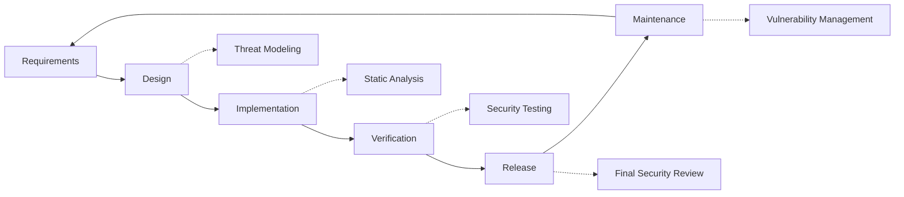

# Sikkerhetspraksis {#security-practices}

## Innholdsfortegnelse {#table-of-contents}

* [Forord](#foreword)
* [Infrastruktursikkerhet](#infrastructure-security)
  * [Sikre datasentre](#secure-data-centers)
  * [Nettverkssikkerhet](#network-security)
* [E-postsikkerhet](#email-security)
  * [Kryptering](#encryption)
  * [Autentisering og autorisasjon](#authentication-and-authorization)
  * [Tiltak mot misbruk](#anti-abuse-measures)
* [Databeskyttelse](#data-protection)
  * [Dataminimering](#data-minimization)
  * [Sikkerhetskopiering og gjenoppretting](#backup-and-recovery)
* [Tjenesteleverandører](#service-providers)
* [Samsvar og revisjon](#compliance-and-auditing)
  * [Regelmessige sikkerhetsvurderinger](#regular-security-assessments)
  * [Samsvar](#compliance)
* [Hendelsesrespons](#incident-response)
* [Sikkerhetsutviklingslivssyklus](#security-development-lifecycle)
* [Serverherding](#server-hardening)
* [Servicenivåavtale](#service-level-agreement)
* [Åpen kildekode-sikkerhet](#open-source-security)
* [Ansattsikkerhet](#employee-security)
* [Kontinuerlig forbedring](#continuous-improvement)
* [Ytterligere ressurser](#additional-resources)

## Forord {#foreword}

Hos Forward Email er sikkerhet vår høyeste prioritet. Vi har implementert omfattende sikkerhetstiltak for å beskytte e-postkommunikasjonen og personopplysningene dine. Dette dokumentet beskriver våre sikkerhetsrutiner og trinnene vi tar for å sikre konfidensialiteten, integriteten og tilgjengeligheten til e-posten din.

## Infrastruktursikkerhet {#infrastructure-security}

### Sikre datasentre {#secure-data-centers}

Infrastrukturen vår driftes i SOC 2-kompatible datasentre med:

* Fysisk sikkerhet og overvåking døgnet rundt
* Biometriske adgangskontroller
* Redundante strømforsyningssystemer
* Avansert branndeteksjon og brannslukking
* Miljøovervåking

### Nettverkssikkerhet {#network-security}

Vi implementerer flere lag med nettverkssikkerhet:

* Brannmurer i bedriftsklasse med strenge tilgangskontrolllister
* DDoS-beskyttelse og -reduksjon
* Regelmessig skanning av nettverkssårbarheter
* Systemer for deteksjon og forebygging av inntrenging
* Trafikkryptering mellom alle tjenesteendepunkter
* Portskanningsbeskyttelse med automatisk blokkering av mistenkelig aktivitet

> \[!IMPORTANT]
> Alle data under overføring krypteres med TLS 1.2+ med moderne krypteringspakker.

## E-postsikkerhet {#email-security}

### Kryptering {#encryption}

* **Transport Layer Security (TLS)**: All e-posttrafikk krypteres under sending med TLS 1.2 eller høyere.** **End-to-End-kryptering**: Støtte for OpenPGP/MIME- og S/MIME-standarder.** **Lagringskryptering**: Alle lagrede e-poster krypteres i ro med ChaCha20-Poly1305-kryptering i SQLite-filer.** **Full diskkryptering**: LUKS v2-kryptering for hele disken.** **Omfattende beskyttelse**: Vi implementerer kryptering i ro, kryptering i minnet og kryptering under sending.

> \[!NOTE]
> Vi er verdens første og eneste e-posttjeneste som bruker **[kvantebestandige og individuelt krypterte SQLite-postbokser](https://forwardemail.net/en/blog/docs/best-quantum-safe-encrypted-email-service)**.

### Autentisering og autorisasjon {#authentication-and-authorization}

* **DKIM-signering**: Alle utgående e-poster signeres med DKIM
* **SPF og DMARC**: Full støtte for SPF og DMARC for å forhindre e-postforfalskning
* **MTA-STS**: Støtte for MTA-STS for å håndheve TLS-kryptering
* **Flerfaktorautentisering**: Tilgjengelig for all kontotilgang

### Tiltak mot misbruk {#anti-abuse-measures}

* **Spamfiltrering**: Flerlags spamdeteksjon med maskinlæring
* **Virusskanning**: Sanntidsskanning av alle vedlegg
* **Hastighetsbegrensning**: Beskyttelse mot brute force- og opplistingsangrep
* **IP-omdømme**: Overvåking av avsenderens IP-omdømme
* **Innholdsfiltrering**: Deteksjon av ondsinnede URL-er og phishing-forsøk

## Databeskyttelse {#data-protection}

### Dataminimering {#data-minimization}

Vi følger prinsippet om dataminimering:

* Vi samler kun inn dataene som er nødvendige for å tilby tjenesten vår.
* E-postinnhold behandles i minnet og lagres ikke permanent med mindre det er nødvendig for IMAP/POP3-levering.
* Logger anonymiseres og lagres kun så lenge det er nødvendig.

### Sikkerhetskopiering og gjenoppretting {#backup-and-recovery}

* Automatiserte daglige sikkerhetskopier med kryptering
* Geografisk distribuert lagring av sikkerhetskopier
* Regelmessig testing av gjenoppretting av sikkerhetskopier
* Prosedyrer for katastrofegjenoppretting med definerte RPO og RTO

## Tjenesteleverandører {#service-providers}

Vi velger nøye ut tjenesteleverandørene våre for å sikre at de oppfyller våre høye sikkerhetsstandarder. Nedenfor er leverandørene vi bruker for internasjonal dataoverføring og deres samsvarsstatus for GDPR:

| Leverandør | Hensikt | DPF-sertifisert | GDPR-samsvarsside |
| --------------------------------------------- | ------------------------- | ------------- | ----------------------------------------------------------------- |
| [Cloudflare](https://www.cloudflare.com) | CDN, DDoS-beskyttelse, DNS | ✅ Ja | [Cloudflare GDPR](https://www.cloudflare.com/trust-hub/gdpr/) |
| [DataPacket](https://www.datapacket.com) | Serverinfrastruktur | ❌ Nei | [DataPacket Privacy](https://www.datapacket.com/privacy-policy) |
| [Digital Ocean](https://www.digitalocean.com) | Skyinfrastruktur | ❌ Nei | [DigitalOcean GDPR](https://www.digitalocean.com/legal/gdpr) |
| [Vultr](https://www.vultr.com) | Skyinfrastruktur | ❌ Nei | [Vultr GDPR](https://www.vultr.com/legal/eea-gdpr-privacy/) |
| [Stripe](https://stripe.com) | Betalingsbehandling | ✅ Ja | [Stripe Privacy Center](https://stripe.com/legal/privacy-center) |
| [PayPal](https://www.paypal.com) | Betalingsbehandling | ❌ Nei | [PayPal Privacy](https://www.paypal.com/uk/legalhub/privacy-full) |

Vi bruker disse leverandørene for å sikre pålitelig og sikker tjenestelevering, samtidig som vi overholder internasjonale personvernregler. Alle dataoverføringer utføres med nødvendige sikkerhetstiltak på plass for å beskytte dine personopplysninger.

## Samsvar og revisjon {#compliance-and-auditing}

### Regelmessige sikkerhetsvurderinger {#regular-security-assessments}

Teamet vårt overvåker, gjennomgår og vurderer regelmessig kodebasen, serverne, infrastrukturen og praksisene. Vi implementerer et omfattende sikkerhetsprogram som inkluderer:

* Regelmessig rotasjon av SSH-nøkler
* Kontinuerlig overvåking av tilgangslogger
* Automatisert sikkerhetsskanning
* Proaktiv sårbarhetshåndtering
* Regelmessig sikkerhetsopplæring for alle teammedlemmer

### Samsvar {#compliance}

* [GDPR](https://forwardemail.net/gdpr)-kompatible datahåndteringspraksiser
* [Databehandleravtale (DPA)](https://forwardemail.net/dpa) tilgjengelig for bedriftskunder
* CCPA-kompatible personvernkontroller
* SOC 2 Type II-reviderte prosesser

## Hendelsesrespons {#incident-response}

Vår plan for sikkerhetshendelser inkluderer:

1. **Deteksjon**: Automatiserte overvåkings- og varslingssystemer
2. **Inneslutning**: Umiddelbar isolering av berørte systemer
3. **Utryddelse**: Fjerning av trusselen og rotårsaksanalyse
4. **Gjenoppretting**: Sikker gjenoppretting av tjenester
5. **Varsling**: Rettidig kommunikasjon med berørte brukere
6. **Analyse etter hendelsen**: Omfattende gjennomgang og forbedring

> \[!WARNING]
> Hvis du oppdager et sikkerhetsproblem, må du umiddelbart rapportere det til <security@forwardemail.net>.

## Sikkerhetsutviklingslivssyklus {#security-development-lifecycle}

All kode gjennomgår:

* Innsamling av sikkerhetskrav
* Trusselmodellering under design
* Sikker kodepraksis
* Statisk og dynamisk sikkerhetstesting av applikasjoner
* Kodegjennomgang med sikkerhetsfokus
* Skanning av avhengighetssårbarheter

## Serverherding {#server-hardening}

Vår [Ansible-konfigurasjon](https://github.com/forwardemail/forwardemail.net/tree/master/ansible) implementerer en rekke serverherdingstiltak:

* **USB-tilgang deaktivert**: Fysiske porter deaktiveres ved å svarteliste usb-storage-kjernemodulen
* **Brannmurregler**: Strenge iptables-regler som kun tillater nødvendige tilkoblinger
* **SSH-herding**: Kun nøkkelbasert autentisering, ingen passordpålogging, root-pålogging deaktivert
* **Tjenesteisolering**: Hver tjeneste kjører med minimale nødvendige rettigheter
* **Automatiske oppdateringer**: Sikkerhetsoppdateringer installeres automatisk
* **Sikker oppstart**: Verifisert oppstartsprosess for å forhindre manipulering
* **Kjerneherding**: Sikre kjerneparametere og sysctl-konfigurasjoner
* **Filsystembegrensninger**: noexec-, nosuid- og nodev-monteringsalternativer der det er aktuelt
* **Kjernedumper deaktivert**: System konfigurert til å forhindre kjernedumper for sikkerhet
* **Bytte deaktivert**: Bytt minne deaktivert for å forhindre datalekkasje
* **Portskanningsbeskyttelse**: Automatisert deteksjon og blokkering av portskanningsforsøk
* **Transparente store sider deaktivert**: THP deaktivert for forbedret ytelse og sikkerhet
* **Systemtjenesteherding**: Ikke-essensielle tjenester som Apport deaktivert
* **Bruker Administrasjon**: Prinsippet om minste privilegium med separate distribusjons- og devops-brukere
* **Grenser for filbeskrivelser**: Økte grenser for bedre ytelse og sikkerhet

## Servicenivåavtale {#service-level-agreement}

Vi opprettholder et høyt nivå av tjenestetilgjengelighet og pålitelighet. Infrastrukturen vår er utformet for redundans og feiltoleranse for å sikre at e-posttjenesten din forblir operativ. Selv om vi ikke publiserer et formelt tjenestenivåavtaledokument, er vi forpliktet til å:

* 99,9 %+ oppetid for alle tjenester
* Rask respons på tjenesteavbrudd
* Transparent kommunikasjon ved hendelser
* Regelmessig vedlikehold i perioder med lav trafikk

## Sikkerhet med åpen kildekode {#open-source-security}

Som en [åpen kildekode-tjeneste](https://github.com/forwardemail/forwardemail.net) drar sikkerheten vår nytte av:

* Gjennomsiktig kode som kan revideres av alle
* Sikkerhetsforbedringer drevet av fellesskapet
* Rask identifisering og oppdatering av sårbarheter
* Ingen sikkerhet på grunn av uklarhet

## Ansattsikkerhet {#employee-security}

* Bakgrunnssjekk for alle ansatte
* Opplæring i sikkerhetsbevissthet
* Prinsippet om minste tilgangsrett
* Regelmessig sikkerhetsopplæring

## Kontinuerlig forbedring {#continuous-improvement}

Vi forbedrer kontinuerlig vår sikkerhetstilstand gjennom:

* Overvåking av sikkerhetstrender og nye trusler
* Regelmessig gjennomgang og oppdateringer av sikkerhetspolicyer
* Tilbakemeldinger fra sikkerhetsforskere og brukere
* Deltakelse i sikkerhetsfellesskapet

Hvis du vil ha mer informasjon om våre sikkerhetsrutiner eller for å rapportere sikkerhetsproblemer, kan du kontakte <security@forwardemail.net>.

## Ytterligere ressurser {#additional-resources}

* [Personvernerklæring](https://forwardemail.net/en/privacy)
* [Vilkår for bruk](https://forwardemail.net/en/terms)
* [GDPR-samsvar](https://forwardemail.net/gdpr)
* [Databehandleravtale (DPA)](https://forwardemail.net/dpa)
* [Rapporter misbruk](https://forwardemail.net/en/report-abuse)
* [Sikkerhetspolicy](https://github.com/forwardemail/.github/blob/main/SECURITY.md)
* [Security.txt](https://forwardemail.net/security.txt)
* [GitHub-arkivet](https://github.com/forwardemail/forwardemail.net)
* [FAQ](https://forwardemail.net/en/faq)