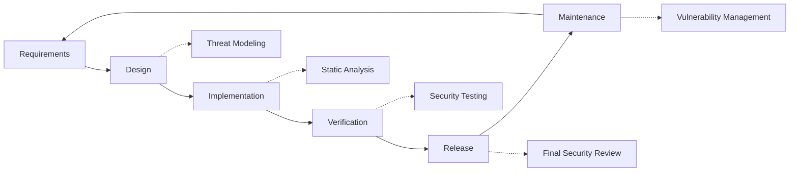

# Sikkerhetsrutiner {#security-practices}

## Innholdsfortegnelse {#table-of-contents}

* [Forord](#foreword)
* [Infrastruktur-sikkerhet](#infrastructure-security)
  * [Sikre datasentre](#secure-data-centers)
  * [Nettverkssikkerhet](#network-security)
* [E-postsikkerhet](#email-security)
  * [Kryptering](#encryption)
  * [Autentisering og autorisasjon](#authentication-and-authorization)
  * [Tiltak mot misbruk](#anti-abuse-measures)
* [Databeskyttelse](#data-protection)
  * [Dataminimering](#data-minimization)
  * [Backup og gjenoppretting](#backup-and-recovery)
* [Tjenesteleverandører](#service-providers)
* [Overholdelse og revisjon](#compliance-and-auditing)
  * [Regelmessige sikkerhetsvurderinger](#regular-security-assessments)
  * [Overholdelse](#compliance)
* [Hendelseshåndtering](#incident-response)
* [Sikkerhetsutviklingslivssyklus](#security-development-lifecycle)
* [Serverherding](#server-hardening)
* [Tjenestenivåavtale](#service-level-agreement)
* [Open source-sikkerhet](#open-source-security)
* [Ansattesikkerhet](#employee-security)
* [Kontinuerlig forbedring](#continuous-improvement)
* [Ytterligere ressurser](#additional-resources)

## Forord {#foreword}

Hos Forward Email er sikkerhet vår høyeste prioritet. Vi har implementert omfattende sikkerhetstiltak for å beskytte dine e-postkommunikasjoner og personopplysninger. Dette dokumentet beskriver våre sikkerhetsrutiner og de tiltakene vi tar for å sikre konfidensialitet, integritet og tilgjengelighet for din e-post.

## Infrastruktur-sikkerhet {#infrastructure-security}

### Sikre datasentre {#secure-data-centers}

Vår infrastruktur er hostet i SOC 2-kompatible datasentre med:

* 24/7 fysisk sikkerhet og overvåkning
* Biometriske adgangskontroller
* Redundante strømforsyninger
* Avansert brannvarsling og slukking
* Miljøovervåkning

### Nettverkssikkerhet {#network-security}

Vi implementerer flere lag med nettverkssikkerhet:

* Brannmurer på bedriftsnivå med strenge tilgangskontrollister
* DDoS-beskyttelse og avbøtning
* Regelmessig sårbarhetsskanning av nettverket
* Innbruddsdeteksjons- og forebyggingssystemer
* Trafikk-kryptering mellom alle tjenestepunkter
* Portskanningsbeskyttelse med automatisk blokkering av mistenkelig aktivitet

> \[!IMPORTANT]
> All data under overføring er kryptert med TLS 1.2+ med moderne krypteringssett.

## E-postsikkerhet {#email-security}

### Kryptering {#encryption}

* **Transport Layer Security (TLS)**: All e-posttrafikk krypteres under overføring med TLS 1.2 eller høyere
* **Ende-til-ende-kryptering**: Støtte for OpenPGP/MIME og S/MIME-standarder
* **Lagringskryptering**: Alle lagrede e-poster er kryptert i hvile med ChaCha20-Poly1305-kryptering i SQLite-filer
* **Full disk-kryptering**: LUKS v2-kryptering for hele disken
* **Omfattende beskyttelse**: Vi implementerer kryptering i hvile, i minnet og under overføring

> \[!NOTE]
> Vi er verdens første og eneste e-posttjeneste som bruker **[kvantesikre og individuelt krypterte SQLite-postbokser](https://forwardemail.net/en/blog/docs/best-quantum-safe-encrypted-email-service)**.

### Autentisering og autorisasjon {#authentication-and-authorization}

* **DKIM-signering**: Alle utgående e-poster signeres med DKIM
* **SPF og DMARC**: Full støtte for SPF og DMARC for å forhindre e-postforfalskning
* **MTA-STS**: Støtte for MTA-STS for å håndheve TLS-kryptering
* **Multifaktorautentisering**: Tilgjengelig for all kontotilgang

### Tiltak mot misbruk {#anti-abuse-measures}

* **Spamfiltrering**: Flerlags spamdeteksjon med maskinlæring
* **Virus-skanning**: Sanntidsskanning av alle vedlegg
* **Ratebegrensning**: Beskyttelse mot brute force- og oppregningsangrep
* **IP-omdømme**: Overvåkning av avsender-IP-omdømme
* **Innholdsfiltrering**: Deteksjon av ondsinnede URL-er og phishingforsøk

## Databeskyttelse {#data-protection}

### Dataminimering {#data-minimization}

Vi følger prinsippet om dataminimering:

* Vi samler kun inn data som er nødvendig for å levere vår tjeneste
* E-postinnhold behandles i minnet og lagres ikke permanent med mindre det er nødvendig for IMAP/POP3-levering
* Logger anonymiseres og beholdes kun så lenge det er nødvendig
### Backup og Gjenoppretting {#backup-and-recovery}

* Automatiserte daglige sikkerhetskopier med kryptering
* Geografisk distribuert sikkerhetskopilagring
* Regelmessig testing av sikkerhetskopigjenoppretting
* Katastrofegjenopprettingsprosedyrer med definerte RPO og RTO

## Tjenesteleverandører {#service-providers}

Vi velger våre tjenesteleverandører nøye for å sikre at de oppfyller våre høye sikkerhetsstandarder. Nedenfor er leverandørene vi bruker for internasjonal dataoverføring og deres GDPR-kompatibilitetsstatus:

| Leverandør                                    | Formål                    | DPF Sertifisert | GDPR-kompatibilitetsside                                                                              |
| --------------------------------------------- | -------------------------- | --------------- | ----------------------------------------------------------------------------------------------------- |
| [Cloudflare](https://www.cloudflare.com)      | CDN, DDoS-beskyttelse, DNS | ✅ Ja           | [Cloudflare GDPR](https://www.cloudflare.com/trust-hub/gdpr/)                                         |
| [DataPacket](https://www.datapacket.com)      | Serverinfrastruktur        | ❌ Nei          | [DataPacket Privacy](https://www.datapacket.com/privacy-policy)                                       |
| [Digital Ocean](https://www.digitalocean.com) | Skyinfrastruktur           | ❌ Nei          | [DigitalOcean GDPR](https://www.digitalocean.com/legal/gdpr)                                          |
| [GitHub](https://github.com)                  | Kildekodehosting, CI/CD    | ✅ Ja           | [GitHub GDPR](https://docs.github.com/en/site-policy/privacy-policies/github-data-protection-agreement) |
| [Vultr](https://www.vultr.com)                | Skyinfrastruktur           | ❌ Nei          | [Vultr GDPR](https://www.vultr.com/legal/eea-gdpr-privacy/)                                           |
| [Stripe](https://stripe.com)                  | Betalingsbehandling        | ✅ Ja           | [Stripe Privacy Center](https://stripe.com/legal/privacy-center)                                      |
| [PayPal](https://www.paypal.com)              | Betalingsbehandling        | ❌ Nei          | [PayPal Privacy](https://www.paypal.com/uk/legalhub/privacy-full)                                     |

Vi bruker disse leverandørene for å sikre pålitelig og sikker tjenestelevering samtidig som vi opprettholder samsvar med internasjonale databeskyttelsesregler. All dataoverføring gjennomføres med passende sikkerhetstiltak for å beskytte dine personopplysninger.

## Samsvar og Revisjon {#compliance-and-auditing}

### Regelmessige Sikkerhetsvurderinger {#regular-security-assessments}

Vårt team overvåker, gjennomgår og vurderer regelmessig kodebasen, servere, infrastruktur og praksiser. Vi implementerer et omfattende sikkerhetsprogram som inkluderer:

* Regelmessig rotasjon av SSH-nøkler
* Kontinuerlig overvåking av tilgangslogger
* Automatisert sikkerhetsskanning
* Proaktiv sårbarhetsstyring
* Regelmessig sikkerhetstrening for alle teammedlemmer

### Samsvar {#compliance}

* [GDPR](https://forwardemail.net/gdpr) samsvarende databehandlingspraksis
* [Databehandleravtale (DPA)](https://forwardemail.net/dpa) tilgjengelig for bedriftskunder
* CCPA-kompatible personvernkontroller
* SOC 2 Type II reviderte prosesser

## Hendelseshåndtering {#incident-response}

Vår sikkerhetshåndteringsplan for hendelser inkluderer:

1. **Oppdagelse**: Automatiserte overvåkings- og varslingstjenester
2. **Innesperring**: Umiddelbar isolering av berørte systemer
3. **Utryddelse**: Fjerning av trusselen og rotårsaksanalyse
4. **Gjenoppretting**: Sikker gjenoppretting av tjenester
5. **Varsling**: Rask kommunikasjon med berørte brukere
6. **Etterhendelsesanalyse**: Omfattende gjennomgang og forbedring

> \[!WARNING]
> Hvis du oppdager en sikkerhetssårbarhet, vennligst rapporter den umiddelbart til <security@forwardemail.net>.

## Sikkerhetsutviklingslivssyklus {#security-development-lifecycle}

```mermaid
flowchart LR
    A[Requirements] --> B[Design]
    B --> C[Implementation]
    C --> D[Verification]
    D --> E[Release]
    E --> F[Maintenance]
    F --> A
    B -.-> G[Threat Modeling]
    C -.-> H[Static Analysis]
    D -.-> I[Security Testing]
    E -.-> J[Final Security Review]
    F -.-> K[Vulnerability Management]
```
All kode gjennomgår:

* Innsamling av sikkerhetskrav
* Trusselmodellering under design
* Sikker koding praksis
* Statisk og dynamisk applikasjonssikkerhetstesting
* Kodegjennomgang med sikkerhetsfokus
* Avhengighets sårbarhetsskanning

## Serverherding {#server-hardening}

Vår [Ansible-konfigurasjon](https://github.com/forwardemail/forwardemail.net/tree/master/ansible) implementerer en rekke serverherdingstiltak:

* **USB-tilgang deaktivert**: Fysiske porter er deaktivert ved å svarteliste usb-storage kjerne-modulen
* **Brannmurregler**: Strenge iptables-regler som kun tillater nødvendige tilkoblinger
* **SSH-herding**: Kun nøkkelbasert autentisering, ingen passordinnlogging, root-innlogging deaktivert
* **Tjenesteisolasjon**: Hver tjeneste kjører med minimale nødvendige privilegier
* **Automatiske oppdateringer**: Sikkerhetsoppdateringer blir brukt automatisk
* **Sikker oppstart**: Verifisert oppstartsprosess for å forhindre manipulering
* **Kjerneherding**: Sikre kjerneparametere og sysctl-konfigurasjoner
* **Filssystembegrensninger**: noexec, nosuid og nodev monteringsalternativer der det er hensiktsmessig
* **Kjerne-dumps deaktivert**: System konfigurert for å forhindre kjerne-dumps for sikkerhet
* **Swap deaktivert**: Swap-minne deaktivert for å forhindre datalekkasjer
* **Beskyttelse mot portskanning**: Automatisk deteksjon og blokkering av portskanningsforsøk
* **Transparent Huge Pages deaktivert**: THP deaktivert for bedre ytelse og sikkerhet
* **Systemtjenesteherding**: Ikke-essensielle tjenester som Apport deaktivert
* **Brukerhåndtering**: Prinsippet om minste privilegium med separate deploy- og devops-brukere
* **Filbeskrivergrenser**: Økte grenser for bedre ytelse og sikkerhet

## Tjenestenivåavtale {#service-level-agreement}

Vi opprettholder et høyt nivå av tjenestetilgjengelighet og pålitelighet. Vår infrastruktur er designet for redundans og feiltoleranse for å sikre at e-posttjenesten din forblir operativ. Selv om vi ikke publiserer et formelt SLA-dokument, er vi forpliktet til:

* 99,9 %+ oppetid for alle tjenester
* Rask respons ved tjenesteavbrudd
* Åpen kommunikasjon under hendelser
* Regelmessig vedlikehold i perioder med lav trafikk

## Åpen kildekode-sikkerhet {#open-source-security}

Som en [åpen kildekode-tjeneste](https://github.com/forwardemail/forwardemail.net) drar vår sikkerhet nytte av:

* Transparent kode som kan revideres av alle
* Fellesskapsdrevne sikkerhetsforbedringer
* Rask identifisering og utbedring av sårbarheter
* Ingen sikkerhet gjennom uklarhet

## Ansattsikkerhet {#employee-security}

* Bakgrunnssjekker for alle ansatte
* Sikkerhetsbevissthetstrening
* Prinsippet om minste privilegium-tilgang
* Regelmessig sikkerhetsopplæring

## Kontinuerlig forbedring {#continuous-improvement}

Vi forbedrer kontinuerlig vår sikkerhetsstilling gjennom:

* Overvåking av sikkerhetstrender og nye trusler
* Regelmessig gjennomgang og oppdatering av sikkerhetspolicyer
* Tilbakemeldinger fra sikkerhetsforskere og brukere
* Deltakelse i sikkerhetsmiljøet

For mer informasjon om våre sikkerhetsrutiner eller for å rapportere sikkerhetsbekymringer, vennligst kontakt <security@forwardemail.net>.

## Ytterligere ressurser {#additional-resources}

* [Personvernregler](https://forwardemail.net/en/privacy)
* [Vilkår for bruk](https://forwardemail.net/en/terms)
* [GDPR-overholdelse](https://forwardemail.net/gdpr)
* [Databehandleravtale (DPA)](https://forwardemail.net/dpa)
* [Rapporter misbruk](https://forwardemail.net/en/report-abuse)
* [Sikkerhetspolicy](https://github.com/forwardemail/.github/blob/main/SECURITY.md)
* [Security.txt](https://forwardemail.net/security.txt)
* [GitHub-repositorium](https://github.com/forwardemail/forwardemail.net)
* [FAQ](https://forwardemail.net/en/faq)
