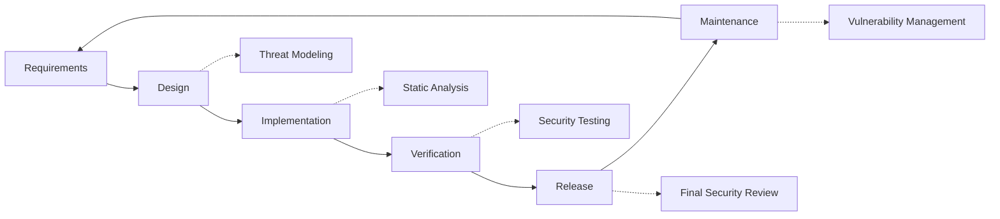

# Praktyki bezpieczeństwa {#security-practices}

## Spis treści {#table-of-contents}

* [Przedmowa](#foreword)
* [Bezpieczeństwo infrastruktury](#infrastructure-security)
  * [Bezpieczne centra danych](#secure-data-centers)
  * [Bezpieczeństwo sieci](#network-security)
* [Bezpieczeństwo poczty e-mail](#email-security)
  * [Szyfrowanie](#encryption)
  * [Uwierzytelnianie i autoryzacja](#authentication-and-authorization)
  * [Środki przeciwdziałania nadużyciom](#anti-abuse-measures)
* [Ochrona danych](#data-protection)
  * [Minimalizacja danych](#data-minimization)
  * [Kopie zapasowe i odzyskiwanie](#backup-and-recovery)
* [Dostawcy usług](#service-providers)
* [Zgodność i audyt](#compliance-and-auditing)
  * [Regularne oceny bezpieczeństwa](#regular-security-assessments)
  * [Zgodność](#compliance)
* [Reagowanie na incydenty](#incident-response)
* [Cykl rozwoju zabezpieczeń](#security-development-lifecycle)
* [Wzmocnienie serwera](#server-hardening)
* [Umowa o poziomie usług](#service-level-agreement)
* [Bezpieczeństwo Open Source](#open-source-security)
* [Bezpieczeństwo pracowników](#employee-security)
* [Ciągłe doskonalenie](#continuous-improvement)
* [Dodatkowe zasoby](#additional-resources)

## Przedmowa {#foreword}

W Forward Email bezpieczeństwo jest naszym najwyższym priorytetem. Wdrożyliśmy kompleksowe środki bezpieczeństwa, aby chronić Twoją komunikację e-mailową i dane osobowe. Niniejszy dokument opisuje nasze praktyki bezpieczeństwa oraz kroki, które podejmujemy w celu zapewnienia poufności, integralności i dostępności Twojej poczty e-mail.

## Bezpieczeństwo infrastruktury {#infrastructure-security}

### Bezpieczne centra danych {#secure-data-centers}

Nasza infrastruktura jest hostowana w centrach danych zgodnych ze standardem SOC 2, które posiadają:

* Całodobowa ochrona fizyczna i monitoring
* Biometryczna kontrola dostępu
* Redundantne systemy zasilania
* Zaawansowane wykrywanie i gaszenie pożaru
* Monitoring środowiska

### Bezpieczeństwo sieci {#network-security}

Wdrażamy wielowarstwowe zabezpieczenia sieciowe:

* Zapory sieciowe klasy korporacyjnej ze ścisłymi listami kontroli dostępu
* Ochrona przed atakami DDoS i ich łagodzenie
* Regularne skanowanie sieci w poszukiwaniu luk w zabezpieczeniach
* Systemy wykrywania i zapobiegania włamaniom
* Szyfrowanie ruchu między wszystkimi punktami końcowymi usługi
* Ochrona poprzez skanowanie portów z automatycznym blokowaniem podejrzanej aktywności

> \[!IMPORTANT]
> Wszystkie przesyłane dane są szyfrowane przy użyciu protokołu TLS 1.2+ z wykorzystaniem nowoczesnych szyfrów.

## Bezpieczeństwo poczty e-mail {#email-security}

### Szyfrowanie {#encryption}

* **Transport Layer Security (TLS)**: Cały ruch e-mail jest szyfrowany w trakcie przesyłania przy użyciu protokołu TLS 1.2 lub nowszego.
* **Szyfrowanie typu end-to-end**: Obsługa standardów OpenPGP/MIME i S/MIME.
* **Szyfrowanie pamięci masowej**: Wszystkie przechowywane wiadomości e-mail są szyfrowane w stanie spoczynku przy użyciu szyfrowania ChaCha20-Poly1305 w plikach SQLite.
* **Pełne szyfrowanie dysku**: Szyfrowanie LUKS v2 dla całego dysku.
* **Kompleksowa ochrona**: Wdrażamy szyfrowanie w stanie spoczynku, szyfrowanie w pamięci i szyfrowanie w trakcie przesyłania.

> \[!NOTE]
> Jesteśmy pierwszą i jedyną na świecie usługą poczty e-mail korzystającą z **[skrzynki pocztowe SQLite odporne na ataki kwantowe i indywidualnie szyfrowane](https://forwardemail.net/en/blog/docs/best-quantum-safe-encrypted-email-service)**.

### Uwierzytelnianie i autoryzacja {#authentication-and-authorization}

* **Podpisywanie DKIM**: Wszystkie wiadomości wychodzące są podpisywane za pomocą DKIM
* **SPF i DMARC**: Pełne wsparcie dla SPF i DMARC w celu zapobiegania podszywaniu się pod adres e-mail
* **MTA-STS**: Wsparcie dla MTA-STS w celu wymuszenia szyfrowania TLS
* **Uwierzytelnianie wieloskładnikowe**: Dostępne dla wszystkich kont

### Środki przeciwdziałania nadużyciom {#anti-abuse-measures}

* **Filtrowanie spamu**: Wielowarstwowe wykrywanie spamu z wykorzystaniem uczenia maszynowego
* **Skanowanie w poszukiwaniu wirusów**: Skanowanie wszystkich załączników w czasie rzeczywistym
* **Ograniczanie przepustowości**: Ochrona przed atakami siłowymi i enumeracyjnymi
* **Reputacja IP**: Monitorowanie reputacji wysyłającego adresu IP
* **Filtrowanie treści**: Wykrywanie złośliwych adresów URL i prób phishingu

## Ochrona danych {#data-protection}

### Minimalizacja danych {#data-minimization}

Kierujemy się zasadą minimalizacji danych:

* Gromadzimy tylko dane niezbędne do świadczenia naszych usług.
* Treść wiadomości e-mail jest przetwarzana w pamięci i nie jest trwale przechowywana, chyba że jest to wymagane do dostarczenia wiadomości IMAP/POP3.
* Logi są anonimizowane i przechowywane tylko tak długo, jak to konieczne.

### Kopia zapasowa i odzyskiwanie {#backup-and-recovery}

* Automatyczne codzienne kopie zapasowe z szyfrowaniem
* Geograficznie rozproszone przechowywanie kopii zapasowych
* Regularne testowanie przywracania kopii zapasowych
* Procedury odzyskiwania po awarii z określonymi wartościami RPO i RTO

## Dostawcy usług {#service-providers}

Starannie dobieramy naszych dostawców usług, aby zapewnić im zgodność z naszymi wysokimi standardami bezpieczeństwa. Poniżej przedstawiamy dostawców, z których korzystamy w zakresie międzynarodowego transferu danych, oraz ich status zgodności z RODO:

| Dostawca | Zamiar | Certyfikowany DPF | Strona zgodności z RODO |
| --------------------------------------------- | ------------------------- | ------------- | ----------------------------------------------------------------- |
| [Cloudflare](https://www.cloudflare.com) | CDN, ochrona DDoS, DNS | ✅ Tak | [Cloudflare GDPR](https://www.cloudflare.com/trust-hub/gdpr/) |
| [DataPacket](https://www.datapacket.com) | Infrastruktura serwerowa | ❌ Nie | [DataPacket Privacy](https://www.datapacket.com/privacy-policy) |
| [Digital Ocean](https://www.digitalocean.com) | Infrastruktura chmurowa | ❌ Nie | [DigitalOcean GDPR](https://www.digitalocean.com/legal/gdpr) |
| [Vultr](https://www.vultr.com) | Infrastruktura chmurowa | ❌ Nie | [Vultr GDPR](https://www.vultr.com/legal/eea-gdpr-privacy/) |
| [Stripe](https://stripe.com) | Przetwarzanie płatności | ✅ Tak | [Stripe Privacy Center](https://stripe.com/legal/privacy-center) |
| [PayPal](https://www.paypal.com) | Przetwarzanie płatności | ❌ Nie | [PayPal Privacy](https://www.paypal.com/uk/legalhub/privacy-full) |

Korzystamy z usług tych dostawców, aby zapewnić niezawodne i bezpieczne świadczenie usług, zachowując jednocześnie zgodność z międzynarodowymi przepisami o ochronie danych. Wszystkie transfery danych odbywają się z zachowaniem odpowiednich zabezpieczeń w celu ochrony Twoich danych osobowych.

## Zgodność i audyt {#compliance-and-auditing}

### Regularne oceny bezpieczeństwa {#regular-security-assessments}

Nasz zespół regularnie monitoruje, weryfikuje i ocenia bazę kodu, serwery, infrastrukturę i procedury. Wdrażamy kompleksowy program bezpieczeństwa, który obejmuje:

* Regularna rotacja kluczy SSH
* Ciągły monitoring logów dostępu
* Automatyczne skanowanie bezpieczeństwa
* Proaktywne zarządzanie lukami w zabezpieczeniach
* Regularne szkolenia z zakresu bezpieczeństwa dla wszystkich członków zespołu

### Zgodność {#compliance}

* Praktyki przetwarzania danych zgodne z [GDPR](https://forwardemail.net/gdpr)
* [Umowa o przetwarzaniu danych (DPA)](https://forwardemail.net/dpa) dostępne dla klientów biznesowych
* Kontrola prywatności zgodna z CCPA
* Procesy audytowane zgodnie z SOC 2 typu II

## Reakcja na incydenty {#incident-response}

Nasz plan reagowania na incydenty bezpieczeństwa obejmuje:

1. **Wykrywanie**: Zautomatyzowane systemy monitorowania i alarmowania
2. **Ograniczanie**: Natychmiastowa izolacja zagrożonych systemów
3. **Eradykacja**: Usunięcie zagrożenia i analiza przyczyn źródłowych
4. **Odzyskiwanie**: Bezpieczne przywracanie usług
5. **Powiadomienie**: Terminowa komunikacja z zagrożonymi użytkownikami
6. **Analiza poincydentalna**: Kompleksowy przegląd i udoskonalenie

> \[!WARNING]
> Jeśli odkryjesz lukę w zabezpieczeniach, zgłoś ją natychmiast na adres <security@forwardemail.net>.

## Cykl rozwoju zabezpieczeń {#security-development-lifecycle}

Cały kod przechodzi:

* Gromadzenie wymagań bezpieczeństwa
* Modelowanie zagrożeń podczas projektowania
* Bezpieczne praktyki kodowania
* Statyczne i dynamiczne testowanie bezpieczeństwa aplikacji
* Przegląd kodu ze szczególnym uwzględnieniem bezpieczeństwa
* Skanowanie podatności na zależności

## Wzmocnienie serwera {#server-hardening}

Nasz [Konfiguracja Ansible](https://github.com/forwardemail/forwardemail.net/tree/master/ansible) wdraża liczne środki wzmacniające serwer:

* **Dostęp USB wyłączony**: Porty fizyczne są wyłączane poprzez umieszczenie modułu jądra USB-storage na czarnej liście.
* **Reguły zapory sieciowej**: Surowe reguły iptables zezwalające tylko na niezbędne połączenia.
* **Wzmocnienie SSH**: Tylko uwierzytelnianie oparte na kluczu, brak logowania hasłem, logowanie root wyłączone.
* **Izolacja usług**: Każda usługa działa z minimalnymi wymaganymi uprawnieniami.
* **Automatyczne aktualizacje**: Poprawki bezpieczeństwa są stosowane automatycznie.
* **Bezpieczny rozruch**: Zweryfikowany proces rozruchu w celu zapobiegania manipulacjom.
* **Wzmocnienie jądra**: Bezpieczne parametry jądra i konfiguracje sysctl.
* **Ograniczenia systemu plików**: Opcje montowania noexec, nosuid i nodev, jeśli dotyczy.
* **Wyłączone zrzuty pamięci**: System skonfigurowany w celu zapobiegania zrzutom pamięci ze względów bezpieczeństwa.
* **Wyłączona pamięć wymiany**: Wyłączona pamięć wymiany, aby zapobiec wyciekowi danych.
* **Ochrona przed skanowaniem portów**: Automatyczne wykrywanie i blokowanie prób skanowania portów.
* **Przezroczysty Duże strony wyłączone**: THP wyłączone dla poprawy wydajności i bezpieczeństwa
* **Wzmocnienie usług systemowych**: Usługi nieistotne, takie jak Apport, wyłączone
* **Zarządzanie użytkownikami**: Zasada najmniejszych uprawnień z oddzielnymi użytkownikami wdrożeniowymi i DevOps
* **Limit deskryptorów plików**: Zwiększone limity dla lepszej wydajności i bezpieczeństwa

## Umowa o poziomie usług {#service-level-agreement}

Utrzymujemy wysoki poziom dostępności i niezawodności usług. Nasza infrastruktura jest zaprojektowana z myślą o redundancji i odporności na błędy, aby zapewnić ciągłość działania Twojej usługi poczty elektronicznej. Chociaż nie publikujemy formalnego dokumentu SLA, zobowiązujemy się do:

* 99,9%+ dostępności wszystkich usług
* Szybka reakcja na zakłócenia w świadczeniu usług
* Przejrzysta komunikacja w przypadku awarii
* Regularna konserwacja w okresach niskiego ruchu

## Bezpieczeństwo Open Source {#open-source-security}

Jako [usługa typu open source](https://github.com/forwardemail/forwardemail.net) nasze bezpieczeństwo korzystają z następujących korzyści:

* Przejrzysty kod, który może być audytowany przez każdego
* Ulepszenia bezpieczeństwa wprowadzane przez społeczność
* Szybka identyfikacja i łatanie luk
* Brak konieczności zabezpieczania się poprzez ukrywanie

## Bezpieczeństwo pracowników {#employee-security}

* Weryfikacja przeszłości wszystkich pracowników
* Szkolenia z zakresu bezpieczeństwa
* Zasada dostępu z najmniejszymi uprawnieniami
* Regularne szkolenia z zakresu bezpieczeństwa

## Ciągłe doskonalenie {#continuous-improvement}

Ciągle udoskonalamy naszą postawę w zakresie bezpieczeństwa poprzez:

* Monitorowanie trendów bezpieczeństwa i pojawiających się zagrożeń
* Regularny przegląd i aktualizacja polityk bezpieczeństwa
* Informacje zwrotne od badaczy bezpieczeństwa i użytkowników
* Udział w społeczności zajmującej się bezpieczeństwem

Aby uzyskać więcej informacji na temat naszych praktyk bezpieczeństwa lub zgłosić kwestie związane z bezpieczeństwem, skontaktuj się z nami pod adresem <security@forwardemail.net>.

## Dodatkowe zasoby {#additional-resources}

* [Polityka prywatności](https://forwardemail.net/en/privacy)
* [Warunki korzystania z usługi](https://forwardemail.net/en/terms)
* [Zgodność z RODO](https://forwardemail.net/gdpr)
* [Umowa o przetwarzaniu danych (DPA)](https://forwardemail.net/dpa)
* [Zgłoś nadużycie](https://forwardemail.net/en/report-abuse)
* [Polityka bezpieczeństwa](https://github.com/forwardemail/.github/blob/main/SECURITY.md)
* [Security.txt](https://forwardemail.net/security.txt)
* [Repozytorium GitHub](https://github.com/forwardemail/forwardemail.net)
* [FAQ](https://forwardemail.net/en/faq)