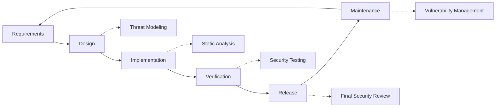

# Praktyki bezpieczeństwa {#security-practices}

## Spis treści {#table-of-contents}

* [Przedmowa](#foreword)
* [Bezpieczeństwo infrastruktury](#infrastructure-security)
  * [Bezpieczne centra danych](#secure-data-centers)
  * [Bezpieczeństwo sieci](#network-security)
* [Bezpieczeństwo e-mail](#email-security)
  * [Szyfrowanie](#encryption)
  * [Uwierzytelnianie i autoryzacja](#authentication-and-authorization)
  * [Środki przeciwdziałające nadużyciom](#anti-abuse-measures)
* [Ochrona danych](#data-protection)
  * [Minimalizacja danych](#data-minimization)
  * [Kopie zapasowe i odzyskiwanie](#backup-and-recovery)
* [Dostawcy usług](#service-providers)
* [Zgodność i audyt](#compliance-and-auditing)
  * [Regularne oceny bezpieczeństwa](#regular-security-assessments)
  * [Zgodność](#compliance)
* [Reakcja na incydenty](#incident-response)
* [Cykl życia rozwoju bezpieczeństwa](#security-development-lifecycle)
* [Wzmacnianie serwera](#server-hardening)
* [Umowa o poziomie usług](#service-level-agreement)
* [Bezpieczeństwo open source](#open-source-security)
* [Bezpieczeństwo pracowników](#employee-security)
* [Ciągłe doskonalenie](#continuous-improvement)
* [Dodatkowe zasoby](#additional-resources)

## Przedmowa {#foreword}

W Forward Email bezpieczeństwo jest naszym najwyższym priorytetem. Wdrożyliśmy kompleksowe środki bezpieczeństwa, aby chronić Twoją komunikację e-mailową oraz dane osobowe. Niniejszy dokument przedstawia nasze praktyki bezpieczeństwa oraz kroki, które podejmujemy, aby zapewnić poufność, integralność i dostępność Twojej poczty e-mail.

## Bezpieczeństwo infrastruktury {#infrastructure-security}

### Bezpieczne centra danych {#secure-data-centers}

Nasza infrastruktura jest hostowana w centrach danych zgodnych z SOC 2, które posiadają:

* całodobową ochronę fizyczną i monitoring
* kontrolę dostępu biometrycznego
* redundantne systemy zasilania
* zaawansowane wykrywanie i gaszenie pożarów
* monitorowanie środowiska

### Bezpieczeństwo sieci {#network-security}

Stosujemy wielowarstwowe zabezpieczenia sieciowe:

* zapory sieciowe klasy korporacyjnej z rygorystycznymi listami kontroli dostępu
* ochrona i łagodzenie skutków ataków DDoS
* regularne skanowanie podatności sieciowych
* systemy wykrywania i zapobiegania włamaniom
* szyfrowanie ruchu pomiędzy wszystkimi punktami końcowymi usług
* ochrona przed skanowaniem portów z automatycznym blokowaniem podejrzanej aktywności

> \[!IMPORTANT]
> Wszystkie dane przesyłane są szyfrowane przy użyciu TLS 1.2+ z nowoczesnymi zestawami szyfrów.

## Bezpieczeństwo e-mail {#email-security}

### Szyfrowanie {#encryption}

* **Transport Layer Security (TLS)**: Cały ruch e-mailowy jest szyfrowany podczas przesyłania za pomocą TLS 1.2 lub wyższego
* **Szyfrowanie end-to-end**: Wsparcie dla standardów OpenPGP/MIME oraz S/MIME
* **Szyfrowanie przechowywania**: Wszystkie przechowywane e-maile są szyfrowane w spoczynku za pomocą szyfrowania ChaCha20-Poly1305 w plikach SQLite
* **Szyfrowanie całego dysku**: Szyfrowanie LUKS v2 dla całego dysku
* **Kompleksowa ochrona**: Stosujemy szyfrowanie w spoczynku, w pamięci oraz podczas przesyłania

> \[!NOTE]
> Jesteśmy pierwszą i jedyną na świecie usługą e-mail, która używa **[kwantowo odpornych i indywidualnie szyfrowanych skrzynek pocztowych SQLite](https://forwardemail.net/en/blog/docs/best-quantum-safe-encrypted-email-service)**.

### Uwierzytelnianie i autoryzacja {#authentication-and-authorization}

* **Podpisywanie DKIM**: Wszystkie wychodzące e-maile są podpisywane DKIM
* **SPF i DMARC**: Pełne wsparcie dla SPF i DMARC zapobiegające podszywaniu się pod adresy e-mail
* **MTA-STS**: Wsparcie dla MTA-STS wymuszające szyfrowanie TLS
* **Uwierzytelnianie wieloskładnikowe**: Dostępne dla wszystkich kont

### Środki przeciwdziałające nadużyciom {#anti-abuse-measures}

* **Filtrowanie spamu**: Wielowarstwowe wykrywanie spamu z wykorzystaniem uczenia maszynowego
* **Skanowanie wirusów**: Skanowanie w czasie rzeczywistym wszystkich załączników
* **Ograniczanie szybkości**: Ochrona przed atakami brute force i enumeracją
* **Reputacja IP**: Monitorowanie reputacji adresów IP nadawców
* **Filtrowanie treści**: Wykrywanie złośliwych URL-i i prób phishingu

## Ochrona danych {#data-protection}

### Minimalizacja danych {#data-minimization}

Stosujemy zasadę minimalizacji danych:

* Zbieramy tylko dane niezbędne do świadczenia naszych usług
* Treść e-maili jest przetwarzana w pamięci i nie jest przechowywana trwale, chyba że jest to wymagane do dostarczenia przez IMAP/POP3
* Logi są anonimizowane i przechowywane tylko tak długo, jak jest to konieczne
### Kopie zapasowe i odzyskiwanie {#backup-and-recovery}

* Zautomatyzowane codzienne kopie zapasowe z szyfrowaniem
* Geograficznie rozproszone magazyny kopii zapasowych
* Regularne testy przywracania kopii zapasowych
* Procedury odzyskiwania po awarii z określonym RPO i RTO

## Dostawcy usług {#service-providers}

Starannie wybieramy naszych dostawców usług, aby zapewnić, że spełniają nasze wysokie standardy bezpieczeństwa. Poniżej znajdują się dostawcy, których używamy do międzynarodowego transferu danych oraz ich status zgodności z RODO:

| Dostawca                                      | Cel                        | Certyfikat DPF | Strona zgodności z RODO                                                                                 |
| --------------------------------------------- | -------------------------- | ------------- | ------------------------------------------------------------------------------------------------------- |
| [Cloudflare](https://www.cloudflare.com)      | CDN, ochrona DDoS, DNS     | ✅ Tak         | [Cloudflare GDPR](https://www.cloudflare.com/trust-hub/gdpr/)                                           |
| [DataPacket](https://www.datapacket.com)      | Infrastruktura serwerowa   | ❌ Nie        | [DataPacket Privacy](https://www.datapacket.com/privacy-policy)                                         |
| [Digital Ocean](https://www.digitalocean.com) | Infrastruktura chmurowa    | ❌ Nie        | [DigitalOcean GDPR](https://www.digitalocean.com/legal/gdpr)                                            |
| [GitHub](https://github.com)                  | Hosting kodu źródłowego, CI/CD | ✅ Tak         | [GitHub GDPR](https://docs.github.com/en/site-policy/privacy-policies/github-data-protection-agreement) |
| [Vultr](https://www.vultr.com)                | Infrastruktura chmurowa    | ❌ Nie        | [Vultr GDPR](https://www.vultr.com/legal/eea-gdpr-privacy/)                                             |
| [Stripe](https://stripe.com)                  | Przetwarzanie płatności    | ✅ Tak         | [Stripe Privacy Center](https://stripe.com/legal/privacy-center)                                        |
| [PayPal](https://www.paypal.com)              | Przetwarzanie płatności    | ❌ Nie        | [PayPal Privacy](https://www.paypal.com/uk/legalhub/privacy-full)                                       |

Korzystamy z tych dostawców, aby zapewnić niezawodne i bezpieczne świadczenie usług, jednocześnie zachowując zgodność z międzynarodowymi przepisami o ochronie danych. Wszystkie transfery danych odbywają się z odpowiednimi zabezpieczeniami chroniącymi Twoje dane osobowe.

## Zgodność i audyt {#compliance-and-auditing}

### Regularne oceny bezpieczeństwa {#regular-security-assessments}

Nasz zespół regularnie monitoruje, przegląda i ocenia bazę kodu, serwery, infrastrukturę oraz praktyki. Wdrażamy kompleksowy program bezpieczeństwa, który obejmuje:

* Regularną rotację kluczy SSH
* Ciągłe monitorowanie logów dostępu
* Automatyczne skanowanie bezpieczeństwa
* Proaktywne zarządzanie podatnościami
* Regularne szkolenia z zakresu bezpieczeństwa dla wszystkich członków zespołu

### Zgodność {#compliance}

* Praktyki przetwarzania danych zgodne z [RODO](https://forwardemail.net/gdpr)
* Umowa powierzenia przetwarzania danych ([DPA](https://forwardemail.net/dpa)) dostępna dla klientów biznesowych
* Kontrole prywatności zgodne z CCPA
* Procesy audytowane według SOC 2 Typ II

## Reakcja na incydenty {#incident-response}

Nasz plan reagowania na incydenty bezpieczeństwa obejmuje:

1. **Wykrywanie**: Zautomatyzowane systemy monitorowania i powiadamiania
2. **Izolacja**: Natychmiastowa izolacja dotkniętych systemów
3. **Usunięcie**: Eliminacja zagrożenia i analiza przyczyn źródłowych
4. **Odzyskiwanie**: Bezpieczne przywrócenie usług
5. **Powiadomienie**: Terminowa komunikacja z dotkniętymi użytkownikami
6. **Analiza po incydencie**: Kompleksowy przegląd i usprawnienia

> \[!WARNING]
> Jeśli odkryjesz lukę bezpieczeństwa, prosimy o natychmiastowe zgłoszenie na <security@forwardemail.net>.

## Cykl życia rozwoju bezpieczeństwa {#security-development-lifecycle}

```mermaid
flowchart LR
    A[Requirements] --> B[Design]
    B --> C[Implementation]
    C --> D[Verification]
    D --> E[Release]
    E --> F[Maintenance]
    F --> A
    B -.-> G[Threat Modeling]
    C -.-> H[Static Analysis]
    D -.-> I[Security Testing]
    E -.-> J[Final Security Review]
    F -.-> K[Vulnerability Management]
```
Wszystkie kody przechodzą przez:

* Zbieranie wymagań bezpieczeństwa
* Modelowanie zagrożeń podczas projektowania
* Praktyki bezpiecznego kodowania
* Statyczne i dynamiczne testy bezpieczeństwa aplikacji
* Przegląd kodu z naciskiem na bezpieczeństwo
* Skanowanie podatności zależności

## Utwardzanie serwera {#server-hardening}

Nasz [konfiguracja Ansible](https://github.com/forwardemail/forwardemail.net/tree/master/ansible) wdraża liczne środki utwardzania serwera:

* **Dostęp do USB wyłączony**: Fizyczne porty są wyłączone przez zablokowanie modułu jądra usb-storage
* **Reguły zapory**: Ścisłe reguły iptables zezwalające tylko na niezbędne połączenia
* **Utwardzanie SSH**: Tylko uwierzytelnianie kluczem, brak logowania hasłem, wyłączone logowanie root
* **Izolacja usług**: Każda usługa działa z minimalnymi wymaganymi uprawnieniami
* **Automatyczne aktualizacje**: Łatki bezpieczeństwa są stosowane automatycznie
* **Bezpieczny rozruch**: Zweryfikowany proces rozruchu zapobiegający manipulacjom
* **Utwardzanie jądra**: Bezpieczne parametry jądra i konfiguracje sysctl
* **Ograniczenia systemu plików**: opcje montowania noexec, nosuid i nodev tam, gdzie to stosowne
* **Wyłączone zrzuty pamięci (core dumps)**: System skonfigurowany do zapobiegania zrzutom pamięci dla bezpieczeństwa
* **Wyłączona pamięć wymiany (swap)**: Pamięć swap wyłączona, aby zapobiec wyciekom danych
* **Ochrona przed skanowaniem portów**: Automatyczne wykrywanie i blokowanie prób skanowania portów
* **Wyłączone Transparent Huge Pages**: THP wyłączone dla poprawy wydajności i bezpieczeństwa
* **Utwardzanie usług systemowych**: Wyłączone usługi nieistotne, takie jak Apport
* **Zarządzanie użytkownikami**: Zasada najmniejszych uprawnień z oddzielnymi użytkownikami deploy i devops
* **Limity deskryptorów plików**: Zwiększone limity dla lepszej wydajności i bezpieczeństwa

## Umowa o poziomie usług {#service-level-agreement}

Utrzymujemy wysoki poziom dostępności i niezawodności usług. Nasza infrastruktura jest zaprojektowana z myślą o redundancji i odporności na awarie, aby zapewnić ciągłość działania Twojej usługi e-mail. Chociaż nie publikujemy formalnego dokumentu SLA, zobowiązujemy się do:

* 99,9%+ czasu działania wszystkich usług
* Szybkiej reakcji na zakłócenia usług
* Przejrzystej komunikacji podczas incydentów
* Regularnej konserwacji w okresach niskiego ruchu

## Bezpieczeństwo open source {#open-source-security}

Jako [usługa open-source](https://github.com/forwardemail/forwardemail.net), nasze bezpieczeństwo korzysta z:

* Przejrzystego kodu, który może być audytowany przez każdego
* Ulepszeń bezpieczeństwa napędzanych przez społeczność
* Szybkiego wykrywania i łatania podatności
* Braku bezpieczeństwa przez ukrywanie

## Bezpieczeństwo pracowników {#employee-security}

* Sprawdzanie przeszłości wszystkich pracowników
* Szkolenia z zakresu świadomości bezpieczeństwa
* Zasada najmniejszych uprawnień dostępu
* Regularna edukacja w zakresie bezpieczeństwa

## Ciągłe doskonalenie {#continuous-improvement}

Ciągle poprawiamy naszą postawę bezpieczeństwa poprzez:

* Monitorowanie trendów bezpieczeństwa i pojawiających się zagrożeń
* Regularne przeglądy i aktualizacje polityk bezpieczeństwa
* Opinie od badaczy bezpieczeństwa i użytkowników
* Udział w społeczności bezpieczeństwa

Aby uzyskać więcej informacji o naszych praktykach bezpieczeństwa lub zgłosić problemy związane z bezpieczeństwem, prosimy o kontakt pod adresem <security@forwardemail.net>.

## Dodatkowe zasoby {#additional-resources}

* [Polityka prywatności](https://forwardemail.net/en/privacy)
* [Regulamin](https://forwardemail.net/en/terms)
* [Zgodność z RODO](https://forwardemail.net/gdpr)
* [Umowa o przetwarzaniu danych (DPA)](https://forwardemail.net/dpa)
* [Zgłoś nadużycie](https://forwardemail.net/en/report-abuse)
* [Polityka bezpieczeństwa](https://github.com/forwardemail/.github/blob/main/SECURITY.md)
* [Security.txt](https://forwardemail.net/security.txt)
* [Repozytorium GitHub](https://github.com/forwardemail/forwardemail.net)
* [FAQ](https://forwardemail.net/en/faq)
