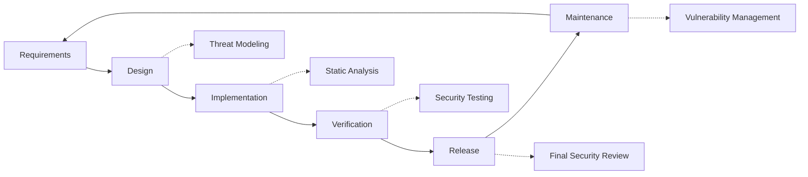

# Práticas de segurança {#security-practices}

## Índice {#table-of-contents}

* [Prefácio](#foreword)
* [Segurança de Infraestrutura](#infrastructure-security)
  * [Data Centers Seguros](#secure-data-centers)
  * [Segurança de rede](#network-security)
* [Segurança de e-mail](#email-security)
  * [Criptografia](#encryption)
  * [Autenticação e Autorização](#authentication-and-authorization)
  * [Medidas Antiabuso](#anti-abuse-measures)
* [Proteção de Dados](#data-protection)
  * [Minimização de dados](#data-minimization)
  * [Backup e Recuperação](#backup-and-recovery)
* [Prestadores de serviços](#service-providers)
* [Conformidade e Auditoria](#compliance-and-auditing)
  * [Avaliações regulares de segurança](#regular-security-assessments)
  * [Conformidade](#compliance)
* [Resposta a incidentes](#incident-response)
* [Ciclo de vida de desenvolvimento de segurança](#security-development-lifecycle)
* [Endurecimento do servidor](#server-hardening)
* [Acordo de Nível de Serviço](#service-level-agreement)
* [Segurança de código aberto](#open-source-security)
* [Segurança dos Funcionários](#employee-security)
* [Melhoria Contínua](#continuous-improvement)
* [Recursos adicionais](#additional-resources)

## Prefácio {#foreword}

Na Forward Email, a segurança é nossa principal prioridade. Implementamos medidas de segurança abrangentes para proteger suas comunicações por e-mail e dados pessoais. Este documento descreve nossas práticas de segurança e as medidas que tomamos para garantir a confidencialidade, a integridade e a disponibilidade do seu e-mail.

## Segurança de infraestrutura {#infrastructure-security}

### Centros de dados seguros {#secure-data-centers}

Nossa infraestrutura é hospedada em data centers compatíveis com SOC 2 com:

* Segurança física e vigilância 24 horas por dia, 7 dias por semana
* Controles de acesso biométricos
* Sistemas de energia redundantes
* Detecção e supressão avançadas de incêndio
* Monitoramento ambiental

### Segurança de rede {#network-security}

Implementamos múltiplas camadas de segurança de rede:

* Firewalls de nível empresarial com listas rigorosas de controle de acesso
* Proteção e mitigação de DDoS
* Verificação regular de vulnerabilidades de rede
* Sistemas de detecção e prevenção de intrusão
* Criptografia de tráfego entre todos os endpoints de serviço
* Proteção de varredura de portas com bloqueio automatizado de atividades suspeitas

> \[!IMPORTANT]
> Todos os dados em trânsito são criptografados usando TLS 1.2+ com conjuntos de criptografia modernos.

## Segurança de e-mail {#email-security}

### Criptografia {#encryption}

* **Segurança da Camada de Transporte (TLS)**: Todo o tráfego de e-mail é criptografado em trânsito usando TLS 1.2 ou superior
* **Criptografia de Ponta a Ponta**: Suporte aos padrões OpenPGP/MIME e S/MIME
* **Criptografia de Armazenamento**: Todos os e-mails armazenados são criptografados em repouso usando criptografia ChaCha20-Poly1305 em arquivos SQLite
* **Criptografia de Disco Completo**: Criptografia LUKS v2 para todo o disco
* **Proteção Abrangente**: Implementamos criptografia em repouso, criptografia na memória e criptografia em trânsito

> \[!NOTE]
> Somos o primeiro e único serviço de e-mail do mundo a usar **[caixas de correio SQLite resistentes a quantum e criptografadas individualmente](https://forwardemail.net/en/blog/docs/best-quantum-safe-encrypted-email-service)**.

### Autenticação e Autorização {#authentication-and-authorization}

* **Assinatura DKIM**: Todos os e-mails enviados são assinados com DKIM
* **SPF e DMARC**: Suporte total para SPF e DMARC para evitar spoofing de e-mails
* **MTA-STS**: Suporte para MTA-STS para aplicar criptografia TLS
* **Autenticação Multifator**: Disponível para todos os acessos de conta

### Medidas antiabuso {#anti-abuse-measures}

* **Filtragem de Spam**: Detecção de spam em várias camadas com aprendizado de máquina
* **Verificação de Vírus**: Verificação em tempo real de todos os anexos
* **Limitação de Taxa**: Proteção contra ataques de força bruta e enumeração
* **Reputação de IP**: Monitoramento da reputação de IP de envio
* **Filtragem de Conteúdo**: Detecção de URLs maliciosos e tentativas de phishing

## Proteção de Dados {#data-protection}

### Minimização de Dados {#data-minimization}

Seguimos o princípio de minimização de dados:

* Coletamos apenas os dados necessários para fornecer nosso serviço
* O conteúdo do e-mail é processado na memória e não é armazenado de forma persistente, a menos que seja necessário para entrega IMAP/POP3
* Os registros são anonimizados e retidos apenas pelo tempo necessário

### Backup e Recuperação {#backup-and-recovery}

* Backups diários automatizados com criptografia
* Armazenamento de backup distribuído geograficamente
* Testes regulares de restauração de backup
* Procedimentos de recuperação de desastres com RPO e RTO definidos

## Provedores de serviços {#service-providers}

Selecionamos cuidadosamente nossos provedores de serviços para garantir que atendam aos nossos elevados padrões de segurança. Abaixo, listamos os provedores que utilizamos para transferência internacional de dados e seus respectivos status de conformidade com o GDPR:

| Provedor | Propósito | Certificado DPF | Página de conformidade com o GDPR |
| --------------------------------------------- | ------------------------- | ------------- | ----------------------------------------------------------------- |
| [Cloudflare](https://www.cloudflare.com) | CDN, proteção DDoS, DNS | ✅ Sim | [Cloudflare GDPR](https://www.cloudflare.com/trust-hub/gdpr/) |
| [DataPacket](https://www.datapacket.com) | Infraestrutura de servidor | ❌ Não | [DataPacket Privacy](https://www.datapacket.com/privacy-policy) |
| [Digital Ocean](https://www.digitalocean.com) | Infraestrutura de nuvem | ❌ Não | [DigitalOcean GDPR](https://www.digitalocean.com/legal/gdpr) |
| [Vultr](https://www.vultr.com) | Infraestrutura de nuvem | ❌ Não | [Vultr GDPR](https://www.vultr.com/legal/eea-gdpr-privacy/) |
| [Stripe](https://stripe.com) | Processamento de pagamento | ✅ Sim | [Stripe Privacy Center](https://stripe.com/legal/privacy-center) |
| [PayPal](https://www.paypal.com) | Processamento de pagamento | ❌ Não | [PayPal Privacy](https://www.paypal.com/uk/legalhub/privacy-full) |

Utilizamos esses provedores para garantir a prestação de serviços confiável e segura, mantendo a conformidade com as normas internacionais de proteção de dados. Todas as transferências de dados são realizadas com as devidas salvaguardas para proteger suas informações pessoais.

## Conformidade e Auditoria {#compliance-and-auditing}

### Avaliações regulares de segurança {#regular-security-assessments}

Nossa equipe monitora, revisa e avalia regularmente a base de código, os servidores, a infraestrutura e as práticas. Implementamos um programa de segurança abrangente que inclui:

* Rotação regular de chaves SSH
* Monitoramento contínuo de logs de acesso
* Verificação de segurança automatizada
* Gerenciamento proativo de vulnerabilidades
* Treinamento regular de segurança para todos os membros da equipe

### Conformidade {#compliance}

* Práticas de tratamento de dados em conformidade com [GDPR](https://forwardemail.net/gdpr)
* [Contrato de Processamento de Dados (DPA)](https://forwardemail.net/dpa) disponível para clientes empresariais
* Controles de privacidade em conformidade com CCPA
* Processos auditados SOC 2 Tipo II

## Resposta a incidentes {#incident-response}

Nosso plano de resposta a incidentes de segurança inclui:

1. **Detecção**: Sistemas automatizados de monitoramento e alerta
2. **Contenção**: Isolamento imediato dos sistemas afetados
3. **Erradicação**: Remoção da ameaça e análise da causa raiz
4. **Recuperação**: Restauração segura dos serviços
5. **Notificação**: Comunicação oportuna com os usuários afetados
6. **Análise pós-incidente**: Revisão e melhoria abrangentes

> \[!WARNING]
> Se você descobrir uma vulnerabilidade de segurança, informe-a imediatamente para <security@forwardemail.net>.

## Ciclo de vida de desenvolvimento de segurança {#security-development-lifecycle}

Todo código passa por:

* Levantamento de requisitos de segurança
* Modelagem de ameaças durante o projeto
* Práticas de codificação seguras
* Testes de segurança de aplicações estáticas e dinâmicas
* Revisão de código com foco em segurança
* Varredura de vulnerabilidades de dependência

## Proteção do servidor {#server-hardening}

Nosso [Configuração Ansible](https://github.com/forwardemail/forwardemail.net/tree/master/ansible) implementa inúmeras medidas de proteção do servidor:

* **Acesso USB Desativado**: Portas físicas são desativadas ao colocar o módulo do kernel usb-storage na lista negra
* **Regras de Firewall**: Regras rígidas do iptables, permitindo apenas conexões necessárias
* **Proteção SSH**: Autenticação baseada apenas em chave, sem login com senha, login root desabilitado
* **Isolamento de Serviço**: Cada serviço é executado com os privilégios mínimos necessários
* **Atualizações Automáticas**: Patches de segurança são aplicados automaticamente
* **Inicialização Segura**: Processo de inicialização verificado para evitar adulterações
* **Proteção do Kernel**: Parâmetros do kernel e configurações sysctl seguros
* **Restrições do Sistema de Arquivos**: opções de montagem noexec, nosuid e nodev, quando apropriado
* **Core Dumps Desativados**: Sistema configurado para impedir core dumps por motivos de segurança
* **Swap Desativado**: Memória swap desabilitada para evitar vazamento de dados
* **Proteção de Varredura de Portas**: Detecção e bloqueio automatizados de tentativas de varredura de portas
* **Páginas Enormes Transparentes Desativadas**: THP desabilitado para melhor desempenho e segurança
* **Serviço do Sistema Reforço**: Serviços não essenciais, como o Appport, desabilitados
* **Gerenciamento de Usuários**: Princípio do menor privilégio com usuários separados de implantação e DevOps
* **Limites do Descritor de Arquivos**: Limites aumentados para melhor desempenho e segurança

## Acordo de Nível de Serviço {#service-level-agreement}

Mantemos um alto nível de disponibilidade e confiabilidade do serviço. Nossa infraestrutura foi projetada para oferecer redundância e tolerância a falhas, garantindo que seu serviço de e-mail permaneça operacional. Embora não publiquemos um SLA formal, temos o compromisso de:

* Mais de 99,9% de disponibilidade para todos os serviços
* Resposta rápida a interrupções de serviço
* Comunicação transparente durante incidentes
* Manutenção regular durante períodos de baixo tráfego

## Segurança de código aberto {#open-source-security}

Como [serviço de código aberto](https://github.com/forwardemail/forwardemail.net), nossa segurança se beneficia de:

* Código transparente que pode ser auditado por qualquer pessoa
* Melhorias de segurança conduzidas pela comunidade
* Identificação e correção rápidas de vulnerabilidades
* Sem segurança por obscuridade

## Segurança do Funcionário {#employee-security}

* Verificação de antecedentes de todos os funcionários
* Treinamento de conscientização sobre segurança
* Princípio do acesso com privilégios mínimos
* Treinamento regular sobre segurança

## Melhoria Contínua {#continuous-improvement}

Melhoramos continuamente nossa postura de segurança por meio de:

* Monitoramento de tendências de segurança e ameaças emergentes
* Revisão e atualizações regulares das políticas de segurança
* Feedback de pesquisadores e usuários de segurança
* Participação na comunidade de segurança

Para obter mais informações sobre nossas práticas de segurança ou para relatar preocupações de segurança, entre em contato com <security@forwardemail.net>.

## Recursos adicionais {#additional-resources}

* [política de Privacidade](https://forwardemail.net/en/privacy)
* [Termos de Serviço](https://forwardemail.net/en/terms)
* [Conformidade com o RGPD](https://forwardemail.net/gdpr)
* [Contrato de Processamento de Dados (DPA)](https://forwardemail.net/dpa)
* [Denunciar abuso](https://forwardemail.net/en/report-abuse)
* [Política de Segurança](https://github.com/forwardemail/.github/blob/main/SECURITY.md)
* [Security.txt](https://forwardemail.net/security.txt)
* [Repositório GitHub](https://github.com/forwardemail/forwardemail.net)
* [FAQ](https://forwardemail.net/en/faq)