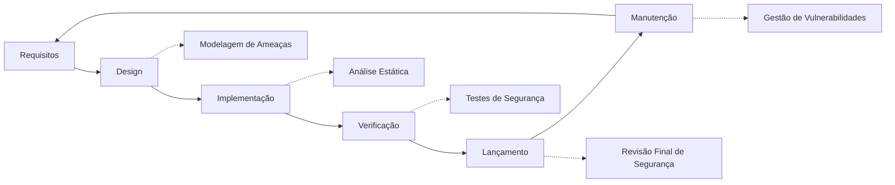

# Práticas de Segurança {#security-practices}

## Índice {#table-of-contents}

* [Prefácio](#foreword)
* [Segurança da Infraestrutura](#infrastructure-security)
  * [Data Centers Seguros](#secure-data-centers)
  * [Segurança de Rede](#network-security)
* [Segurança de Email](#email-security)
  * [Criptografia](#encryption)
  * [Autenticação e Autorização](#authentication-and-authorization)
  * [Medidas Anti-Abuso](#anti-abuse-measures)
* [Proteção de Dados](#data-protection)
  * [Minimização de Dados](#data-minimization)
  * [Backup e Recuperação](#backup-and-recovery)
* [Provedores de Serviço](#service-providers)
* [Conformidade e Auditoria](#compliance-and-auditing)
  * [Avaliações Regulares de Segurança](#regular-security-assessments)
  * [Conformidade](#compliance)
* [Resposta a Incidentes](#incident-response)
* [Ciclo de Vida de Desenvolvimento Seguro](#security-development-lifecycle)
* [Endurecimento de Servidor](#server-hardening)
* [Acordo de Nível de Serviço](#service-level-agreement)
* [Segurança de Código Aberto](#open-source-security)
* [Segurança dos Funcionários](#employee-security)
* [Melhoria Contínua](#continuous-improvement)
* [Recursos Adicionais](#additional-resources)

## Prefácio {#foreword}

No Forward Email, a segurança é nossa maior prioridade. Implementamos medidas abrangentes de segurança para proteger suas comunicações por email e dados pessoais. Este documento descreve nossas práticas de segurança e os passos que tomamos para garantir a confidencialidade, integridade e disponibilidade do seu email.

## Segurança da Infraestrutura {#infrastructure-security}

### Data Centers Seguros {#secure-data-centers}

Nossa infraestrutura está hospedada em data centers compatíveis com SOC 2 com:

* Segurança física e vigilância 24/7
* Controles de acesso biométricos
* Sistemas de energia redundantes
* Detecção e supressão avançada de incêndios
* Monitoramento ambiental

### Segurança de Rede {#network-security}

Implementamos múltiplas camadas de segurança de rede:

* Firewalls de nível empresarial com listas de controle de acesso rigorosas
* Proteção e mitigação contra DDoS
* Escaneamento regular de vulnerabilidades de rede
* Sistemas de detecção e prevenção de intrusões
* Criptografia de tráfego entre todos os pontos finais do serviço
* Proteção contra varredura de portas com bloqueio automático de atividades suspeitas

> \[!IMPORTANT]
> Todos os dados em trânsito são criptografados usando TLS 1.2+ com suítes de cifra modernas.

## Segurança de Email {#email-security}

### Criptografia {#encryption}

* **Transport Layer Security (TLS)**: Todo o tráfego de email é criptografado em trânsito usando TLS 1.2 ou superior
* **Criptografia de Ponta a Ponta**: Suporte aos padrões OpenPGP/MIME e S/MIME
* **Criptografia de Armazenamento**: Todos os emails armazenados são criptografados em repouso usando criptografia ChaCha20-Poly1305 em arquivos SQLite
* **Criptografia de Disco Completo**: Criptografia LUKS v2 para todo o disco
* **Proteção Abrangente**: Implementamos criptografia em repouso, em memória e em trânsito

> \[!NOTE]
> Somos o primeiro e único serviço de email do mundo a usar **[caixas de correio SQLite criptografadas individualmente e resistentes a computação quântica](https://forwardemail.net/en/blog/docs/best-quantum-safe-encrypted-email-service)**.

### Autenticação e Autorização {#authentication-and-authorization}

* **Assinatura DKIM**: Todos os emails enviados são assinados com DKIM
* **SPF e DMARC**: Suporte completo para SPF e DMARC para prevenir falsificação de email
* **MTA-STS**: Suporte para MTA-STS para impor criptografia TLS
* **Autenticação Multifator**: Disponível para todo acesso à conta

### Medidas Anti-Abuso {#anti-abuse-measures}

* **Filtro de Spam**: Detecção de spam em múltiplas camadas com aprendizado de máquina
* **Escaneamento de Vírus**: Escaneamento em tempo real de todos os anexos
* **Limitação de Taxa**: Proteção contra ataques de força bruta e enumeração
* **Reputação de IP**: Monitoramento da reputação do IP remetente
* **Filtro de Conteúdo**: Detecção de URLs maliciosas e tentativas de phishing

## Proteção de Dados {#data-protection}

### Minimização de Dados {#data-minimization}

Seguimos o princípio da minimização de dados:

* Coletamos apenas os dados necessários para fornecer nosso serviço
* O conteúdo do email é processado em memória e não armazenado persistentemente, a menos que necessário para entrega IMAP/POP3
* Logs são anonimizados e retidos apenas pelo tempo necessário
### Backup e Recuperação {#backup-and-recovery}

* Backups diários automatizados com criptografia
* Armazenamento de backup distribuído geograficamente
* Testes regulares de restauração de backup
* Procedimentos de recuperação de desastres com RPO e RTO definidos

## Provedores de Serviço {#service-providers}

Selecionamos cuidadosamente nossos provedores de serviço para garantir que atendam aos nossos altos padrões de segurança. Abaixo estão os provedores que usamos para transferência internacional de dados e seu status de conformidade com o GDPR:

| Provedor                                      | Finalidade                | Certificado DPF | Página de Conformidade GDPR                                                                              |
| --------------------------------------------- | ------------------------- | --------------- | ------------------------------------------------------------------------------------------------------- |
| [Cloudflare](https://www.cloudflare.com)      | CDN, proteção contra DDoS, DNS | ✅ Sim          | [Cloudflare GDPR](https://www.cloudflare.com/trust-hub/gdpr/)                                           |
| [DataPacket](https://www.datapacket.com)      | Infraestrutura de servidores | ❌ Não          | [DataPacket Privacy](https://www.datapacket.com/privacy-policy)                                         |
| [Digital Ocean](https://www.digitalocean.com) | Infraestrutura em nuvem    | ❌ Não          | [DigitalOcean GDPR](https://www.digitalocean.com/legal/gdpr)                                            |
| [GitHub](https://github.com)                  | Hospedagem de código-fonte, CI/CD | ✅ Sim          | [GitHub GDPR](https://docs.github.com/en/site-policy/privacy-policies/github-data-protection-agreement) |
| [Vultr](https://www.vultr.com)                | Infraestrutura em nuvem    | ❌ Não          | [Vultr GDPR](https://www.vultr.com/legal/eea-gdpr-privacy/)                                             |
| [Stripe](https://stripe.com)                  | Processamento de pagamentos | ✅ Sim          | [Stripe Privacy Center](https://stripe.com/legal/privacy-center)                                        |
| [PayPal](https://www.paypal.com)              | Processamento de pagamentos | ❌ Não          | [PayPal Privacy](https://www.paypal.com/uk/legalhub/privacy-full)                                       |

Usamos esses provedores para garantir a entrega de serviços confiáveis e seguros, mantendo a conformidade com as regulamentações internacionais de proteção de dados. Todas as transferências de dados são realizadas com as salvaguardas apropriadas para proteger suas informações pessoais.

## Conformidade e Auditoria {#compliance-and-auditing}

### Avaliações Regulares de Segurança {#regular-security-assessments}

Nossa equipe monitora, revisa e avalia regularmente a base de código, servidores, infraestrutura e práticas. Implementamos um programa abrangente de segurança que inclui:

* Rotação regular de chaves SSH
* Monitoramento contínuo dos logs de acesso
* Escaneamento automatizado de segurança
* Gestão proativa de vulnerabilidades
* Treinamento regular de segurança para todos os membros da equipe

### Conformidade {#compliance}

* Práticas de tratamento de dados em conformidade com o [GDPR](https://forwardemail.net/gdpr)
* [Acordo de Processamento de Dados (DPA)](https://forwardemail.net/dpa) disponível para clientes empresariais
* Controles de privacidade em conformidade com o CCPA
* Processos auditados SOC 2 Tipo II

## Resposta a Incidentes {#incident-response}

Nosso plano de resposta a incidentes de segurança inclui:

1. **Detecção**: Sistemas automatizados de monitoramento e alerta
2. **Contenção**: Isolamento imediato dos sistemas afetados
3. **Erradicação**: Remoção da ameaça e análise da causa raiz
4. **Recuperação**: Restauração segura dos serviços
5. **Notificação**: Comunicação oportuna com os usuários afetados
6. **Análise Pós-incidente**: Revisão abrangente e melhorias

> \[!WARNING]
> Se você descobrir uma vulnerabilidade de segurança, por favor reporte imediatamente para <security@forwardemail.net>.

## Ciclo de Vida de Desenvolvimento de Segurança {#security-development-lifecycle}

```mermaid
flowchart LR
    A[Requisitos] --> B[Design]
    B --> C[Implementação]
    C --> D[Verificação]
    D --> E[Lançamento]
    E --> F[Manutenção]
    F --> A
    B -.-> G[Modelagem de Ameaças]
    C -.-> H[Análise Estática]
    D -.-> I[Testes de Segurança]
    E -.-> J[Revisão Final de Segurança]
    F -.-> K[Gestão de Vulnerabilidades]
```
Todo o código passa por:

* Levantamento de requisitos de segurança
* Modelagem de ameaças durante o design
* Práticas de codificação segura
* Testes de segurança de aplicação estáticos e dinâmicos
* Revisão de código com foco em segurança
* Escaneamento de vulnerabilidades em dependências

## Endurecimento do Servidor {#server-hardening}

Nossa [configuração Ansible](https://github.com/forwardemail/forwardemail.net/tree/master/ansible) implementa diversas medidas de endurecimento do servidor:

* **Acesso USB Desabilitado**: Portas físicas são desabilitadas por meio da lista negra do módulo usb-storage do kernel
* **Regras de Firewall**: Regras rigorosas do iptables permitindo apenas conexões necessárias
* **Endurecimento SSH**: Autenticação baseada em chave somente, sem login por senha, login root desabilitado
* **Isolamento de Serviços**: Cada serviço roda com privilégios mínimos necessários
* **Atualizações Automáticas**: Patches de segurança aplicados automaticamente
* **Boot Seguro**: Processo de boot verificado para prevenir adulterações
* **Endurecimento do Kernel**: Parâmetros seguros do kernel e configurações sysctl
* **Restrições no Sistema de Arquivos**: opções de montagem noexec, nosuid e nodev onde apropriado
* **Core Dumps Desabilitados**: Sistema configurado para prevenir core dumps por segurança
* **Swap Desabilitado**: Memória swap desabilitada para prevenir vazamento de dados
* **Proteção contra Scan de Portas**: Detecção e bloqueio automatizado de tentativas de scan de portas
* **Transparent Huge Pages Desabilitado**: THP desabilitado para melhor desempenho e segurança
* **Endurecimento de Serviços do Sistema**: Serviços não essenciais como Apport desabilitados
* **Gerenciamento de Usuários**: Princípio do menor privilégio com usuários separados para deploy e devops
* **Limites de Descritores de Arquivo**: Limites aumentados para melhor desempenho e segurança

## Acordo de Nível de Serviço {#service-level-agreement}

Mantemos um alto nível de disponibilidade e confiabilidade do serviço. Nossa infraestrutura é projetada para redundância e tolerância a falhas para garantir que seu serviço de email permaneça operacional. Embora não publiquemos um documento formal de SLA, estamos comprometidos com:

* 99,9%+ de uptime para todos os serviços
* Resposta rápida a interrupções de serviço
* Comunicação transparente durante incidentes
* Manutenção regular em períodos de baixo tráfego

## Segurança Open Source {#open-source-security}

Como um [serviço open-source](https://github.com/forwardemail/forwardemail.net), nossa segurança se beneficia de:

* Código transparente que pode ser auditado por qualquer pessoa
* Melhorias de segurança conduzidas pela comunidade
* Identificação e correção rápida de vulnerabilidades
* Sem segurança por obscuridade

## Segurança dos Funcionários {#employee-security}

* Verificação de antecedentes para todos os funcionários
* Treinamento de conscientização em segurança
* Princípio do menor privilégio de acesso
* Educação regular em segurança

## Melhoria Contínua {#continuous-improvement}

Melhoramos continuamente nossa postura de segurança por meio de:

* Monitoramento de tendências de segurança e ameaças emergentes
* Revisão e atualização regular das políticas de segurança
* Feedback de pesquisadores de segurança e usuários
* Participação na comunidade de segurança

Para mais informações sobre nossas práticas de segurança ou para reportar preocupações de segurança, por favor contate <security@forwardemail.net>.

## Recursos Adicionais {#additional-resources}

* [Política de Privacidade](https://forwardemail.net/en/privacy)
* [Termos de Serviço](https://forwardemail.net/en/terms)
* [Conformidade com GDPR](https://forwardemail.net/gdpr)
* [Acordo de Processamento de Dados (DPA)](https://forwardemail.net/dpa)
* [Reportar Abuso](https://forwardemail.net/en/report-abuse)
* [Política de Segurança](https://github.com/forwardemail/.github/blob/main/SECURITY.md)
* [Security.txt](https://forwardemail.net/security.txt)
* [Repositório GitHub](https://github.com/forwardemail/forwardemail.net)
* [FAQ](https://forwardemail.net/en/faq)
