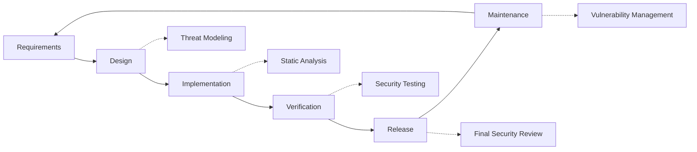

# Меры безопасности {#security-practices}

## Содержание {#table-of-contents}

* [Предисловие](#foreword)
* [Безопасность инфраструктуры](#infrastructure-security)
  * [Безопасные центры обработки данных](#secure-data-centers)
  * [Сетевая безопасность](#network-security)
* [Безопасность электронной почты](#email-security)
  * [Шифрование](#encryption)
  * [Аутентификация и авторизация](#authentication-and-authorization)
  * [Меры по борьбе со злоупотреблениями](#anti-abuse-measures)
* [Защита данных](#data-protection)
  * [Минимизация данных](#data-minimization)
  * [Резервное копирование и восстановление](#backup-and-recovery)
* [Поставщики услуг](#service-providers)
* [Соблюдение и аудит](#compliance-and-auditing)
  * [Регулярные оценки безопасности](#regular-security-assessments)
  * [Согласие](#compliance)
* [Реагирование на инциденты](#incident-response)
* [Жизненный цикл разработки безопасности](#security-development-lifecycle)
* [Усиление защиты сервера](#server-hardening)
* [Соглашение об уровне обслуживания](#service-level-agreement)
* [Безопасность с открытым исходным кодом](#open-source-security)
* [Безопасность сотрудников](#employee-security)
* [Постоянное совершенствование](#continuous-improvement)
* [Дополнительные ресурсы](#additional-resources)

## Предисловие {#foreword}

В Forward Email безопасность — наш главный приоритет. Мы внедрили комплексные меры безопасности для защиты ваших электронных сообщений и персональных данных. В этом документе изложены наши методы обеспечения безопасности и шаги, которые мы предпринимаем для обеспечения конфиденциальности, целостности и доступности вашей электронной почты.

## Безопасность инфраструктуры {#infrastructure-security}

### Безопасные центры обработки данных {#secure-data-centers}

Наша инфраструктура размещена в центрах обработки данных, соответствующих стандарту SOC 2, где есть:

* Круглосуточная физическая безопасность и наблюдение
* Биометрический контроль доступа
* Резервные системы питания
* Расширенное обнаружение и тушение пожара
* Мониторинг окружающей среды

### Сетевая безопасность {#network-security}

Мы реализуем несколько уровней сетевой безопасности:

* Корпоративные межсетевые экраны со строгими списками контроля доступа
* Защита от DDoS-атак и их смягчение
* Регулярное сканирование уязвимостей сети
* Системы обнаружения и предотвращения вторжений
* Шифрование трафика между всеми конечными точками обслуживания
* Защита от сканирования портов с автоматической блокировкой подозрительной активности

> \[!IMPORTANT]
> All data in transit is encrypted using TLS 1.2+ with modern cipher suites.

## Безопасность электронной почты {#email-security}

### Шифрование {#encryption}

* **Безопасность транспортного уровня (TLS)**: весь трафик электронной почты шифруется при передаче с использованием TLS 1.2 или выше
* **Сквозное шифрование**: поддержка стандартов OpenPGP/MIME и S/MIME
* **Шифрование хранилища**: все сохраненные электронные письма шифруются при хранении с использованием шифрования ChaCha20-Poly1305 в файлах SQLite
* **Полное шифрование диска**: шифрование LUKS v2 для всего диска
* **Комплексная защита**: мы реализуем шифрование при хранении, шифрование в памяти и шифрование при передаче

> \[!NOTE]
> We're the world's first and only email service to use **[quantum-resistant and individually encrypted SQLite mailboxes](https://forwardemail.net/en/blog/docs/best-quantum-safe-encrypted-email-service)**.

### Аутентификация и авторизация {#authentication-and-authorization}

* **Подпись DKIM**: все исходящие письма подписываются с помощью DKIM
* **SPF и DMARC**: полная поддержка SPF и DMARC для предотвращения подделки писем
* **MTA-STS**: поддержка MTA-STS для обеспечения шифрования TLS
* **Многофакторная аутентификация**: доступна для доступа ко всем учетным записям

### Меры по борьбе со злоупотреблениями {#anti-abuse-measures}

* **Фильтрация спама**: многоуровневое обнаружение спама с машинным обучением
* **Сканирование на вирусы**: сканирование всех вложений в режиме реального времени
* **Ограничение скорости**: защита от атак методом подбора и перечисления
* **Репутация IP**: мониторинг репутации отправляющего IP
* **Фильтрация контента**: обнаружение вредоносных URL-адресов и попыток фишинга

## Защита данных {#data-protection}

### Минимизация данных {#data-minimization}

Мы следуем принципу минимизации данных:

* Мы собираем только те данные, которые необходимы для предоставления наших услуг
* Содержимое электронной почты обрабатывается в памяти и не хранится постоянно, если только это не требуется для доставки IMAP/POP3
* Журналы анонимизируются и хранятся только столько времени, сколько необходимо

### Резервное копирование и восстановление {#backup-and-recovery}

* Автоматизированное ежедневное резервное копирование с шифрованием
* Географически распределенное хранилище резервных копий
* Регулярное тестирование восстановления резервных копий
* Процедуры аварийного восстановления с определенными RPO и RTO

## Поставщики услуг {#service-providers}

Мы тщательно выбираем наших поставщиков услуг, чтобы гарантировать, что они соответствуют нашим высоким стандартам безопасности. Ниже приведены поставщики, которых мы используем для международной передачи данных, и их статус соответствия GDPR:

| Поставщик | Цель | Сертифицировано DPF | Страница соответствия GDPR |
| --------------------------------------------- | ------------------------- | ------------- | ----------------------------------------------------------------- |
| [Cloudflare](https://www.cloudflare.com) | CDN, защита от DDoS-атак, DNS | ✅ Да | [Cloudflare GDPR](https://www.cloudflare.com/trust-hub/gdpr/) |
| [DataPacket](https://www.datapacket.com) | Серверная инфраструктура | ❌ Нет | [DataPacket Privacy](https://www.datapacket.com/privacy-policy) |
| [Digital Ocean](https://www.digitalocean.com) | Облачная инфраструктура | ❌ Нет | [DigitalOcean GDPR](https://www.digitalocean.com/legal/gdpr) |
| [Vultr](https://www.vultr.com) | Облачная инфраструктура | ❌ Нет | [Vultr GDPR](https://www.vultr.com/legal/eea-gdpr-privacy/) |
| [Stripe](https://stripe.com) | Обработка платежей | ✅ Да | [Stripe Privacy Center](https://stripe.com/legal/privacy-center) |
| [PayPal](https://www.paypal.com) | Обработка платежей | ❌ Нет | [PayPal Privacy](https://www.paypal.com/uk/legalhub/privacy-full) |

Мы используем этих поставщиков для обеспечения надежной и безопасной доставки услуг, сохраняя при этом соответствие международным правилам защиты данных. Все передачи данных осуществляются с использованием соответствующих мер безопасности для защиты вашей личной информации.

## Соответствие требованиям и аудит {#compliance-and-auditing}

### Регулярные оценки безопасности {#regular-security-assessments}

Наша команда регулярно отслеживает, проверяет и оценивает кодовую базу, серверы, инфраструктуру и практики. Мы реализуем комплексную программу безопасности, которая включает:

* Регулярная ротация ключей SSH
* Постоянный мониторинг журналов доступа
* Автоматическое сканирование безопасности
* Проактивное управление уязвимостями
* Регулярное обучение по безопасности для всех членов команды

### Соответствие {#compliance}

* [GDPR](https://forwardemail.net/gdpr) методы обработки данных
* [Соглашение об обработке данных (DPA)](https://forwardemail.net/dpa) доступно для корпоративных клиентов
* Средства управления конфиденциальностью, соответствующие CCPA
* Процессы, прошедшие аудит SOC 2 Тип II

## Реагирование на инциденты {#incident-response}

Наш план реагирования на инциденты безопасности включает:

1. **Обнаружение**: Автоматизированные системы мониторинга и оповещения
2. **Сдерживание**: Немедленная изоляция затронутых систем
3. **Искоренение**: Устранение угрозы и анализ первопричины
4. **Восстановление**: Безопасное восстановление услуг
5. **Уведомление**: Своевременная связь с затронутыми пользователями
6. **Анализ после инцидента**: Всесторонний обзор и улучшение

> \[!WARNING]
> If you discover a security vulnerability, please report it immediately to <security@forwardemail.net>.

## Жизненный цикл разработки безопасности {#security-development-lifecycle}

Весь код подвергается:

* Сбор требований безопасности
* Моделирование угроз во время проектирования
* Безопасные методы кодирования
* Статическое и динамическое тестирование безопасности приложений
* Обзор кода с фокусом на безопасность
* Сканирование уязвимостей зависимостей

## Укрепление сервера {#server-hardening}

Наш [Конфигурация Ansible](https://github.com/forwardemail/forwardemail.net/tree/master/ansible) реализует многочисленные меры по защите сервера:

* **USB Access Disabled**: Физические порты отключены путем внесения в черный список модуля ядра usb-storage
* **Firewall Rules**: Строгие правила iptables, разрешающие только необходимые соединения
* **SSH Hardening**: Только аутентификация на основе ключей, вход без пароля, вход root отключен
* **Service Isolation**: Каждая служба работает с минимальными необходимыми привилегиями
* **Automatic Updates**: Исправления безопасности применяются автоматически
* **Secure Boot**: Проверенный процесс загрузки для предотвращения несанкционированного доступа
* **Kernel Hardening**: Безопасные параметры ядра и конфигурации sysctl
* **File System Restrictions**: Параметры монтирования noexec, nosuid и nodev, где это применимо
* **Core Dumps Disabled**: Система настроена на предотвращение дампов ядра в целях безопасности
* **Swap Disabled**: Память подкачки отключена для предотвращения утечки данных
* **Port Scanning Protection**: Автоматическое обнаружение и блокировка сканирования портов попытки
* **Отключено прозрачные огромные страницы**: THP отключен для повышения производительности и безопасности
* **Усиление системных служб**: необязательные службы, такие как Apport, отключены
* **Управление пользователями**: принцип наименьших привилегий с отдельными пользователями развертывания и devops
* **Ограничения дескрипторов файлов**: увеличенные ограничения для повышения производительности и безопасности

## Соглашение об уровне обслуживания {#service-level-agreement}

Мы поддерживаем высокий уровень доступности и надежности сервиса. Наша инфраструктура разработана для избыточности и отказоустойчивости, чтобы гарантировать, что ваш почтовый сервис останется работоспособным. Хотя мы не публикуем формальный документ SLA, мы обязуемся:

* 99,9%+ времени безотказной работы всех служб
* Быстрое реагирование на сбои в работе служб
* Прозрачная коммуникация во время инцидентов
* Регулярное техническое обслуживание в периоды низкого трафика

## Безопасность с открытым исходным кодом {#open-source-security}

Как [служба с открытым исходным кодом](https://github.com/forwardemail/forwardemail.net), наша система безопасности обеспечивает следующие преимущества:

* Прозрачный код, который может быть проверен любым пользователем
* Улучшения безопасности, инициированные сообществом
* Быстрое выявление и исправление уязвимостей
* Отсутствие безопасности из-за неизвестности

## Безопасность сотрудников {#employee-security}

* Проверка биографических данных всех сотрудников
* Обучение по вопросам безопасности
* Принцип доступа с наименьшими привилегиями
* Регулярное обучение по вопросам безопасности

## Постоянное совершенствование {#continuous-improvement}

Мы постоянно улучшаем нашу позицию по безопасности посредством:

* Мониторинг тенденций безопасности и возникающих угроз
* Регулярный обзор и обновление политик безопасности
* Отзывы от исследователей безопасности и пользователей
* Участие в сообществе безопасности

Для получения дополнительной информации о наших методах обеспечения безопасности или для сообщения о проблемах безопасности обращайтесь по адресу <security@forwardemail.net>.

## Дополнительные ресурсы {#additional-resources}

* [политика конфиденциальности](https://forwardemail.net/en/privacy)
* [Условия обслуживания](https://forwardemail.net/en/terms)
* [Соответствие GDPR](https://forwardemail.net/gdpr)
* [Соглашение об обработке данных (DPA)](https://forwardemail.net/dpa)
* [Сообщить о злоупотреблении](https://forwardemail.net/en/report-abuse)
* [Политика безопасности](https://github.com/forwardemail/.github/blob/main/SECURITY.md)
* [Security.txt](https://forwardemail.net/security.txt)
* [Репозиторий GitHub](https://github.com/forwardemail/forwardemail.net)
* [FAQ](https://forwardemail.net/en/faq)