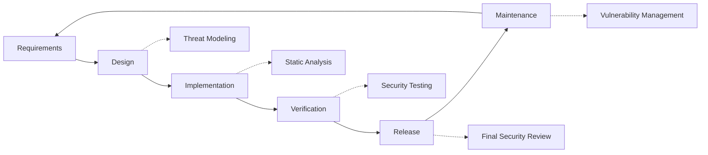

# Меры безопасности {#security-practices}

## Содержание {#table-of-contents}

* [Предисловие](#foreword)
* [Безопасность инфраструктуры](#infrastructure-security)
  * [Безопасные центры обработки данных](#secure-data-centers)
  * [Сетевая безопасность](#network-security)
* [Безопасность электронной почты](#email-security)
  * [Шифрование](#encryption)
  * [Аутентификация и авторизация](#authentication-and-authorization)
  * [Меры по борьбе со злоупотреблениями](#anti-abuse-measures)
* [Защита данных](#data-protection)
  * [Минимизация данных](#data-minimization)
  * [Резервное копирование и восстановление](#backup-and-recovery)
* [Поставщики услуг](#service-providers)
* [Соблюдение требований и аудит](#compliance-and-auditing)
  * [Регулярные оценки безопасности](#regular-security-assessments)
  * [Согласие](#compliance)
* [Реагирование на инциденты](#incident-response)
* [Жизненный цикл разработки безопасности](#security-development-lifecycle)
* [Укрепление сервера](#server-hardening)
* [Соглашение об уровне обслуживания](#service-level-agreement)
* [Безопасность с открытым исходным кодом](#open-source-security)
* [Безопасность сотрудников](#employee-security)
* [Постоянное совершенствование](#continuous-improvement)
* [Дополнительные ресурсы](#additional-resources)

## Предисловие {#foreword}

В Forward Email безопасность — наш главный приоритет. Мы внедрили комплексные меры безопасности для защиты ваших электронных писем и персональных данных. В этом документе описаны наши методы обеспечения безопасности и шаги, предпринимаемые для обеспечения конфиденциальности, целостности и доступности вашей электронной почты.

## Безопасность инфраструктуры {#infrastructure-security}

### Безопасные центры обработки данных {#secure-data-centers}

Наша инфраструктура размещена в центрах обработки данных, соответствующих стандарту SOC 2, с:

* Круглосуточная физическая охрана и видеонаблюдение
* Биометрический контроль доступа
* Резервные системы электропитания
* Современные системы обнаружения и тушения пожаров
* Мониторинг окружающей среды

### Сетевая безопасность {#network-security}

Мы реализуем несколько уровней сетевой безопасности:

* Межсетевые экраны корпоративного уровня со строгими списками контроля доступа
* Защита от DDoS-атак и их устранение
* Регулярное сканирование уязвимостей сети
* Системы обнаружения и предотвращения вторжений
* Шифрование трафика между всеми конечными точками обслуживания
* Защита от сканирования портов с автоматической блокировкой подозрительной активности

> \[!IMPORTANT]
> Все передаваемые данные шифруются с использованием протокола TLS 1.2+ с использованием современных алгоритмов шифрования.

## Безопасность электронной почты {#email-security}

### Шифрование {#encryption}

* **Безопасность транспортного уровня (TLS)**: весь трафик электронной почты шифруется при передаче с использованием протокола TLS 1.2 или выше.
* **Сквозное шифрование**: поддержка стандартов OpenPGP/MIME и S/MIME.
* **Шифрование хранилища**: все хранимые электронные письма шифруются при хранении с использованием алгоритма ChaCha20-Poly1305 в файлах SQLite.
* **Полное шифрование диска**: шифрование LUKS v2 для всего диска.
* **Комплексная защита**: мы реализуем шифрование при хранении, шифрование в памяти и шифрование при передаче.

> \[!NOTE]
> Мы — первый и единственный в мире почтовый сервис, использующий **[квантово-устойчивые и индивидуально зашифрованные почтовые ящики SQLite](https://forwardemail.net/en/blog/docs/best-quantum-safe-encrypted-email-service)**.

### Аутентификация и авторизация {#authentication-and-authorization}

* **Подпись DKIM**: Все исходящие письма подписываются DKIM.
* **SPF и DMARC**: Полная поддержка SPF и DMARC для предотвращения подмены писем.
* **MTA-STS**: Поддержка MTA-STS для обеспечения шифрования TLS.
* **Многофакторная аутентификация**: Доступна для всех учётных записей.

### Меры по борьбе со злоупотреблениями {#anti-abuse-measures}

* **Фильтрация спама**: Многоуровневое обнаружение спама с использованием машинного обучения
* **Сканирование на вирусы**: Сканирование всех вложений в режиме реального времени
* **Ограничение скорости**: Защита от атак методом подбора и перебора паролей
* **Репутация IP-адреса**: Мониторинг репутации IP-адреса отправителя
* **Фильтрация контента**: Обнаружение вредоносных URL-адресов и попыток фишинга

## Защита данных {#data-protection}

### Минимизация данных {#data-minimization}

Мы следуем принципу минимизации данных:

* Мы собираем только те данные, которые необходимы для предоставления наших услуг.
* Содержимое электронных писем обрабатывается в памяти и не хранится постоянно, за исключением случаев, когда это требуется для доставки по протоколам IMAP/POP3.
* Журналы анонимизируются и хранятся только в течение необходимого времени.

### Резервное копирование и восстановление {#backup-and-recovery}

* Автоматизированное ежедневное резервное копирование с шифрованием
* Географически распределенное хранилище резервных копий
* Регулярное тестирование восстановления из резервных копий
* Процедуры аварийного восстановления с заданными RPO и RTO

## Поставщики услуг {#service-providers}

Мы тщательно выбираем поставщиков услуг, чтобы гарантировать их соответствие нашим высоким стандартам безопасности. Ниже перечислены поставщики, которые мы используем для международной передачи данных, и их статус соответствия GDPR:

| Поставщик | Цель | Сертифицировано DPF | Страница соответствия GDPR |
| --------------------------------------------- | ------------------------- | ------------- | ----------------------------------------------------------------- |
| [Cloudflare](https://www.cloudflare.com) | CDN, защита от DDoS-атак, DNS | ✅ Да | [Cloudflare GDPR](https://www.cloudflare.com/trust-hub/gdpr/) |
| [DataPacket](https://www.datapacket.com) | Серверная инфраструктура | ❌ Нет | [DataPacket Privacy](https://www.datapacket.com/privacy-policy) |
| [Digital Ocean](https://www.digitalocean.com) | Облачная инфраструктура | ❌ Нет | [DigitalOcean GDPR](https://www.digitalocean.com/legal/gdpr) |
| [Vultr](https://www.vultr.com) | Облачная инфраструктура | ❌ Нет | [Vultr GDPR](https://www.vultr.com/legal/eea-gdpr-privacy/) |
| [Stripe](https://stripe.com) | Обработка платежей | ✅ Да | [Stripe Privacy Center](https://stripe.com/legal/privacy-center) |
| [PayPal](https://www.paypal.com) | Обработка платежей | ❌ Нет | [PayPal Privacy](https://www.paypal.com/uk/legalhub/privacy-full) |

Мы пользуемся услугами этих поставщиков для обеспечения надёжного и безопасного предоставления услуг с соблюдением международных норм защиты данных. Вся передача данных осуществляется с использованием соответствующих мер безопасности для защиты вашей персональной информации.

## Соответствие требованиям и аудит {#compliance-and-auditing}

### Регулярные оценки безопасности {#regular-security-assessments}

Наша команда регулярно отслеживает, проверяет и оценивает кодовую базу, серверы, инфраструктуру и применяемые методы. Мы внедряем комплексную программу безопасности, которая включает в себя:

* Регулярная ротация SSH-ключей
* Постоянный мониторинг журналов доступа
* Автоматизированное сканирование безопасности
* Проактивное управление уязвимостями
* Регулярное обучение по безопасности для всех членов команды

### Соответствие {#compliance}

* Практики обработки данных, соответствующие [GDPR](https://forwardemail.net/gdpr)
* [Соглашение об обработке данных (DPA)](https://forwardemail.net/dpa) доступен для корпоративных клиентов
* Средства управления конфиденциальностью, соответствующие CCPA
* Процессы, прошедшие аудит SOC 2 Тип II

## Реагирование на инциденты {#incident-response}

Наш план реагирования на инциденты безопасности включает:

1. **Обнаружение**: Автоматизированные системы мониторинга и оповещения
2. **Сдерживание**: Немедленная изоляция затронутых систем
3. **Устранение**: Устранение угрозы и анализ первопричин
4. **Восстановление**: Безопасное восстановление сервисов
5. **Уведомление**: Своевременное информирование затронутых пользователей
6. **Анализ после инцидента**: Комплексный анализ и улучшение

> \[!WARNING]
> Если вы обнаружили уязвимость безопасности, немедленно сообщите об этом по адресу <security@forwardemail.net>.

## Жизненный цикл разработки безопасности {#security-development-lifecycle}

Весь код подвергается:

* Сбор требований безопасности
* Моделирование угроз на этапе проектирования
* Безопасные методы кодирования
* Статическое и динамическое тестирование безопасности приложений
* Проверка кода с акцентом на безопасность
* Сканирование уязвимостей зависимостей

## Укрепление сервера {#server-hardening}

Наш [Конфигурация Ansible](https://github.com/forwardemail/forwardemail.net/tree/master/ansible) реализует многочисленные меры по защите сервера:

* **Доступ к USB отключен**: Физические порты отключены путём добавления модуля ядра usb-storage в чёрный список.
* **Правила брандмауэра**: Строгие правила iptables, разрешающие только необходимые соединения.
* **Усиление защиты SSH**: Только аутентификация по ключам, вход без пароля, вход с правами root отключен.
* **Изоляция служб**: Каждая служба работает с минимальными необходимыми привилегиями.
* **Автоматические обновления**: Исправления безопасности применяются автоматически.
* **Безопасная загрузка**: Проверенная загрузка для предотвращения несанкционированного доступа.
* **Усиление защиты ядра**: Безопасные параметры ядра и конфигурации sysctl.
* **Ограничения файловой системы**: Параметры монтирования noexec, nosuid и nodev, где это применимо.
* **Дампы ядра отключены**: Система настроена на предотвращение дампов ядра в целях безопасности.
* **Подкачка отключена**: Подкачка памяти отключена для предотвращения утечки данных.
* **Защита от сканирования портов**: Автоматическое обнаружение и блокировка сканирования портов. Попытки
* **Прозрачные огромные страницы отключены**: THP отключен для повышения производительности и безопасности
* **Усиление защиты системных служб**: Необязательные службы, такие как Apport, отключены
* **Управление пользователями**: Принцип наименьших привилегий с разделением пользователей для развертывания и DevOps
* **Ограничения на количество файловых дескрипторов**: Увеличенные ограничения для повышения производительности и безопасности

## Соглашение об уровне обслуживания {#service-level-agreement}

Мы поддерживаем высокий уровень доступности и надежности сервиса. Наша инфраструктура разработана с учётом резервирования и отказоустойчивости, чтобы гарантировать бесперебойную работу вашей электронной почты. Хотя мы не публикуем официальное соглашение об уровне обслуживания (SLA), мы обязуемся:

* Более 99,9% времени безотказной работы всех сервисов
* Быстрое реагирование на сбои в работе сервисов
* Прозрачное взаимодействие во время инцидентов
* Регулярное техническое обслуживание в периоды низкой нагрузки

## Безопасность с открытым исходным кодом {#open-source-security}

Как [служба с открытым исходным кодом](https://github.com/forwardemail/forwardemail.net), наша безопасность выигрывает за счет:

* Прозрачный код, доступный для аудита любым пользователем
* Улучшения безопасности, инициированные сообществом
* Быстрое выявление и устранение уязвимостей
* Отсутствие безопасности через неизвестность

## Безопасность сотрудников {#employee-security}

* Проверка биографических данных всех сотрудников
* Обучение по вопросам безопасности
* Принцип минимальных привилегий доступа
* Регулярное обучение по вопросам безопасности

## Постоянное совершенствование {#continuous-improvement}

Мы постоянно улучшаем нашу позицию по безопасности посредством:

* Мониторинг тенденций безопасности и возникающих угроз
* Регулярный пересмотр и обновление политик безопасности
* Отзывы исследователей и пользователей безопасности
* Участие в жизни сообщества специалистов по безопасности

Чтобы получить дополнительную информацию о наших методах обеспечения безопасности или сообщить о проблемах безопасности, свяжитесь с нами по адресу <security@forwardemail.net>.

## Дополнительные ресурсы {#additional-resources}

* [политика конфиденциальности](https://forwardemail.net/en/privacy)
* [Условия обслуживания](https://forwardemail.net/en/terms)
* [Соответствие GDPR](https://forwardemail.net/gdpr)
* [Соглашение об обработке данных (DPA)](https://forwardemail.net/dpa)
* [Сообщить о нарушении](https://forwardemail.net/en/report-abuse)
* [Политика безопасности](https://github.com/forwardemail/.github/blob/main/SECURITY.md)
* [Security.txt](https://forwardemail.net/security.txt)
* [Репозиторий GitHub](https://github.com/forwardemail/forwardemail.net)
* [FAQ](https://forwardemail.net/en/faq)