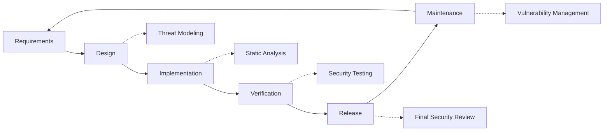

# Практики безопасности {#security-practices}

## Содержание {#table-of-contents}

* [Предисловие](#foreword)
* [Безопасность инфраструктуры](#infrastructure-security)
  * [Безопасные дата-центры](#secure-data-centers)
  * [Сетевая безопасность](#network-security)
* [Безопасность электронной почты](#email-security)
  * [Шифрование](#encryption)
  * [Аутентификация и авторизация](#authentication-and-authorization)
  * [Меры против злоупотреблений](#anti-abuse-measures)
* [Защита данных](#data-protection)
  * [Минимизация данных](#data-minimization)
  * [Резервное копирование и восстановление](#backup-and-recovery)
* [Поставщики услуг](#service-providers)
* [Соответствие и аудит](#compliance-and-auditing)
  * [Регулярные оценки безопасности](#regular-security-assessments)
  * [Соответствие требованиям](#compliance)
* [Реагирование на инциденты](#incident-response)
* [Жизненный цикл разработки безопасности](#security-development-lifecycle)
* [Укрепление серверов](#server-hardening)
* [Соглашение об уровне обслуживания](#service-level-agreement)
* [Безопасность с открытым исходным кодом](#open-source-security)
* [Безопасность сотрудников](#employee-security)
* [Непрерывное улучшение](#continuous-improvement)
* [Дополнительные ресурсы](#additional-resources)

## Предисловие {#foreword}

В Forward Email безопасность — наш главный приоритет. Мы внедрили комплексные меры безопасности для защиты вашей электронной переписки и персональных данных. В этом документе изложены наши практики безопасности и шаги, которые мы предпринимаем для обеспечения конфиденциальности, целостности и доступности вашей электронной почты.

## Безопасность инфраструктуры {#infrastructure-security}

### Безопасные дата-центры {#secure-data-centers}

Наша инфраструктура размещена в дата-центрах, соответствующих стандарту SOC 2, с:

* круглосуточной физической охраной и видеонаблюдением
* биометрическим контролем доступа
* резервными системами электропитания
* современными системами обнаружения и тушения пожаров
* мониторингом окружающей среды

### Сетевая безопасность {#network-security}

Мы реализуем несколько уровней сетевой безопасности:

* корпоративные межсетевые экраны с жесткими списками контроля доступа
* защита и смягчение DDoS-атак
* регулярное сканирование сети на уязвимости
* системы обнаружения и предотвращения вторжений
* шифрование трафика между всеми конечными точками сервиса
* защита от сканирования портов с автоматической блокировкой подозрительной активности

> \[!IMPORTANT]
> Все данные в транзите шифруются с использованием TLS 1.2+ с современными наборами шифров.

## Безопасность электронной почты {#email-security}

### Шифрование {#encryption}

* **Transport Layer Security (TLS)**: Весь почтовый трафик шифруется в транзите с использованием TLS 1.2 или выше
* **Конечное шифрование (End-to-End Encryption)**: Поддержка стандартов OpenPGP/MIME и S/MIME
* **Шифрование хранения**: Все сохранённые письма шифруются в состоянии покоя с использованием ChaCha20-Poly1305 в файлах SQLite
* **Полное шифрование диска**: Шифрование всего диска с помощью LUKS v2
* **Комплексная защита**: Мы реализуем шифрование в состоянии покоя, в памяти и в транзите

> \[!NOTE]
> Мы — первая и единственная в мире почтовая служба, использующая **[квантово-устойчивые и индивидуально зашифрованные почтовые ящики SQLite](https://forwardemail.net/en/blog/docs/best-quantum-safe-encrypted-email-service)**.

### Аутентификация и авторизация {#authentication-and-authorization}

* **Подпись DKIM**: Все исходящие письма подписываются с помощью DKIM
* **SPF и DMARC**: Полная поддержка SPF и DMARC для предотвращения подделки писем
* **MTA-STS**: Поддержка MTA-STS для принудительного использования TLS-шифрования
* **Многофакторная аутентификация**: Доступна для всех аккаунтов

### Меры против злоупотреблений {#anti-abuse-measures}

* **Фильтрация спама**: Многоуровневое обнаружение спама с использованием машинного обучения
* **Сканирование на вирусы**: Проверка всех вложений в режиме реального времени
* **Ограничение скорости**: Защита от атак перебора и перечисления
* **Репутация IP**: Мониторинг репутации IP-адресов отправителей
* **Фильтрация контента**: Обнаружение вредоносных URL и фишинговых попыток

## Защита данных {#data-protection}

### Минимизация данных {#data-minimization}

Мы придерживаемся принципа минимизации данных:

* Собираем только те данные, которые необходимы для предоставления сервиса
* Содержимое писем обрабатывается в памяти и не сохраняется постоянно, если это не требуется для доставки через IMAP/POP3
* Логи анонимизируются и хранятся только столько, сколько необходимо
### Резервное копирование и восстановление {#backup-and-recovery}

* Автоматическое ежедневное резервное копирование с шифрованием
* Географически распределённое хранилище резервных копий
* Регулярное тестирование восстановления из резервных копий
* Процедуры аварийного восстановления с определёнными RPO и RTO

## Поставщики услуг {#service-providers}

Мы тщательно выбираем наших поставщиков услуг, чтобы гарантировать соответствие высоким стандартам безопасности. Ниже приведены поставщики, которых мы используем для международной передачи данных, и их статус соответствия GDPR:

| Поставщик                                     | Назначение                | Сертифицирован DPF | Страница соответствия GDPR                                                                              |
| --------------------------------------------- | -------------------------- | ------------------ | ------------------------------------------------------------------------------------------------------- |
| [Cloudflare](https://www.cloudflare.com)      | CDN, защита от DDoS, DNS  | ✅ Да              | [Cloudflare GDPR](https://www.cloudflare.com/trust-hub/gdpr/)                                           |
| [DataPacket](https://www.datapacket.com)      | Серверная инфраструктура  | ❌ Нет             | [DataPacket Privacy](https://www.datapacket.com/privacy-policy)                                         |
| [Digital Ocean](https://www.digitalocean.com) | Облачная инфраструктура   | ❌ Нет             | [DigitalOcean GDPR](https://www.digitalocean.com/legal/gdpr)                                            |
| [GitHub](https://github.com)                  | Хостинг исходного кода, CI/CD | ✅ Да           | [GitHub GDPR](https://docs.github.com/en/site-policy/privacy-policies/github-data-protection-agreement) |
| [Vultr](https://www.vultr.com)                | Облачная инфраструктура   | ❌ Нет             | [Vultr GDPR](https://www.vultr.com/legal/eea-gdpr-privacy/)                                             |
| [Stripe](https://stripe.com)                  | Обработка платежей        | ✅ Да              | [Stripe Privacy Center](https://stripe.com/legal/privacy-center)                                        |
| [PayPal](https://www.paypal.com)              | Обработка платежей        | ❌ Нет             | [PayPal Privacy](https://www.paypal.com/uk/legalhub/privacy-full)                                       |

Мы используем этих поставщиков для обеспечения надёжного и безопасного предоставления услуг при соблюдении международных правил защиты данных. Все передачи данных осуществляются с применением соответствующих мер защиты для охраны вашей личной информации.

## Соответствие и аудит {#compliance-and-auditing}

### Регулярные оценки безопасности {#regular-security-assessments}

Наша команда регулярно контролирует, проверяет и оценивает кодовую базу, серверы, инфраструктуру и практики. Мы внедряем комплексную программу безопасности, которая включает:

* Регулярную ротацию SSH-ключей
* Непрерывный мониторинг журналов доступа
* Автоматизированное сканирование безопасности
* Проактивное управление уязвимостями
* Регулярное обучение безопасности всех членов команды

### Соответствие {#compliance}

* Практики обработки данных, соответствующие [GDPR](https://forwardemail.net/gdpr)
* [Соглашение об обработке данных (DPA)](https://forwardemail.net/dpa) доступно для корпоративных клиентов
* Контроль конфиденциальности, соответствующий CCPA
* Процессы, прошедшие аудит SOC 2 Type II

## Реагирование на инциденты {#incident-response}

Наш план реагирования на инциденты безопасности включает:

1. **Обнаружение**: Автоматизированные системы мониторинга и оповещения
2. **Локализация**: Немедленная изоляция затронутых систем
3. **Устранение**: Удаление угрозы и анализ первопричины
4. **Восстановление**: Безопасное восстановление сервисов
5. **Уведомление**: Своевременное информирование затронутых пользователей
6. **Анализ после инцидента**: Всесторонний обзор и улучшение

> \[!WARNING]
> Если вы обнаружили уязвимость в безопасности, пожалуйста, немедленно сообщите об этом на <security@forwardemail.net>.

## Жизненный цикл разработки безопасности {#security-development-lifecycle}

```mermaid
flowchart LR
    A[Requirements] --> B[Design]
    B --> C[Implementation]
    C --> D[Verification]
    D --> E[Release]
    E --> F[Maintenance]
    F --> A
    B -.-> G[Threat Modeling]
    C -.-> H[Static Analysis]
    D -.-> I[Security Testing]
    E -.-> J[Final Security Review]
    F -.-> K[Vulnerability Management]
```
Весь код проходит:

* Сбор требований по безопасности
* Моделирование угроз на этапе проектирования
* Практики безопасного программирования
* Статическое и динамическое тестирование безопасности приложений
* Рецензирование кода с акцентом на безопасность
* Сканирование уязвимостей зависимостей

## Укрепление сервера {#server-hardening}

Наш [Ansible конфиг](https://github.com/forwardemail/forwardemail.net/tree/master/ansible) реализует множество мер по укреплению сервера:

* **Доступ к USB отключен**: Физические порты отключены путем занесения модуля ядра usb-storage в черный список
* **Правила файрвола**: Строгие правила iptables, разрешающие только необходимые подключения
* **Укрепление SSH**: Только аутентификация по ключу, без входа по паролю, вход root отключен
* **Изоляция сервисов**: Каждый сервис работает с минимально необходимыми привилегиями
* **Автоматические обновления**: Патчи безопасности применяются автоматически
* **Безопасная загрузка**: Проверенный процесс загрузки для предотвращения подмены
* **Укрепление ядра**: Безопасные параметры ядра и конфигурации sysctl
* **Ограничения файловой системы**: опции монтирования noexec, nosuid и nodev там, где это уместно
* **Отключение дампов памяти**: Система настроена на предотвращение создания core dump для безопасности
* **Отключение swap**: Swap-память отключена для предотвращения утечки данных
* **Защита от сканирования портов**: Автоматическое обнаружение и блокировка попыток сканирования портов
* **Отключение Transparent Huge Pages**: THP отключены для повышения производительности и безопасности
* **Укрепление системных сервисов**: Отключены несущественные сервисы, такие как Apport
* **Управление пользователями**: Принцип наименьших привилегий с отдельными пользователями deploy и devops
* **Лимиты дескрипторов файлов**: Повышенные лимиты для лучшей производительности и безопасности

## Соглашение об уровне обслуживания {#service-level-agreement}

Мы поддерживаем высокий уровень доступности и надежности сервиса. Наша инфраструктура спроектирована с учетом избыточности и отказоустойчивости, чтобы обеспечить бесперебойную работу вашей почты. Хотя мы не публикуем формальный документ SLA, мы обязуемся:

* 99.9%+ времени безотказной работы всех сервисов
* Быстрой реакции на сбои в работе
* Прозрачной коммуникации во время инцидентов
* Регулярного обслуживания в периоды низкой нагрузки

## Безопасность с открытым исходным кодом {#open-source-security}

Как [сервис с открытым исходным кодом](https://github.com/forwardemail/forwardemail.net), наша безопасность обеспечивается:

* Прозрачным кодом, который может проверить любой
* Улучшениями безопасности, инициируемыми сообществом
* Быстрым выявлением и исправлением уязвимостей
* Отсутствием безопасности за счет секретности

## Безопасность сотрудников {#employee-security}

* Проверка биографии всех сотрудников
* Обучение осведомленности по безопасности
* Доступ по принципу наименьших привилегий
* Регулярное обучение по безопасности

## Непрерывное улучшение {#continuous-improvement}

Мы постоянно улучшаем нашу безопасность через:

* Мониторинг тенденций безопасности и новых угроз
* Регулярный пересмотр и обновление политик безопасности
* Обратную связь от исследователей безопасности и пользователей
* Участие в сообществе безопасности

Для получения дополнительной информации о наших практиках безопасности или для сообщения о проблемах безопасности, пожалуйста, свяжитесь с <security@forwardemail.net>.

## Дополнительные ресурсы {#additional-resources}

* [Политика конфиденциальности](https://forwardemail.net/en/privacy)
* [Условия обслуживания](https://forwardemail.net/en/terms)
* [Соответствие GDPR](https://forwardemail.net/gdpr)
* [Соглашение об обработке данных (DPA)](https://forwardemail.net/dpa)
* [Сообщить о злоупотреблении](https://forwardemail.net/en/report-abuse)
* [Политика безопасности](https://github.com/forwardemail/.github/blob/main/SECURITY.md)
* [Security.txt](https://forwardemail.net/security.txt)
* [Репозиторий GitHub](https://github.com/forwardemail/forwardemail.net)
* [Часто задаваемые вопросы](https://forwardemail.net/en/faq)
