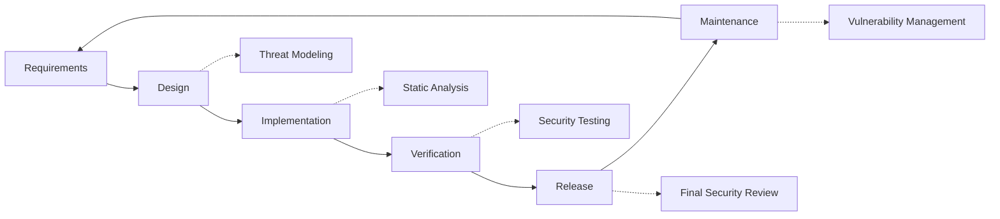

# Säkerhetsrutiner {#security-practices}

## Innehållsförteckning {#table-of-contents}

* [Förord](#foreword)
* [Infrastruktursäkerhet](#infrastructure-security)
  * [Säkra datacenter](#secure-data-centers)
  * [Nätverkssäkerhet](#network-security)
* [E-postsäkerhet](#email-security)
  * [Kryptering](#encryption)
  * [Autentisering och auktorisering](#authentication-and-authorization)
  * [Åtgärder mot missbruk](#anti-abuse-measures)
* [Dataskydd](#data-protection)
  * [Dataminimering](#data-minimization)
  * [Säkerhetskopiering och återställning](#backup-and-recovery)
* [Tjänsteleverantörer](#service-providers)
* [Efterlevnad och revision](#compliance-and-auditing)
  * [Regelbundna säkerhetsbedömningar](#regular-security-assessments)
  * [Efterlevnad](#compliance)
* [Incident Response](#incident-response)
* [Säkerhetsutveckling livscykel](#security-development-lifecycle)
* [Serverhärdning](#server-hardening)
* [Servicenivåavtal](#service-level-agreement)
* [Säkerhet med öppen källkod](#open-source-security)
* [Personalsäkerhet](#employee-security)
* [Kontinuerlig förbättring](#continuous-improvement)
* [Ytterligare resurser](#additional-resources)

## Förord {#foreword}

Hos Forward Email är säkerhet vår högsta prioritet. Vi har implementerat omfattande säkerhetsåtgärder för att skydda din e-postkommunikation och personliga data. Det här dokumentet beskriver våra säkerhetsrutiner och de steg vi vidtar för att säkerställa konfidentialitet, integritet och tillgänglighet för din e-post.

## Infrastruktursäkerhet {#infrastructure-security}

### Säkra datacenter {#secure-data-centers}

Vår infrastruktur är värd i SOC 2-kompatibla datacenter med:

* Fysisk säkerhet och övervakning dygnet runt
* Biometriska åtkomstkontroller
* Redundanta strömförsörjningssystem
* Avancerad branddetektering och brandsläckning
* Miljöövervakning

### Nätverkssäkerhet {#network-security}

Vi implementerar flera lager av nätverkssäkerhet:

* Brandväggar i företagsklass med strikta åtkomstkontrolllistor
* DDoS-skydd och -reducering
* Regelbunden skanning av nätverkssårbarheter
* System för att upptäcka och förebygga intrång
* Trafikkryptering mellan alla tjänsteslutpunkter
* Portskanningsskydd med automatisk blockering av misstänkt aktivitet

> \[!IMPORTANT]
> All data in transit is encrypted using TLS 1.2+ with modern cipher suites.

## E-postsäkerhet {#email-security}

### Kryptering {#encryption}

* **Transport Layer Security (TLS)**: All e-posttrafik krypteras under överföring med TLS 1.2 eller högre
* **End-to-End-kryptering**: Stöd för OpenPGP/MIME- och S/MIME-standarder
* **Lagringskryptering**: Alla lagrade e-postmeddelanden krypteras i vila med ChaCha20-Poly1305-kryptering i SQLite-filer
* **Fullständig diskkryptering**: LUKS v2-kryptering för hela disken
* **Omfattande skydd**: Vi implementerar kryptering i vila, kryptering i minnet och kryptering under överföring

> \[!NOTE]
> We're the world's first and only email service to use **[quantum-resistant and individually encrypted SQLite mailboxes](https://forwardemail.net/en/blog/docs/best-quantum-safe-encrypted-email-service)**.

### Autentisering och auktorisering {#authentication-and-authorization}

* **DKIM-signering**: Alla utgående e-postmeddelanden signeras med DKIM
* **SPF och DMARC**: Fullt stöd för SPF och DMARC för att förhindra e-postförfalskning
* **MTA-STS**: Stöd för MTA-STS för att framtvinga TLS-kryptering
* **Multifaktorautentisering**: Tillgängligt för all kontoåtkomst

### Åtgärder mot missbruk {#anti-abuse-measures}

* **Spamfiltrering**: Flerskiktad spamdetektering med maskininlärning
* **Virusskanning**: Realtidsskanning av alla bilagor
* **Hastighetsbegränsning**: Skydd mot brute force- och uppräkningsattacker
* **IP-rykte**: Övervakning av avsändarens IP-rykte
* **Innehållsfiltrering**: Detektering av skadliga webbadresser och nätfiskeförsök

## Dataskydd {#data-protection}

### Dataminimering {#data-minimization}

Vi följer principen om dataminimering:

* Vi samlar endast in de uppgifter som är nödvändiga för att tillhandahålla vår tjänst.
* E-postinnehåll bearbetas i minnet och lagras inte permanent om det inte krävs för IMAP/POP3-leverans.
* Loggar anonymiseras och sparas endast så länge som det är nödvändigt.

### Säkerhetskopiering och återställning {#backup-and-recovery}

* Automatiserade dagliga säkerhetskopior med kryptering
* Geografiskt distribuerad lagring av säkerhetskopior
* Regelbunden testning av återställning av säkerhetskopior
* Katastrofåterställningsprocedurer med definierade RPO och RTO

## Tjänsteleverantörer {#service-providers}

Vi väljer noggrant ut våra tjänsteleverantörer för att säkerställa att de uppfyller våra höga säkerhetsstandarder. Nedan är de leverantörer vi använder för internationell dataöverföring och deras GDPR-efterlevnadsstatus:

| Leverantör | Ändamål | DPF-certifierad | Sida om efterlevnad av GDPR |
| --------------------------------------------- | ------------------------- | ------------- | ----------------------------------------------------------------- |
| [Cloudflare](https://www.cloudflare.com) | CDN, DDoS-skydd, DNS | ✅ Ja | [Cloudflare GDPR](https://www.cloudflare.com/trust-hub/gdpr/) |
| [DataPacket](https://www.datapacket.com) | Serverinfrastruktur | ❌ Nej | [DataPacket Privacy](https://www.datapacket.com/privacy-policy) |
| [Digital Ocean](https://www.digitalocean.com) | Molninfrastruktur | ❌ Nej | [DigitalOcean GDPR](https://www.digitalocean.com/legal/gdpr) |
| [Vultr](https://www.vultr.com) | Molninfrastruktur | ❌ Nej | [Vultr GDPR](https://www.vultr.com/legal/eea-gdpr-privacy/) |
| [Stripe](https://stripe.com) | Betalningshantering | ✅ Ja | [Stripe Privacy Center](https://stripe.com/legal/privacy-center) |
| [PayPal](https://www.paypal.com) | Betalningshantering | ❌ Nej | [PayPal Privacy](https://www.paypal.com/uk/legalhub/privacy-full) |

Vi använder dessa leverantörer för att säkerställa tillförlitlig, säker tjänsteleverans samtidigt som vi upprätthåller efterlevnad av internationella dataskyddsbestämmelser. Alla dataöverföringar utförs med lämpliga skyddsåtgärder för att skydda din personliga information.

## Efterlevnad och revision {#compliance-and-auditing}

### Regelbundna säkerhetsbedömningar {#regular-security-assessments}

Vårt team övervakar, granskar och utvärderar regelbundet kodbasen, servrarna, infrastrukturen och metoderna. Vi implementerar ett omfattande säkerhetsprogram som inkluderar:

* Regelbunden rotation av SSH-nycklar
* Kontinuerlig övervakning av åtkomstloggar
* Automatiserad säkerhetsskanning
* Proaktiv sårbarhetshantering
* Regelbunden säkerhetsutbildning för alla teammedlemmar

### Efterlevnad {#compliance}

* [GDPR](https://forwardemail.net/gdpr)-kompatibla datahanteringspraxis
* [Databearbetningsavtal (DPA)](https://forwardemail.net/dpa) tillgänglig för företagskunder
* CCPA-kompatibla integritetskontroller
* SOC 2 Typ II granskade processer

## Incidentrespons {#incident-response}

Vår åtgärdsplan för säkerhetsincidenter inkluderar:

1. **Upptäckt**: Automatiserade övervaknings- och varningssystem
2. **Inneslutning**: Omedelbar isolering av berörda system
3. **Utrotning**: Borttagning av hotet och analys av rotorsaksen
4. **Återställning**: Säker återställning av tjänster
5. **Meddelande**: Snabb kommunikation med berörda användare
6. **Analys efter incident**: Omfattande granskning och förbättring

> \[!WARNING]
> If you discover a security vulnerability, please report it immediately to <security@forwardemail.net>.

## Säkerhetsutvecklingslivscykel {#security-development-lifecycle}

All kod genomgår:

* Insamling av säkerhetskrav
* Hotmodellering under design
* Säkra kodningsrutiner
* Statisk och dynamisk säkerhetstestning av applikationer
* Kodgranskning med säkerhetsfokus
* Skanning av beroendens sårbarheter

## Serverhärdning {#server-hardening}

Vår [Ansible konfiguration](https://github.com/forwardemail/forwardemail.net/tree/master/ansible) implementerar ett flertal serverhärdningsåtgärder:

* **USB-åtkomst inaktiverad**: Fysiska portar inaktiveras genom att svartlista usb-storage-kärnmodulen
* **Brandväggsregler**: Strikta iptables-regler som endast tillåter nödvändiga anslutningar
* **SSH-härdning**: Endast nyckelbaserad autentisering, ingen lösenordsinloggning, root-inloggning inaktiverad
* **Tjänstisolering**: Varje tjänst körs med minimala nödvändiga behörigheter
* **Automatiska uppdateringar**: Säkerhetspatchar tillämpas automatiskt
* **Säker start**: Verifierad startprocess för att förhindra manipulering
* **Kärnhärdning**: Säkra kärnparametrar och sysctl-konfigurationer
* **Filsystembegränsningar**: noexec-, nosuid- och nodev-monteringsalternativ där det är lämpligt
* **Core Dumps inaktiverade**: Systemet är konfigurerat för att förhindra core dumps för säkerhet
* **Swap inaktiverad**: Swap-minne inaktiverat för att förhindra dataläckage
* **Portskanningsskydd**: Automatisk detektering och blockering av portskanningsförsök
* **Transparent Huge Pages inaktiverade**: THP inaktiverat för förbättrad prestanda och säkerhet
* **Systemtjänsthärdning**: Icke-nödvändiga tjänster som Apport inaktiverade
* **Användare Hantering**: Principen om minsta behörighet med separata deploy- och devops-användare
* **Gränser för filbeskrivningar**: Ökade gränser för bättre prestanda och säkerhet

## Servicenivåavtal {#service-level-agreement}

Vi upprätthåller en hög nivå av servicetillgänglighet och tillförlitlighet. Vår infrastruktur är designad för redundans och feltolerans för att säkerställa att din e-posttjänst förblir i drift. Även om vi inte publicerar ett formellt SLA-dokument, har vi åtagit oss att:

* 99,9 %+ drifttid för alla tjänster
* Snabb respons vid avbrott i tjänsten
* Transparent kommunikation vid incidenter
* Regelbundet underhåll under perioder med låg trafik

## Öppen källkodssäkerhet {#open-source-security}

Som en [öppen källkodstjänst](https://github.com/forwardemail/forwardemail.net) drar vår säkerhet nytta av:

* Transparent kod som kan granskas av vem som helst
* Gemenskapsdrivna säkerhetsförbättringar
* Snabb identifiering och patchning av sårbarheter
* Ingen säkerhet genom oklarhet

## Medarbetarsäkerhet {#employee-security}

* Bakgrundskontroller för alla anställda
* Säkerhetsmedvetenhetsutbildning
* Principen om minsta möjliga åtkomsträtt
* Regelbunden säkerhetsutbildning

## Kontinuerlig förbättring {#continuous-improvement}

Vi förbättrar kontinuerligt vår säkerhetsställning genom:

* Övervakning av säkerhetstrender och framväxande hot
* Regelbunden granskning och uppdateringar av säkerhetspolicyer
* Feedback från säkerhetsforskare och användare
* Deltagande i säkerhetsgemenskapen

För mer information om våra säkerhetsrutiner eller för att rapportera säkerhetsproblem, vänligen kontakta <security@forwardemail.net>.

## Ytterligare resurser {#additional-resources}

* [Integritetspolicy](https://forwardemail.net/en/privacy)
* [Användarvillkor](https://forwardemail.net/en/terms)
* [GDPR-efterlevnad](https://forwardemail.net/gdpr)
* [Databearbetningsavtal (DPA)](https://forwardemail.net/dpa)
* [Rapportera missbruk](https://forwardemail.net/en/report-abuse)
* [Säkerhetspolicy](https://github.com/forwardemail/.github/blob/main/SECURITY.md)
* [Security.txt](https://forwardemail.net/security.txt)
* [GitHub Repository](https://github.com/forwardemail/forwardemail.net)
* [FAQ](https://forwardemail.net/en/faq)