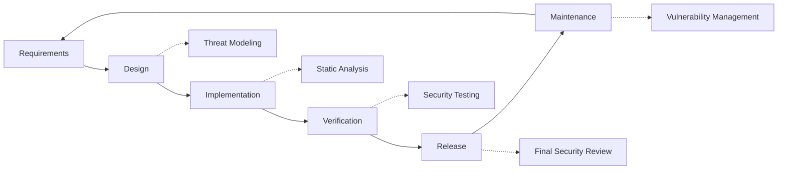

# Säkerhetspraxis {#security-practices}

## Innehållsförteckning {#table-of-contents}

* [Förord](#foreword)
* [Infrastruktursäkerhet](#infrastructure-security)
  * [Säkra datacenter](#secure-data-centers)
  * [Nätverkssäkerhet](#network-security)
* [E-postsäkerhet](#email-security)
  * [Kryptering](#encryption)
  * [Autentisering och auktorisering](#authentication-and-authorization)
  * [Åtgärder mot missbruk](#anti-abuse-measures)
* [Dataskydd](#data-protection)
  * [Dataminimering](#data-minimization)
  * [Backup och återställning](#backup-and-recovery)
* [Tjänsteleverantörer](#service-providers)
* [Efterlevnad och revision](#compliance-and-auditing)
  * [Regelbundna säkerhetsbedömningar](#regular-security-assessments)
  * [Efterlevnad](#compliance)
* [Incidenthantering](#incident-response)
* [Säkerhetsutvecklingslivscykel](#security-development-lifecycle)
* [Serverhärdning](#server-hardening)
* [Service Level Agreement](#service-level-agreement)
* [Öppen källkodssäkerhet](#open-source-security)
* [Anställdas säkerhet](#employee-security)
* [Kontinuerlig förbättring](#continuous-improvement)
* [Ytterligare resurser](#additional-resources)

## Förord {#foreword}

På Forward Email är säkerhet vår högsta prioritet. Vi har implementerat omfattande säkerhetsåtgärder för att skydda dina e-postkommunikationer och personuppgifter. Detta dokument beskriver våra säkerhetspraxis och de steg vi tar för att säkerställa konfidentialitet, integritet och tillgänglighet för din e-post.

## Infrastruktursäkerhet {#infrastructure-security}

### Säkra datacenter {#secure-data-centers}

Vår infrastruktur är värd i SOC 2-kompatibla datacenter med:

* 24/7 fysisk säkerhet och övervakning
* Biometriska åtkomstkontroller
* Redundanta strömsystem
* Avancerad branddetektion och släckning
* Miljöövervakning

### Nätverkssäkerhet {#network-security}

Vi implementerar flera lager av nätverkssäkerhet:

* Brandväggar av företagsklass med strikta åtkomstkontrollistor
* DDoS-skydd och mildring
* Regelbunden sårbarhetsskanning av nätverket
* Intrångsdetektering och förebyggande system
* Trafikkryptering mellan alla tjänstepunkter
* Portskanningsskydd med automatiskt blockering av misstänkt aktivitet

> \[!IMPORTANT]
> All data under överföring är krypterad med TLS 1.2+ med moderna chifferpaket.

## E-postsäkerhet {#email-security}

### Kryptering {#encryption}

* **Transport Layer Security (TLS)**: All e-posttrafik krypteras under överföring med TLS 1.2 eller högre
* **End-to-End-kryptering**: Stöd för OpenPGP/MIME och S/MIME-standarder
* **Lagringskryptering**: Alla lagrade e-postmeddelanden är krypterade i vila med ChaCha20-Poly1305-kryptering i SQLite-filer
* **Full disk-kryptering**: LUKS v2-kryptering för hela disken
* **Omfattande skydd**: Vi implementerar kryptering i vila, kryptering i minnet och kryptering under överföring

> \[!NOTE]
> Vi är världens första och enda e-posttjänst som använder **[kvantresistenta och individuellt krypterade SQLite-postlådor](https://forwardemail.net/en/blog/docs/best-quantum-safe-encrypted-email-service)**.

### Autentisering och auktorisering {#authentication-and-authorization}

* **DKIM-signering**: Alla utgående e-postmeddelanden signeras med DKIM
* **SPF och DMARC**: Fullt stöd för SPF och DMARC för att förhindra e-postförfalskning
* **MTA-STS**: Stöd för MTA-STS för att upprätthålla TLS-kryptering
* **Multifaktorautentisering**: Tillgängligt för all kontotillgång

### Åtgärder mot missbruk {#anti-abuse-measures}

* **Spamfiltrering**: Flerlagrad spamdetektion med maskininlärning
* **Virusskanning**: Realtidsskanning av alla bilagor
* **Hastighetsbegränsning**: Skydd mot brute force- och uppräkningsattacker
* **IP-rykte**: Övervakning av avsändarens IP-rykte
* **Innehållsfiltrering**: Upptäckt av skadliga URL:er och nätfiskeattacker

## Dataskydd {#data-protection}

### Dataminimering {#data-minimization}

Vi följer principen om dataminimering:

* Vi samlar endast in den data som är nödvändig för att tillhandahålla vår tjänst
* E-postinnehåll behandlas i minnet och lagras inte permanent om det inte krävs för IMAP/POP3-leverans
* Loggar anonymiseras och behålls endast så länge det är nödvändigt
### Backup och Återställning {#backup-and-recovery}

* Automatiserade dagliga säkerhetskopior med kryptering
* Geografiskt distribuerad lagring av säkerhetskopior
* Regelbunden testning av återställning från säkerhetskopior
* Katastrofåterställningsprocedurer med definierade RPO och RTO

## Tjänsteleverantörer {#service-providers}

Vi väljer noggrant våra tjänsteleverantörer för att säkerställa att de uppfyller våra höga säkerhetsstandarder. Nedan är de leverantörer vi använder för internationell dataöverföring och deras GDPR-efterlevnadsstatus:

| Leverantör                                    | Syfte                      | DPF Certifierad | GDPR-efterlevnadssida                                                                                   |
| --------------------------------------------- | -------------------------- | --------------- | ------------------------------------------------------------------------------------------------------- |
| [Cloudflare](https://www.cloudflare.com)      | CDN, DDoS-skydd, DNS       | ✅ Ja           | [Cloudflare GDPR](https://www.cloudflare.com/trust-hub/gdpr/)                                           |
| [DataPacket](https://www.datapacket.com)      | Serverinfrastruktur        | ❌ Nej          | [DataPacket Privacy](https://www.datapacket.com/privacy-policy)                                         |
| [Digital Ocean](https://www.digitalocean.com) | Molninfrastruktur          | ❌ Nej          | [DigitalOcean GDPR](https://www.digitalocean.com/legal/gdpr)                                            |
| [GitHub](https://github.com)                  | Källkodshantering, CI/CD  | ✅ Ja           | [GitHub GDPR](https://docs.github.com/en/site-policy/privacy-policies/github-data-protection-agreement) |
| [Vultr](https://www.vultr.com)                | Molninfrastruktur          | ❌ Nej          | [Vultr GDPR](https://www.vultr.com/legal/eea-gdpr-privacy/)                                             |
| [Stripe](https://stripe.com)                  | Betalningshantering        | ✅ Ja           | [Stripe Privacy Center](https://stripe.com/legal/privacy-center)                                        |
| [PayPal](https://www.paypal.com)              | Betalningshantering        | ❌ Nej          | [PayPal Privacy](https://www.paypal.com/uk/legalhub/privacy-full)                                       |

Vi använder dessa leverantörer för att säkerställa pålitlig och säker tjänsteleverans samtidigt som vi upprätthåller efterlevnad av internationella dataskyddsregler. Alla dataöverföringar genomförs med lämpliga skyddsåtgärder för att skydda din personliga information.

## Efterlevnad och Revision {#compliance-and-auditing}

### Regelbundna Säkerhetsbedömningar {#regular-security-assessments}

Vårt team övervakar, granskar och bedömer regelbundet kodbasen, servrar, infrastruktur och rutiner. Vi implementerar ett omfattande säkerhetsprogram som inkluderar:

* Regelbunden rotation av SSH-nycklar
* Kontinuerlig övervakning av åtkomstloggar
* Automatiserad säkerhetsskanning
* Proaktiv hantering av sårbarheter
* Regelbunden säkerhetsutbildning för alla teammedlemmar

### Efterlevnad {#compliance}

* [GDPR](https://forwardemail.net/gdpr) kompatibla databehandlingsrutiner
* [Databehandlingsavtal (DPA)](https://forwardemail.net/dpa) tillgängligt för företagskunder
* CCPA-kompatibla integritetskontroller
* SOC 2 Typ II reviderade processer

## Incidenthantering {#incident-response}

Vår plan för hantering av säkerhetsincidenter inkluderar:

1. **Upptäckt**: Automatiserade övervaknings- och larmssystem
2. **Inneslutning**: Omedelbar isolering av påverkade system
3. **Utrotning**: Borttagning av hotet och rotorsaksanalys
4. **Återställning**: Säker återställning av tjänster
5. **Meddelande**: Snabb kommunikation med berörda användare
6. **Efterincidentanalys**: Omfattande granskning och förbättring

> \[!WARNING]
> Om du upptäcker en säkerhetssårbarhet, vänligen rapportera den omedelbart till <security@forwardemail.net>.

## Säkerhetsutvecklingslivscykel {#security-development-lifecycle}

```mermaid
flowchart LR
    A[Requirements] --> B[Design]
    B --> C[Implementation]
    C --> D[Verification]
    D --> E[Release]
    E --> F[Maintenance]
    F --> A
    B -.-> G[Threat Modeling]
    C -.-> H[Static Analysis]
    D -.-> I[Security Testing]
    E -.-> J[Final Security Review]
    F -.-> K[Vulnerability Management]
```
All kod genomgår:

* Insamling av säkerhetskrav
* Hotmodellering under designfasen
* Säker kodningspraxis
* Statisk och dynamisk applikationssäkerhetstestning
* Kodgranskning med säkerhetsfokus
* Skanning av beroende sårbarheter

## Serverförstärkning {#server-hardening}

Vår [Ansible-konfiguration](https://github.com/forwardemail/forwardemail.net/tree/master/ansible) implementerar många serverförstärkningsåtgärder:

* **USB-åtkomst inaktiverad**: Fysiska portar är inaktiverade genom att svartlista usb-storage-kernelmodulen
* **Brandväggsregler**: Strikta iptables-regler som endast tillåter nödvändiga anslutningar
* **SSH-förstärkning**: Endast nyckelbaserad autentisering, inget lösenordsinloggning, root-inloggning inaktiverad
* **Tjänsteisolering**: Varje tjänst körs med minimala nödvändiga privilegier
* **Automatiska uppdateringar**: Säkerhetspatchar appliceras automatiskt
* **Säker uppstart**: Verifierad uppstartsprocess för att förhindra manipulation
* **Kernel-förstärkning**: Säker kernelparametrar och sysctl-konfigurationer
* **Filsystembegränsningar**: noexec, nosuid och nodev monteringsalternativ där det är lämpligt
* **Core dumps inaktiverade**: Systemet är konfigurerat för att förhindra core dumps av säkerhetsskäl
* **Swap inaktiverat**: Swapminne inaktiverat för att förhindra dataläckage
* **Skydd mot portskanning**: Automatisk upptäckt och blockering av portskanningsförsök
* **Transparent Huge Pages inaktiverat**: THP inaktiverat för förbättrad prestanda och säkerhet
* **Systemtjänstförstärkning**: Icke nödvändiga tjänster som Apport inaktiverade
* **Användarhantering**: Principen om minsta privilegium med separata deploy- och devops-användare
* **Begränsningar för filbeskrivare**: Ökade gränser för bättre prestanda och säkerhet

## Servicenivåavtal {#service-level-agreement}

Vi upprätthåller en hög nivå av tjänstetillgänglighet och tillförlitlighet. Vår infrastruktur är designad för redundans och feltolerans för att säkerställa att din e-posttjänst förblir operativ. Även om vi inte publicerar ett formellt SLA-dokument är vi engagerade i:

* 99,9 %+ drifttid för alla tjänster
* Snabb respons vid tjänsteavbrott
* Transparent kommunikation under incidenter
* Regelbundet underhåll under perioder med låg trafik

## Öppen källkodssäkerhet {#open-source-security}

Som en [öppen källkodstjänst](https://github.com/forwardemail/forwardemail.net) drar vår säkerhet nytta av:

* Transparent kod som kan granskas av vem som helst
* Gemenskapsdrivna säkerhetsförbättringar
* Snabb identifiering och patchning av sårbarheter
* Ingen säkerhet genom dunkelhet

## Anställdas säkerhet {#employee-security}

* Bakgrundskontroller för alla anställda
* Säkerhetsmedvetenhetsträning
* Principen om minsta privilegium för åtkomst
* Regelbunden säkerhetsutbildning

## Kontinuerlig förbättring {#continuous-improvement}

Vi förbättrar kontinuerligt vår säkerhetsställning genom:

* Övervakning av säkerhetstrender och nya hot
* Regelbunden granskning och uppdatering av säkerhetspolicys
* Feedback från säkerhetsforskare och användare
* Deltagande i säkerhetsgemenskapen

För mer information om våra säkerhetspraxis eller för att rapportera säkerhetsproblem, vänligen kontakta <security@forwardemail.net>.

## Ytterligare resurser {#additional-resources}

* [Integritetspolicy](https://forwardemail.net/en/privacy)
* [Användarvillkor](https://forwardemail.net/en/terms)
* [GDPR-efterlevnad](https://forwardemail.net/gdpr)
* [Avtal om databehandling (DPA)](https://forwardemail.net/dpa)
* [Rapportera missbruk](https://forwardemail.net/en/report-abuse)
* [Säkerhetspolicy](https://github.com/forwardemail/.github/blob/main/SECURITY.md)
* [Security.txt](https://forwardemail.net/security.txt)
* [GitHub-förråd](https://github.com/forwardemail/forwardemail.net)
* [Vanliga frågor](https://forwardemail.net/en/faq)
