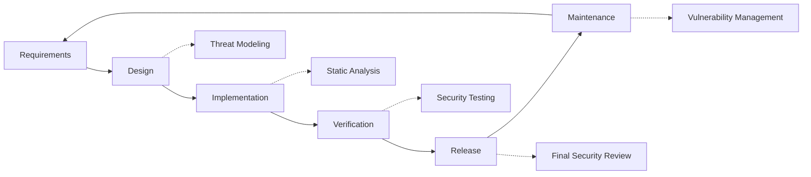

# แนวทางปฏิบัติด้านความปลอดภัย {#security-practices}

## สารบัญ {#table-of-contents}

* [คำนำ](#foreword)
* [ความปลอดภัยโครงสร้างพื้นฐาน](#infrastructure-security)
  * [ศูนย์ข้อมูลที่ปลอดภัย](#secure-data-centers)
  * [ความปลอดภัยเครือข่าย](#network-security)
* [ความปลอดภัยของอีเมล์](#email-security)
  * [การเข้ารหัส](#encryption)
  * [การรับรองและการอนุญาต](#authentication-and-authorization)
  * [มาตรการต่อต้านการละเมิด](#anti-abuse-measures)
* [การคุ้มครองข้อมูล](#data-protection)
  * [การย่อขนาดข้อมูล](#data-minimization)
  * [การสำรองข้อมูลและการกู้คืน](#backup-and-recovery)
* [ผู้ให้บริการ](#service-providers)
* [การปฏิบัติตามและการตรวจสอบ](#compliance-and-auditing)
  * [การประเมินความปลอดภัยเป็นประจำ](#regular-security-assessments)
  * [การปฏิบัติตาม](#compliance)
* [การตอบสนองต่อเหตุการณ์](#incident-response)
* [วงจรชีวิตการพัฒนาความปลอดภัย](#security-development-lifecycle)
* [การเสริมความแข็งแกร่งให้กับเซิร์ฟเวอร์](#server-hardening)
* [ข้อตกลงระดับการบริการ](#service-level-agreement)
* [ความปลอดภัยโอเพ่นซอร์ส](#open-source-security)
* [ความปลอดภัยของพนักงาน](#employee-security)
* [การปรับปรุงอย่างต่อเนื่อง](#continuous-improvement)
* [แหล่งข้อมูลเพิ่มเติม](#additional-resources)

## คำนำ {#foreword}

ที่ Forward Email ความปลอดภัยคือสิ่งสำคัญที่สุดสำหรับเรา เราได้นำมาตรการรักษาความปลอดภัยที่ครอบคลุมมาใช้เพื่อปกป้องการสื่อสารทางอีเมลและข้อมูลส่วนบุคคลของคุณ เอกสารนี้จะระบุแนวทางปฏิบัติด้านความปลอดภัยของเราและขั้นตอนที่เราใช้เพื่อให้แน่ใจว่าอีเมลของคุณมีความลับ สมบูรณ์ และพร้อมใช้งาน

## ความปลอดภัยโครงสร้างพื้นฐาน {#infrastructure-security}

### ศูนย์ข้อมูลที่ปลอดภัย {#secure-data-centers}

โครงสร้างพื้นฐานของเราได้รับการโฮสต์อยู่ในศูนย์ข้อมูลที่สอดคล้องกับ SOC 2 พร้อมด้วย:

* ระบบรักษาความปลอดภัยทางกายภาพและการเฝ้าระวังตลอด 24 ชั่วโมงทุกวัน
* ระบบควบคุมการเข้าถึงแบบไบโอเมตริกซ์
* ระบบไฟฟ้าสำรอง
* การตรวจจับและดับเพลิงขั้นสูง
* การตรวจสอบสิ่งแวดล้อม

### ความปลอดภัยเครือข่าย {#network-security}

เราใช้การรักษาความปลอดภัยเครือข่ายหลายชั้น:

* ไฟร์วอลล์ระดับองค์กรพร้อมรายการควบคุมการเข้าถึงที่เข้มงวด
* การป้องกันและบรรเทา DDoS
* การสแกนช่องโหว่เครือข่ายเป็นประจำ
* ระบบตรวจจับและป้องกันการบุกรุก
* การเข้ารหัสการรับส่งข้อมูลระหว่างจุดสิ้นสุดของบริการทั้งหมด
* การป้องกันการสแกนพอร์ตพร้อมการบล็อกกิจกรรมที่น่าสงสัยโดยอัตโนมัติ

> \[!IMPORTANT]
> All data in transit is encrypted using TLS 1.2+ with modern cipher suites.

## ความปลอดภัยอีเมล {#email-security}

### การเข้ารหัส {#encryption}

* **การรักษาความปลอดภัยระดับการขนส่ง (TLS)**: การรับส่งข้อมูลอีเมลทั้งหมดจะถูกเข้ารหัสระหว่างการส่งโดยใช้ TLS 1.2 หรือสูงกว่า
* **การเข้ารหัสแบบ End-to-End**: รองรับมาตรฐาน OpenPGP/MIME และ S/MIME
* **การเข้ารหัสที่เก็บข้อมูล**: อีเมลที่เก็บไว้ทั้งหมดจะถูกเข้ารหัสขณะไม่ได้ใช้งานโดยใช้การเข้ารหัส ChaCha20-Poly1305 ในไฟล์ SQLite
* **การเข้ารหัสดิสก์ทั้งหมด**: การเข้ารหัส LUKS v2 สำหรับดิสก์ทั้งหมด
* **การป้องกันที่ครอบคลุม**: เราใช้การเข้ารหัสขณะไม่ได้ใช้งาน การเข้ารหัสในหน่วยความจำ และการเข้ารหัสระหว่างการส่ง

> \[!NOTE]
> We're the world's first and only email service to use **[quantum-resistant and individually encrypted SQLite mailboxes](https://forwardemail.net/en/blog/docs/best-quantum-safe-encrypted-email-service)**.

### การตรวจสอบสิทธิ์และการอนุญาต {#authentication-and-authorization}

* **การลงนาม DKIM**: อีเมลขาออกทั้งหมดได้รับการลงนามด้วย DKIM
* **SPF และ DMARC**: รองรับ SPF และ DMARC อย่างเต็มรูปแบบเพื่อป้องกันการปลอมแปลงอีเมล
* **MTA-STS**: รองรับ MTA-STS เพื่อบังคับใช้การเข้ารหัส TLS
* **การตรวจสอบสิทธิ์หลายปัจจัย**: พร้อมใช้งานสำหรับการเข้าถึงบัญชีทั้งหมด

### มาตรการต่อต้านการละเมิด {#anti-abuse-measures}

* **การกรองสแปม**: การตรวจจับสแปมหลายชั้นด้วยการเรียนรู้ของเครื่อง
* **การสแกนไวรัส**: การสแกนไฟล์แนบทั้งหมดแบบเรียลไทม์
* **การจำกัดอัตรา**: การป้องกันการโจมตีแบบบรูทฟอร์ซและการแจงนับ
* **ชื่อเสียง IP**: การตรวจสอบชื่อเสียง IP ที่ส่ง
* **การกรองเนื้อหา**: การตรวจจับ URL ที่เป็นอันตรายและความพยายามฟิชชิ่ง

## การคุ้มครองข้อมูล {#data-protection}

### การลดขนาดข้อมูล {#data-minimization}

เราปฏิบัติตามหลักการลดข้อมูลให้เหลือน้อยที่สุด:

* เราเก็บรวบรวมเฉพาะข้อมูลที่จำเป็นต่อการให้บริการของเราเท่านั้น
* เนื้อหาอีเมลจะได้รับการประมวลผลในหน่วยความจำและจะไม่ถูกจัดเก็บถาวร เว้นแต่จำเป็นสำหรับการจัดส่ง IMAP/POP3
* บันทึกจะถูกทำให้ไม่ระบุตัวตนและจะถูกเก็บไว้เฉพาะเท่าที่จำเป็นเท่านั้น

### การสำรองข้อมูลและการกู้คืน {#backup-and-recovery}

* การสำรองข้อมูลอัตโนมัติทุกวันพร้อมการเข้ารหัส
* พื้นที่จัดเก็บข้อมูลสำรองแบบกระจายทางภูมิศาสตร์
* การทดสอบการกู้คืนข้อมูลสำรองเป็นประจำ
* ขั้นตอนการกู้คืนหลังภัยพิบัติพร้อม RPO และ RTO ที่กำหนดไว้

## ผู้ให้บริการ {#service-providers}

เราคัดเลือกผู้ให้บริการอย่างรอบคอบเพื่อให้แน่ใจว่าเป็นไปตามมาตรฐานความปลอดภัยระดับสูงของเรา ด้านล่างนี้คือผู้ให้บริการที่เราใช้สำหรับการถ่ายโอนข้อมูลระหว่างประเทศและสถานะการปฏิบัติตาม GDPR:

| ผู้ให้บริการ | วัตถุประสงค์ | ได้รับการรับรอง DPF | หน้าการปฏิบัติตาม GDPR |
| --------------------------------------------- | ------------------------- | ------------- | ----------------------------------------------------------------- |
| [Cloudflare](https://www.cloudflare.com) | CDN, การป้องกัน DDoS, DNS | ✅ ใช่ครับ | [Cloudflare GDPR](https://www.cloudflare.com/trust-hub/gdpr/) |
| [DataPacket](https://www.datapacket.com) | โครงสร้างพื้นฐานของเซิร์ฟเวอร์ | ❌ ไม่ | [DataPacket Privacy](https://www.datapacket.com/privacy-policy) |
| [Digital Ocean](https://www.digitalocean.com) | โครงสร้างพื้นฐานคลาวด์ | ❌ ไม่ | [DigitalOcean GDPR](https://www.digitalocean.com/legal/gdpr) |
| [Vultr](https://www.vultr.com) | โครงสร้างพื้นฐานคลาวด์ | ❌ ไม่ | [Vultr GDPR](https://www.vultr.com/legal/eea-gdpr-privacy/) |
| [Stripe](https://stripe.com) | การประมวลผลการชำระเงิน | ✅ ใช่ครับ | [Stripe Privacy Center](https://stripe.com/legal/privacy-center) |
| [PayPal](https://www.paypal.com) | การประมวลผลการชำระเงิน | ❌ ไม่ | [PayPal Privacy](https://www.paypal.com/uk/legalhub/privacy-full) |

เราใช้ผู้ให้บริการเหล่านี้เพื่อให้แน่ใจว่าการส่งมอบบริการมีความน่าเชื่อถือและปลอดภัยในขณะที่ยังคงปฏิบัติตามข้อบังคับการคุ้มครองข้อมูลระหว่างประเทศ การถ่ายโอนข้อมูลทั้งหมดดำเนินการด้วยมาตรการป้องกันที่เหมาะสมเพื่อปกป้องข้อมูลส่วนบุคคลของคุณ

## การปฏิบัติตามและการตรวจสอบ {#compliance-and-auditing}

### การประเมินความปลอดภัยปกติ {#regular-security-assessments}

ทีมงานของเราตรวจสอบ ตรวจสอบ และประเมินฐานโค้ด เซิร์ฟเวอร์ โครงสร้างพื้นฐาน และแนวทางปฏิบัติเป็นประจำ เราใช้โปรแกรมรักษาความปลอดภัยที่ครอบคลุม ซึ่งรวมถึง:

* การหมุนเวียนคีย์ SSH เป็นประจำ
* การตรวจสอบบันทึกการเข้าถึงอย่างต่อเนื่อง
* การสแกนความปลอดภัยอัตโนมัติ
* การจัดการช่องโหว่เชิงรุก
* การฝึกอบรมความปลอดภัยเป็นประจำสำหรับสมาชิกในทีมทุกคน

### การปฏิบัติตาม {#compliance}

* [GDPR](https://forwardemail.net/gdpr) แนวทางปฏิบัติการจัดการข้อมูลที่สอดคล้องกับมาตรฐาน
* [ข้อตกลงการประมวลผลข้อมูล (DPA)](https://forwardemail.net/dpa) สำหรับลูกค้าธุรกิจ
* การควบคุมความเป็นส่วนตัวที่สอดคล้องกับมาตรฐาน CCPA
* กระบวนการที่ได้รับการตรวจสอบตามมาตรฐาน SOC 2 ประเภท II

## การตอบสนองต่อเหตุการณ์ {#incident-response}

แผนการตอบสนองต่อเหตุการณ์ด้านความปลอดภัยของเรามีดังต่อไปนี้:

1. **การตรวจจับ**: ระบบตรวจสอบและแจ้งเตือนอัตโนมัติ
2. **การควบคุม**: แยกระบบที่ได้รับผลกระทบออกทันที
3. **การกำจัด**: การกำจัดภัยคุกคามและการวิเคราะห์สาเหตุหลัก
4. **การกู้คืน**: การกู้คืนบริการอย่างปลอดภัย
5. **การแจ้งเตือน**: การสื่อสารอย่างทันท่วงทีกับผู้ใช้ที่ได้รับผลกระทบ
6. **การวิเคราะห์หลังเกิดเหตุ**: การตรวจสอบและปรับปรุงอย่างครอบคลุม

> \[!WARNING]
> If you discover a security vulnerability, please report it immediately to <security@forwardemail.net>.

## วงจรชีวิตการพัฒนาความปลอดภัย {#security-development-lifecycle}

โค้ดทั้งหมดได้รับการดำเนินการดังนี้:

* การรวบรวมข้อกำหนดด้านความปลอดภัย
* การสร้างแบบจำลองภัยคุกคามระหว่างการออกแบบ
* แนวทางการเขียนโค้ดที่ปลอดภัย
* การทดสอบความปลอดภัยของแอปพลิเคชันแบบคงที่และแบบไดนามิก
* การตรวจสอบโค้ดโดยเน้นด้านความปลอดภัย
* การสแกนช่องโหว่ด้านการอ้างอิง

## การทำให้เซิร์ฟเวอร์แข็งแกร่งขึ้น {#server-hardening}

[การกำหนดค่า Ansible](https://github.com/forwardemail/forwardemail.net/tree/master/ansible) ของเราใช้มาตรการเสริมความแข็งแกร่งให้กับเซิร์ฟเวอร์มากมาย:

* **ปิดการใช้งานการเข้าถึง USB**: พอร์ตทางกายภาพถูกปิดใช้งานโดยแบล็คลิสต์โมดูลเคอร์เนลที่เก็บข้อมูล usb
* **กฎไฟร์วอลล์**: กฎ iptables ที่เข้มงวดซึ่งอนุญาตให้เชื่อมต่อที่จำเป็นเท่านั้น
* **การทำให้ SSH แข็งแกร่ง**: การตรวจสอบสิทธิ์โดยใช้คีย์เท่านั้น ไม่มีการเข้าสู่ระบบด้วยรหัสผ่าน ปิดการเข้าสู่ระบบด้วยสิทธิ์รูท
* **การแยกบริการ**: บริการแต่ละรายการทำงานด้วยสิทธิ์ที่จำเป็นขั้นต่ำ
* **การอัปเดตอัตโนมัติ**: แพตช์ความปลอดภัยจะถูกนำไปใช้โดยอัตโนมัติ
* **การบูตที่ปลอดภัย**: กระบวนการบูตที่ตรวจสอบแล้วเพื่อป้องกันการดัดแปลง
* **การทำให้เคอร์เนลแข็งแกร่ง**: พารามิเตอร์เคอร์เนลที่ปลอดภัยและการกำหนดค่า sysctl
* **ข้อจำกัดของระบบไฟล์**: ตัวเลือกการติดตั้ง noexec, nosuid และ nodev เมื่อเหมาะสม
* **ปิดการใช้งานการถ่ายโอนข้อมูลหลัก**: ระบบถูกกำหนดค่าเพื่อป้องกันการถ่ายโอนข้อมูลหลักเพื่อความปลอดภัย
* **ปิดการใช้งานการสลับ**: หน่วยความจำสลับถูกปิดใช้งานเพื่อป้องกันการรั่วไหลของข้อมูล
* **การป้องกันการสแกนพอร์ต**: การตรวจจับอัตโนมัติและการบล็อกความพยายามในการสแกนพอร์ต
* **ปิดการใช้งานหน้าโปร่งใสขนาดใหญ่**: ปิดการทำงาน THP เพื่อประสิทธิภาพและความปลอดภัยที่ดีขึ้น
* **บริการระบบ การทำให้แข็งแกร่ง**: ปิดใช้งานบริการที่ไม่จำเป็น เช่น Apport
* **การจัดการผู้ใช้**: หลักการของสิทธิ์ขั้นต่ำโดยมีผู้ใช้แบบแยกส่วนในการปรับใช้และ DevOps
* **ข้อจำกัดของตัวระบุไฟล์**: เพิ่มขีดจำกัดเพื่อประสิทธิภาพและความปลอดภัยที่ดีขึ้น

## ข้อตกลงระดับบริการ {#service-level-agreement}

เราให้บริการด้วยความพร้อมใช้งานและความน่าเชื่อถือในระดับสูง โครงสร้างพื้นฐานของเราได้รับการออกแบบให้มีการสำรองข้อมูลและทนต่อข้อผิดพลาดเพื่อให้แน่ใจว่าบริการอีเมลของคุณยังคงทำงานได้ แม้ว่าเราจะไม่เผยแพร่เอกสาร SLA อย่างเป็นทางการ แต่เรามุ่งมั่นที่จะ:

* เปิดใช้งานได้ 99.9% ขึ้นไปสำหรับบริการทั้งหมด
* ตอบสนองอย่างรวดเร็วต่อการหยุดชะงักของบริการ
* การสื่อสารที่โปร่งใสระหว่างเหตุการณ์ที่เกิดขึ้น
* การบำรุงรักษาตามปกติในช่วงที่มีปริมาณการใช้งานต่ำ

## ความปลอดภัยโอเพนซอร์ส {#open-source-security}

เนื่องจากเป็น [บริการโอเพ่นซอร์ส](https://github.com/forwardemail/forwardemail.net) ความปลอดภัยของเราจึงได้รับประโยชน์จาก:

* รหัสโปร่งใสที่ใครๆ ก็ตรวจสอบได้
* การปรับปรุงความปลอดภัยที่ขับเคลื่อนโดยชุมชน
* การระบุและแก้ไขช่องโหว่อย่างรวดเร็ว
* ไม่มีการรักษาความปลอดภัยจากการปกปิด

## ความปลอดภัยของพนักงาน {#employee-security}

* การตรวจสอบประวัติพนักงานทุกคน
* การฝึกอบรมความตระหนักด้านความปลอดภัย
* หลักการการเข้าถึงสิทธิ์ขั้นต่ำ
* การศึกษาความปลอดภัยเป็นประจำ

## การปรับปรุงอย่างต่อเนื่อง {#continuous-improvement}

เราปรับปรุงมาตรการรักษาความปลอดภัยของเราอย่างต่อเนื่องผ่าน:

* การติดตามแนวโน้มด้านความปลอดภัยและภัยคุกคามที่เกิดขึ้นใหม่
* การตรวจสอบและอัปเดตนโยบายด้านความปลอดภัยเป็นประจำ
* ข้อเสนอแนะจากนักวิจัยด้านความปลอดภัยและผู้ใช้
* การมีส่วนร่วมในชุมชนด้านความปลอดภัย

หากต้องการข้อมูลเพิ่มเติมเกี่ยวกับแนวทางปฏิบัติด้านความปลอดภัยของเราหรือต้องการรายงานข้อกังวลด้านความปลอดภัย โปรดติดต่อ <security@forwardemail.net>

## แหล่งข้อมูลเพิ่มเติม {#additional-resources}

* [นโยบายความเป็นส่วนตัว](https://forwardemail.net/en/privacy)
* [เงื่อนไขการบริการ](https://forwardemail.net/en/terms)
* [การปฏิบัติตาม GDPR](https://forwardemail.net/gdpr)
* [ข้อตกลงการประมวลผลข้อมูล (DPA)](https://forwardemail.net/dpa)
* [รายงานการละเมิด](https://forwardemail.net/en/report-abuse)
* [นโยบายความปลอดภัย](https://github.com/forwardemail/.github/blob/main/SECURITY.md)
* [Security.txt](https://forwardemail.net/security.txt)
* [คลังเก็บข้อมูล GitHub](https://github.com/forwardemail/forwardemail.net)
* [FAQ](https://forwardemail.net/en/faq)