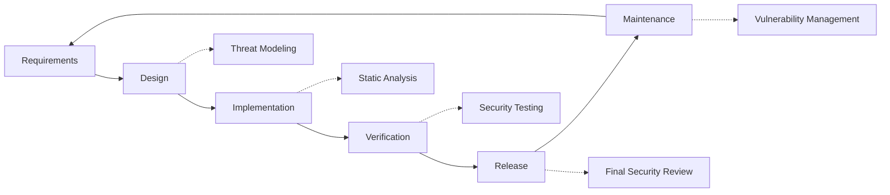

# แนวทางปฏิบัติด้านความปลอดภัย {#security-practices}

## สารบัญ {#table-of-contents}

* [คำนำ](#foreword)
* [ความปลอดภัยโครงสร้างพื้นฐาน](#infrastructure-security)
  * [ศูนย์ข้อมูลที่ปลอดภัย](#secure-data-centers)
  * [ความปลอดภัยเครือข่าย](#network-security)
* [ความปลอดภัยของอีเมล์](#email-security)
  * [การเข้ารหัส](#encryption)
  * [การตรวจสอบความถูกต้องและการอนุญาต](#authentication-and-authorization)
  * [มาตรการต่อต้านการละเมิด](#anti-abuse-measures)
* [การคุ้มครองข้อมูล](#data-protection)
  * [การลดขนาดข้อมูล](#data-minimization)
  * [การสำรองข้อมูลและการกู้คืน](#backup-and-recovery)
* [ผู้ให้บริการ](#service-providers)
* [การปฏิบัติตามกฎระเบียบและการตรวจสอบ](#compliance-and-auditing)
  * [การประเมินความปลอดภัยเป็นประจำ](#regular-security-assessments)
  * [การปฏิบัติตาม](#compliance)
* [การตอบสนองต่อเหตุการณ์](#incident-response)
* [วงจรชีวิตการพัฒนาความปลอดภัย](#security-development-lifecycle)
* [การทำให้เซิร์ฟเวอร์แข็งแกร่งขึ้น](#server-hardening)
* [ข้อตกลงระดับการบริการ](#service-level-agreement)
* [ความปลอดภัยโอเพ่นซอร์ส](#open-source-security)
* [ความปลอดภัยของพนักงาน](#employee-security)
* [การปรับปรุงอย่างต่อเนื่อง](#continuous-improvement)
* [แหล่งข้อมูลเพิ่มเติม](#additional-resources)

## คำนำ {#foreword}

ที่ Forward Email ความปลอดภัยคือสิ่งที่เราให้ความสำคัญสูงสุด เราได้นำมาตรการรักษาความปลอดภัยที่ครอบคลุมมาใช้เพื่อปกป้องการสื่อสารทางอีเมลและข้อมูลส่วนบุคคลของคุณ เอกสารฉบับนี้จะสรุปแนวปฏิบัติด้านความปลอดภัยของเราและขั้นตอนที่เราดำเนินการเพื่อให้มั่นใจถึงการรักษาความลับ ความสมบูรณ์ และความพร้อมใช้งานของอีเมลของคุณ

## ความปลอดภัยโครงสร้างพื้นฐาน {#infrastructure-security}

### ศูนย์ข้อมูลที่ปลอดภัย {#secure-data-centers}

โครงสร้างพื้นฐานของเราได้รับการโฮสต์อยู่ในศูนย์ข้อมูลที่สอดคล้องกับ SOC 2 พร้อมด้วย:

* ระบบรักษาความปลอดภัยทางกายภาพและการเฝ้าระวังตลอด 24 ชั่วโมงทุกวัน
* ระบบควบคุมการเข้า-ออกด้วยไบโอเมตริกซ์
* ระบบไฟฟ้าสำรอง
* ระบบตรวจจับและดับเพลิงขั้นสูง
* ระบบตรวจสอบสภาพแวดล้อม

### ความปลอดภัยเครือข่าย {#network-security}

เราใช้การรักษาความปลอดภัยเครือข่ายหลายชั้น:

* ไฟร์วอลล์ระดับองค์กรพร้อมรายการควบคุมการเข้าถึงที่เข้มงวด
* การป้องกันและบรรเทาผลกระทบจาก DDoS
* การสแกนช่องโหว่เครือข่ายอย่างสม่ำเสมอ
* ระบบตรวจจับและป้องกันการบุกรุก
* การเข้ารหัสทราฟฟิกระหว่างจุดบริการทั้งหมด
* การป้องกันการสแกนพอร์ตพร้อมการบล็อกกิจกรรมที่น่าสงสัยโดยอัตโนมัติ

> \[!IMPORTANT]
> ข้อมูลทั้งหมดที่ส่งผ่านจะถูกเข้ารหัสโดยใช้ TLS 1.2+ พร้อมชุดรหัสที่ทันสมัย

## ความปลอดภัยของอีเมล {#email-security}

### การเข้ารหัส {#encryption}

* **ความปลอดภัยระดับชั้นการขนส่ง (TLS)**: การรับส่งอีเมลทั้งหมดจะถูกเข้ารหัสระหว่างการส่งโดยใช้ TLS 1.2 หรือสูงกว่า
* **การเข้ารหัสแบบ End-to-End**: รองรับมาตรฐาน OpenPGP/MIME และ S/MIME
* **การเข้ารหัสพื้นที่จัดเก็บ**: อีเมลทั้งหมดที่จัดเก็บจะถูกเข้ารหัสขณะพักโดยใช้การเข้ารหัส ChaCha20-Poly1305 ในไฟล์ SQLite
* **การเข้ารหัสดิสก์ทั้งหมด**: การเข้ารหัส LUKS v2 สำหรับดิสก์ทั้งหมด
* **การป้องกันที่ครอบคลุม**: เราใช้การเข้ารหัสขณะพัก การเข้ารหัสในหน่วยความจำ และการเข้ารหัสระหว่างการส่ง

> \[!NOTE]
> เราเป็นบริการอีเมลรายแรกและรายเดียวของโลกที่ใช้ **[กล่องจดหมาย SQLite ที่ทนทานต่อควอนตัมและเข้ารหัสเป็นรายบุคคล](https://forwardemail.net/en/blog/docs/best-quantum-safe-encrypted-email-service)**

### การตรวจสอบสิทธิ์และการอนุญาต {#authentication-and-authorization}

* **การลงนาม DKIM**: อีเมลขาออกทั้งหมดได้รับการลงนามด้วย DKIM
* **SPF และ DMARC**: รองรับ SPF และ DMARC อย่างเต็มรูปแบบเพื่อป้องกันการปลอมแปลงอีเมล
* **MTA-STS**: รองรับ MTA-STS เพื่อบังคับใช้การเข้ารหัส TLS
* **การตรวจสอบสิทธิ์แบบหลายปัจจัย**: พร้อมใช้งานสำหรับการเข้าถึงบัญชีทั้งหมด

### มาตรการต่อต้านการละเมิด {#anti-abuse-measures}

* **การกรองสแปม**: การตรวจจับสแปมแบบหลายชั้นด้วยการเรียนรู้ของเครื่อง
* **การสแกนไวรัส**: การสแกนไฟล์แนบทั้งหมดแบบเรียลไทม์
* **การจำกัดอัตรา**: การป้องกันการโจมตีแบบ Brute Force และ Enumeration
* **ชื่อเสียง IP**: การตรวจสอบชื่อเสียง IP ที่ส่ง
* **การกรองเนื้อหา**: การตรวจจับ URL ที่เป็นอันตรายและการพยายามฟิชชิ่ง

## การคุ้มครองข้อมูล {#data-protection}

### การลดขนาดข้อมูล {#data-minimization}

เราปฏิบัติตามหลักการลดข้อมูลให้เหลือน้อยที่สุด:

* เราเก็บรวบรวมเฉพาะข้อมูลที่จำเป็นต่อการให้บริการของเราเท่านั้น
* เนื้อหาอีเมลจะถูกประมวลผลในหน่วยความจำและจะไม่ถูกจัดเก็บถาวร เว้นแต่จำเป็นสำหรับการจัดส่งแบบ IMAP/POP3
* บันทึกจะถูกทำให้ไม่ระบุตัวตนและจะถูกเก็บไว้เฉพาะเท่าที่จำเป็นเท่านั้น

### การสำรองข้อมูลและการกู้คืน {#backup-and-recovery}

* สำรองข้อมูลอัตโนมัติทุกวันพร้อมการเข้ารหัส
* พื้นที่จัดเก็บข้อมูลสำรองแบบกระจายทางภูมิศาสตร์
* การทดสอบการกู้คืนข้อมูลสำรองเป็นประจำ
* ขั้นตอนการกู้คืนระบบหลังภัยพิบัติพร้อม RPO และ RTO ที่กำหนดไว้

## ผู้ให้บริการ {#service-providers}

เราคัดสรรผู้ให้บริการอย่างรอบคอบเพื่อให้มั่นใจว่าเป็นไปตามมาตรฐานความปลอดภัยขั้นสูงของเรา ด้านล่างนี้คือรายชื่อผู้ให้บริการที่เราใช้สำหรับการถ่ายโอนข้อมูลระหว่างประเทศและสถานะการปฏิบัติตาม GDPR:

| ผู้ให้บริการ | วัตถุประสงค์ | ได้รับการรับรอง DPF | หน้าการปฏิบัติตาม GDPR |
| --------------------------------------------- | ------------------------- | ------------- | ----------------------------------------------------------------- |
| [Cloudflare](https://www.cloudflare.com) | CDN, การป้องกัน DDoS, DNS | ✅ ใช่ครับ | [Cloudflare GDPR](https://www.cloudflare.com/trust-hub/gdpr/) |
| [DataPacket](https://www.datapacket.com) | โครงสร้างพื้นฐานของเซิร์ฟเวอร์ | ❌ ไม่ | [DataPacket Privacy](https://www.datapacket.com/privacy-policy) |
| [Digital Ocean](https://www.digitalocean.com) | โครงสร้างพื้นฐานคลาวด์ | ❌ ไม่ | [DigitalOcean GDPR](https://www.digitalocean.com/legal/gdpr) |
| [Vultr](https://www.vultr.com) | โครงสร้างพื้นฐานคลาวด์ | ❌ ไม่ | [Vultr GDPR](https://www.vultr.com/legal/eea-gdpr-privacy/) |
| [Stripe](https://stripe.com) | การประมวลผลการชำระเงิน | ✅ ใช่ครับ | [Stripe Privacy Center](https://stripe.com/legal/privacy-center) |
| [PayPal](https://www.paypal.com) | การประมวลผลการชำระเงิน | ❌ ไม่ | [PayPal Privacy](https://www.paypal.com/uk/legalhub/privacy-full) |

เราใช้ผู้ให้บริการเหล่านี้เพื่อให้มั่นใจว่าการให้บริการมีความน่าเชื่อถือและปลอดภัย พร้อมทั้งยังคงปฏิบัติตามกฎระเบียบคุ้มครองข้อมูลระหว่างประเทศ การถ่ายโอนข้อมูลทั้งหมดดำเนินการภายใต้มาตรการป้องกันที่เหมาะสมเพื่อปกป้องข้อมูลส่วนบุคคลของคุณ

## การปฏิบัติตามและการตรวจสอบ {#compliance-and-auditing}

### การประเมินความปลอดภัยปกติ {#regular-security-assessments}

ทีมงานของเราตรวจสอบ ตรวจสอบ และประเมินโค้ดเบส เซิร์ฟเวอร์ โครงสร้างพื้นฐาน และแนวปฏิบัติต่างๆ อย่างสม่ำเสมอ เรามีโปรแกรมรักษาความปลอดภัยที่ครอบคลุม ซึ่งประกอบด้วย:

* การหมุนเวียนคีย์ SSH เป็นประจำ
* การตรวจสอบบันทึกการเข้าถึงอย่างต่อเนื่อง
* การสแกนความปลอดภัยอัตโนมัติ
* การจัดการช่องโหว่เชิงรุก
* การฝึกอบรมด้านความปลอดภัยเป็นประจำสำหรับสมาชิกในทีมทุกคน

### การปฏิบัติตาม {#compliance}

* แนวทางปฏิบัติการจัดการข้อมูลที่สอดคล้องกับ [GDPR](https://forwardemail.net/gdpr)
* [ข้อตกลงการประมวลผลข้อมูล (DPA)](https://forwardemail.net/dpa) พร้อมให้บริการสำหรับลูกค้าธุรกิจ
* การควบคุมความเป็นส่วนตัวที่สอดคล้องกับ CCPA
* กระบวนการที่ได้รับการตรวจสอบ SOC 2 ประเภท II

## การตอบสนองต่อเหตุการณ์ {#incident-response}

แผนการตอบสนองต่อเหตุการณ์ด้านความปลอดภัยของเรามีดังต่อไปนี้:

1. **การตรวจจับ**: ระบบตรวจสอบและแจ้งเตือนอัตโนมัติ
2. **การควบคุม**: การแยกระบบที่ได้รับผลกระทบออกทันที
3. **การกำจัด**: การกำจัดภัยคุกคามและการวิเคราะห์สาเหตุหลัก
4. **การกู้คืน**: การกู้คืนบริการอย่างปลอดภัย
5. **การแจ้งเตือน**: การสื่อสารกับผู้ใช้ที่ได้รับผลกระทบอย่างทันท่วงที
6. **การวิเคราะห์หลังเกิดเหตุการณ์**: การตรวจสอบและปรับปรุงอย่างครอบคลุม

> \[!WARNING]
> หากคุณพบช่องโหว่ด้านความปลอดภัย โปรดรายงานไปยัง <security@forwardemail.net> ทันที

## วงจรชีวิตการพัฒนาความปลอดภัย {#security-development-lifecycle}

โค้ดทั้งหมดผ่านกระบวนการ:

* การรวบรวมข้อกำหนดด้านความปลอดภัย
* การสร้างแบบจำลองภัยคุกคามระหว่างการออกแบบ
* แนวทางการเขียนโค้ดที่ปลอดภัย
* การทดสอบความปลอดภัยของแอปพลิเคชันแบบคงที่และแบบไดนามิก
* การตรวจสอบโค้ดโดยเน้นด้านความปลอดภัย
* การสแกนช่องโหว่ของการอ้างอิง

## การทำให้เซิร์ฟเวอร์แข็งแกร่งขึ้น {#server-hardening}

[การกำหนดค่า Ansible](https://github.com/forwardemail/forwardemail.net/tree/master/ansible) ของเราใช้มาตรการเสริมความแข็งแกร่งให้กับเซิร์ฟเวอร์มากมาย:

* **ปิดใช้งานการเข้าถึง USB**: พอร์ตทางกายภาพถูกปิดใช้งานโดยขึ้นบัญชีดำโมดูลเคอร์เนลที่เก็บข้อมูล USB
* **กฎไฟร์วอลล์**: กฎ iptables ที่เข้มงวดอนุญาตให้เชื่อมต่อเฉพาะที่จำเป็นเท่านั้น
* **การเสริมความแข็งแกร่ง SSH**: การตรวจสอบสิทธิ์โดยใช้คีย์เท่านั้น ไม่มีการเข้าสู่ระบบด้วยรหัสผ่าน ปิดใช้งานการเข้าสู่ระบบรูท
* **การแยกบริการ**: แต่ละบริการทำงานด้วยสิทธิ์ที่จำเป็นขั้นต่ำ
* **การอัปเดตอัตโนมัติ**: แพตช์ความปลอดภัยจะถูกนำไปใช้โดยอัตโนมัติ
* **การบูตที่ปลอดภัย**: กระบวนการบูตที่ได้รับการยืนยันเพื่อป้องกันการปลอมแปลง
* **การเสริมความแข็งแกร่งเคอร์เนล**: พารามิเตอร์เคอร์เนลที่ปลอดภัยและการกำหนดค่า sysctl
* **ข้อจำกัดของระบบไฟล์**: ตัวเลือกการติดตั้ง noexec, nosuid และ nodev ตามความเหมาะสม
* **ปิดใช้งาน Core Dumps**: ระบบได้รับการกำหนดค่าเพื่อป้องกัน core dumps เพื่อความปลอดภัย
* **ปิดใช้งาน Swap**: ปิดใช้งานหน่วยความจำ swap เพื่อป้องกันการรั่วไหลของข้อมูล
* **การป้องกันการสแกนพอร์ต**: การตรวจจับและบล็อกความพยายามสแกนพอร์ตโดยอัตโนมัติ
* **ปิดใช้งาน Transparent Huge Pages**: ปิดใช้งาน THP เพื่อประสิทธิภาพและความปลอดภัยที่ดีขึ้น
* **บริการระบบ การเสริมความแข็งแกร่ง**: ปิดใช้งานบริการที่ไม่จำเป็น เช่น Apport
* **การจัดการผู้ใช้**: หลักการสิทธิ์ขั้นต่ำสำหรับผู้ใช้งาน deploy และ devops แยกกัน
* **ขีดจำกัดของตัวอธิบายไฟล์**: เพิ่มขีดจำกัดเพื่อประสิทธิภาพและความปลอดภัยที่ดีขึ้น

## ข้อตกลงระดับบริการ {#service-level-agreement}

เรารักษาระดับความพร้อมใช้งานและความน่าเชื่อถือของบริการให้อยู่ในระดับสูง โครงสร้างพื้นฐานของเราออกแบบมาเพื่อความซ้ำซ้อนและการทนต่อข้อผิดพลาด เพื่อให้มั่นใจว่าบริการอีเมลของคุณยังคงทำงานได้ แม้ว่าเราจะไม่ได้เผยแพร่เอกสาร SLA อย่างเป็นทางการ แต่เรามุ่งมั่นที่จะ:

* ใช้งานได้ 99.9%+ สำหรับทุกบริการ
* ตอบสนองอย่างรวดเร็วเมื่อเกิดการขัดข้องของบริการ
* สื่อสารอย่างโปร่งใสระหว่างเกิดเหตุการณ์
* บำรุงรักษาเป็นประจำในช่วงที่มีปริมาณการใช้งานต่ำ

## ความปลอดภัยโอเพนซอร์ส {#open-source-security}

ในฐานะ [บริการโอเพ่นซอร์ส](https://github.com/forwardemail/forwardemail.net) ความปลอดภัยของเราได้รับประโยชน์จาก:

* โค้ดโปร่งใสที่ใครๆ ก็ตรวจสอบได้
* การปรับปรุงความปลอดภัยที่ขับเคลื่อนโดยชุมชน
* การระบุและแก้ไขช่องโหว่อย่างรวดเร็ว
* ไม่มีความปลอดภัยจากการปกปิด

## ความปลอดภัยของพนักงาน {#employee-security}

* การตรวจสอบประวัติพนักงานทุกคน
* การฝึกอบรมความตระหนักด้านความปลอดภัย
* หลักการเข้าถึงสิทธิ์ขั้นต่ำ
* การอบรมด้านความปลอดภัยเป็นประจำ

## การปรับปรุงอย่างต่อเนื่อง {#continuous-improvement}

เราปรับปรุงมาตรการรักษาความปลอดภัยของเราอย่างต่อเนื่องโดย:

* การติดตามแนวโน้มด้านความปลอดภัยและภัยคุกคามที่เกิดขึ้นใหม่
* การทบทวนและปรับปรุงนโยบายด้านความปลอดภัยอย่างสม่ำเสมอ
* ความคิดเห็นจากนักวิจัยด้านความปลอดภัยและผู้ใช้งาน
* การมีส่วนร่วมในชุมชนด้านความปลอดภัย

หากต้องการข้อมูลเพิ่มเติมเกี่ยวกับแนวทางปฏิบัติด้านความปลอดภัยของเราหรือต้องการรายงานข้อกังวลด้านความปลอดภัย โปรดติดต่อ <security@forwardemail.net>

## แหล่งข้อมูลเพิ่มเติม {#additional-resources}

* [นโยบายความเป็นส่วนตัว](https://forwardemail.net/en/privacy)
* [เงื่อนไขการบริการ](https://forwardemail.net/en/terms)
* [การปฏิบัติตาม GDPR](https://forwardemail.net/gdpr)
* [ข้อตกลงการประมวลผลข้อมูล (DPA)](https://forwardemail.net/dpa)
* [รายงานการละเมิด](https://forwardemail.net/en/report-abuse)
* [นโยบายความปลอดภัย](https://github.com/forwardemail/.github/blob/main/SECURITY.md)
* [Security.txt](https://forwardemail.net/security.txt)
* [คลังเก็บ GitHub](https://github.com/forwardemail/forwardemail.net)
* [FAQ](https://forwardemail.net/en/faq)