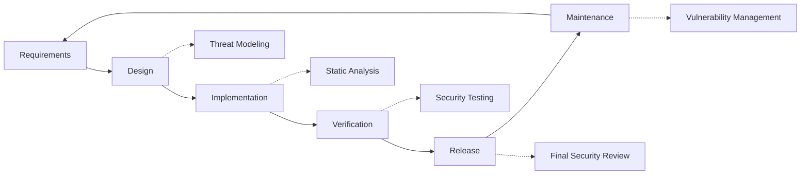

# แนวทางปฏิบัติด้านความปลอดภัย {#security-practices}

## สารบัญ {#table-of-contents}

* [คำนำ](#foreword)
* [ความปลอดภัยของโครงสร้างพื้นฐาน](#infrastructure-security)
  * [ศูนย์ข้อมูลที่ปลอดภัย](#secure-data-centers)
  * [ความปลอดภัยของเครือข่าย](#network-security)
* [ความปลอดภัยของอีเมล](#email-security)
  * [การเข้ารหัส](#encryption)
  * [การพิสูจน์ตัวตนและการอนุญาต](#authentication-and-authorization)
  * [มาตรการป้องกันการละเมิด](#anti-abuse-measures)
* [การปกป้องข้อมูล](#data-protection)
  * [การลดข้อมูลให้น้อยที่สุด](#data-minimization)
  * [การสำรองข้อมูลและการกู้คืน](#backup-and-recovery)
* [ผู้ให้บริการ](#service-providers)
* [การปฏิบัติตามและการตรวจสอบ](#compliance-and-auditing)
  * [การประเมินความปลอดภัยอย่างสม่ำเสมอ](#regular-security-assessments)
  * [การปฏิบัติตามข้อกำหนด](#compliance)
* [การตอบสนองต่อเหตุการณ์](#incident-response)
* [วงจรชีวิตการพัฒนาด้านความปลอดภัย](#security-development-lifecycle)
* [การเสริมความแข็งแกร่งของเซิร์ฟเวอร์](#server-hardening)
* [ข้อตกลงระดับบริการ](#service-level-agreement)
* [ความปลอดภัยของโอเพนซอร์ส](#open-source-security)
* [ความปลอดภัยของพนักงาน](#employee-security)
* [การปรับปรุงอย่างต่อเนื่อง](#continuous-improvement)
* [ทรัพยากรเพิ่มเติม](#additional-resources)

## คำนำ {#foreword}

ที่ Forward Email ความปลอดภัยคือสิ่งสำคัญสูงสุดของเรา เราได้ดำเนินมาตรการความปลอดภัยอย่างครอบคลุมเพื่อปกป้องการสื่อสารทางอีเมลและข้อมูลส่วนบุคคลของคุณ เอกสารนี้สรุปแนวทางปฏิบัติด้านความปลอดภัยของเราและขั้นตอนที่เราดำเนินการเพื่อให้มั่นใจในความลับ ความสมบูรณ์ และความพร้อมใช้งานของอีเมลของคุณ

## ความปลอดภัยของโครงสร้างพื้นฐาน {#infrastructure-security}

### ศูนย์ข้อมูลที่ปลอดภัย {#secure-data-centers}

โครงสร้างพื้นฐานของเราตั้งอยู่ในศูนย์ข้อมูลที่เป็นไปตามมาตรฐาน SOC 2 พร้อมด้วย:

* ระบบรักษาความปลอดภัยและการเฝ้าระวังตลอด 24 ชั่วโมงทุกวัน
* การควบคุมการเข้าถึงด้วยระบบไบโอเมตริกซ์
* ระบบไฟฟ้าสำรอง
* ระบบตรวจจับและดับเพลิงขั้นสูง
* การตรวจสอบสภาพแวดล้อม

### ความปลอดภัยของเครือข่าย {#network-security}

เราดำเนินการความปลอดภัยของเครือข่ายหลายชั้น:

* ไฟร์วอลล์ระดับองค์กรพร้อมรายการควบคุมการเข้าถึงที่เข้มงวด
* การป้องกันและบรรเทา DDoS
* การสแกนหาช่องโหว่เครือข่ายอย่างสม่ำเสมอ
* ระบบตรวจจับและป้องกันการบุกรุก
* การเข้ารหัสการรับส่งข้อมูลระหว่างจุดบริการทั้งหมด
* การป้องกันการสแกนพอร์ตด้วยการบล็อกอัตโนมัติสำหรับกิจกรรมที่น่าสงสัย

> \[!IMPORTANT]
> ข้อมูลทั้งหมดที่ส่งผ่านถูกเข้ารหัสโดยใช้ TLS 1.2+ พร้อมชุดรหัสลับสมัยใหม่

## ความปลอดภัยของอีเมล {#email-security}

### การเข้ารหัส {#encryption}

* **Transport Layer Security (TLS)**: การรับส่งอีเมลทั้งหมดถูกเข้ารหัสในระหว่างการส่งโดยใช้ TLS 1.2 หรือสูงกว่า
* **การเข้ารหัสแบบปลายทางถึงปลายทาง**: รองรับมาตรฐาน OpenPGP/MIME และ S/MIME
* **การเข้ารหัสข้อมูลที่จัดเก็บ**: อีเมลที่จัดเก็บทั้งหมดถูกเข้ารหัสขณะพักด้วยการเข้ารหัส ChaCha20-Poly1305 ในไฟล์ SQLite
* **การเข้ารหัสดิสก์เต็มรูปแบบ**: การเข้ารหัส LUKS v2 สำหรับดิสก์ทั้งหมด
* **การป้องกันอย่างครอบคลุม**: เราดำเนินการเข้ารหัสทั้งขณะพัก ขณะใช้งานในหน่วยความจำ และขณะส่งผ่าน

> \[!NOTE]
> เราเป็นบริการอีเมลแรกและเพียงหนึ่งเดียวของโลกที่ใช้ **[กล่องจดหมาย SQLite ที่เข้ารหัสแบบต้านควอนตัมและเข้ารหัสแยกบุคคล](https://forwardemail.net/en/blog/docs/best-quantum-safe-encrypted-email-service)**

### การพิสูจน์ตัวตนและการอนุญาต {#authentication-and-authorization}

* **การลงนาม DKIM**: อีเมลขาออกทั้งหมดถูกลงนามด้วย DKIM
* **SPF และ DMARC**: รองรับเต็มรูปแบบสำหรับ SPF และ DMARC เพื่อป้องกันการปลอมแปลงอีเมล
* **MTA-STS**: รองรับ MTA-STS เพื่อบังคับใช้การเข้ารหัส TLS
* **การพิสูจน์ตัวตนหลายปัจจัย**: มีให้สำหรับการเข้าถึงบัญชีทั้งหมด

### มาตรการป้องกันการละเมิด {#anti-abuse-measures}

* **การกรองสแปม**: การตรวจจับสแปมหลายชั้นด้วยการเรียนรู้ของเครื่อง
* **การสแกนไวรัส**: การสแกนไฟล์แนบทั้งหมดแบบเรียลไทม์
* **การจำกัดอัตรา**: การป้องกันการโจมตีแบบบรูทฟอร์ซและการตรวจสอบหมายเลข
* **ชื่อเสียง IP**: การตรวจสอบชื่อเสียงของ IP ที่ส่ง
* **การกรองเนื้อหา**: การตรวจจับ URL ที่เป็นอันตรายและการพยายามฟิชชิง

## การปกป้องข้อมูล {#data-protection}

### การลดข้อมูลให้น้อยที่สุด {#data-minimization}

เราปฏิบัติตามหลักการลดข้อมูลให้น้อยที่สุด:

* เราเก็บข้อมูลเฉพาะที่จำเป็นสำหรับการให้บริการของเราเท่านั้น
* เนื้อหาอีเมลจะถูกประมวลผลในหน่วยความจำและจะไม่ถูกจัดเก็บถาวรเว้นแต่จำเป็นสำหรับการส่งผ่าน IMAP/POP3
* บันทึกจะถูกทำให้ไม่ระบุตัวตนและเก็บไว้เฉพาะในระยะเวลาที่จำเป็นเท่านั้น
### การสำรองข้อมูลและการกู้คืน {#backup-and-recovery}

* การสำรองข้อมูลอัตโนมัติรายวันพร้อมการเข้ารหัส
* การจัดเก็บข้อมูลสำรองแบบกระจายทางภูมิศาสตร์
* การทดสอบการกู้คืนข้อมูลสำรองอย่างสม่ำเสมอ
* ขั้นตอนการกู้คืนจากภัยพิบัติพร้อมกำหนด RPO และ RTO ชัดเจน

## ผู้ให้บริการ {#service-providers}

เราคัดเลือกผู้ให้บริการอย่างรอบคอบเพื่อให้มั่นใจว่าพวกเขาตรงตามมาตรฐานความปลอดภัยสูงของเรา ด้านล่างนี้คือผู้ให้บริการที่เราใช้สำหรับการโอนย้ายข้อมูลระหว่างประเทศและสถานะการปฏิบัติตาม GDPR ของพวกเขา:

| ผู้ให้บริการ                                   | วัตถุประสงค์               | ได้รับการรับรอง DPF | หน้าการปฏิบัติตาม GDPR                                                                                  |
| --------------------------------------------- | -------------------------- | ------------------ | ------------------------------------------------------------------------------------------------------- |
| [Cloudflare](https://www.cloudflare.com)      | CDN, ป้องกัน DDoS, DNS     | ✅ ใช่              | [Cloudflare GDPR](https://www.cloudflare.com/trust-hub/gdpr/)                                           |
| [DataPacket](https://www.datapacket.com)      | โครงสร้างพื้นฐานเซิร์ฟเวอร์ | ❌ ไม่ใช่           | [DataPacket Privacy](https://www.datapacket.com/privacy-policy)                                         |
| [Digital Ocean](https://www.digitalocean.com) | โครงสร้างพื้นฐานคลาวด์    | ❌ ไม่ใช่           | [DigitalOcean GDPR](https://www.digitalocean.com/legal/gdpr)                                            |
| [GitHub](https://github.com)                  | โฮสต์ซอร์สโค้ด, CI/CD      | ✅ ใช่              | [GitHub GDPR](https://docs.github.com/en/site-policy/privacy-policies/github-data-protection-agreement) |
| [Vultr](https://www.vultr.com)                | โครงสร้างพื้นฐานคลาวด์    | ❌ ไม่ใช่           | [Vultr GDPR](https://www.vultr.com/legal/eea-gdpr-privacy/)                                             |
| [Stripe](https://stripe.com)                  | การประมวลผลการชำระเงิน    | ✅ ใช่              | [Stripe Privacy Center](https://stripe.com/legal/privacy-center)                                        |
| [PayPal](https://www.paypal.com)              | การประมวลผลการชำระเงิน    | ❌ ไม่ใช่           | [PayPal Privacy](https://www.paypal.com/uk/legalhub/privacy-full)                                       |

เราใช้ผู้ให้บริการเหล่านี้เพื่อให้มั่นใจในการให้บริการที่เชื่อถือได้และปลอดภัย พร้อมทั้งรักษาการปฏิบัติตามกฎระเบียบการคุ้มครองข้อมูลระหว่างประเทศ การโอนย้ายข้อมูลทั้งหมดดำเนินการด้วยมาตรการป้องกันที่เหมาะสมเพื่อปกป้องข้อมูลส่วนบุคคลของคุณ

## การปฏิบัติตามและการตรวจสอบ {#compliance-and-auditing}

### การประเมินความปลอดภัยอย่างสม่ำเสมอ {#regular-security-assessments}

ทีมงานของเราตรวจสอบ ทบทวน และประเมินฐานโค้ด เซิร์ฟเวอร์ โครงสร้างพื้นฐาน และแนวปฏิบัติอย่างสม่ำเสมอ เราดำเนินโปรแกรมความปลอดภัยที่ครอบคลุมซึ่งรวมถึง:

* การหมุนเวียนกุญแจ SSH อย่างสม่ำเสมอ
* การตรวจสอบบันทึกการเข้าถึงอย่างต่อเนื่อง
* การสแกนความปลอดภัยอัตโนมัติ
* การจัดการช่องโหว่เชิงรุก
* การฝึกอบรมความปลอดภัยอย่างสม่ำเสมอสำหรับสมาชิกทีมทุกคน

### การปฏิบัติตาม {#compliance}

* แนวทางการจัดการข้อมูลที่สอดคล้องกับ [GDPR](https://forwardemail.net/gdpr)
* มี [ข้อตกลงการประมวลผลข้อมูล (DPA)](https://forwardemail.net/dpa) สำหรับลูกค้าธุรกิจ
* การควบคุมความเป็นส่วนตัวที่สอดคล้องกับ CCPA
* กระบวนการที่ได้รับการตรวจสอบ SOC 2 Type II

## การตอบสนองต่อเหตุการณ์ {#incident-response}

แผนการตอบสนองเหตุการณ์ความปลอดภัยของเราประกอบด้วย:

1. **การตรวจจับ**: ระบบตรวจสอบและแจ้งเตือนอัตโนมัติ
2. **การควบคุม**: การแยกระบบที่ได้รับผลกระทบทันที
3. **การกำจัด**: การลบภัยคุกคามและวิเคราะห์สาเหตุรากฐาน
4. **การกู้คืน**: การกู้คืนบริการอย่างปลอดภัย
5. **การแจ้งเตือน**: การสื่อสารกับผู้ใช้ที่ได้รับผลกระทบทันเวลา
6. **การวิเคราะห์หลังเหตุการณ์**: การทบทวนและปรับปรุงอย่างครอบคลุม

> \[!WARNING]
> หากคุณค้นพบช่องโหว่ด้านความปลอดภัย โปรดรายงานทันทีที่ <security@forwardemail.net>.

## วงจรชีวิตการพัฒนาด้านความปลอดภัย {#security-development-lifecycle}

```mermaid
flowchart LR
    A[Requirements] --> B[Design]
    B --> C[Implementation]
    C --> D[Verification]
    D --> E[Release]
    E --> F[Maintenance]
    F --> A
    B -.-> G[Threat Modeling]
    C -.-> H[Static Analysis]
    D -.-> I[Security Testing]
    E -.-> J[Final Security Review]
    F -.-> K[Vulnerability Management]
```
All code undergoes:

* การรวบรวมข้อกำหนดด้านความปลอดภัย
* การวิเคราะห์ภัยคุกคามในระหว่างการออกแบบ
* แนวทางการเขียนโค้ดที่ปลอดภัย
* การทดสอบความปลอดภัยของแอปพลิเคชันแบบสแตติกและไดนามิก
* การตรวจสอบโค้ดโดยเน้นความปลอดภัย
* การสแกนช่องโหว่ของไลบรารีที่ใช้งาน

## Server Hardening {#server-hardening}

[Ansible configuration](https://github.com/forwardemail/forwardemail.net/tree/master/ansible) ของเรานำมาตรการเสริมความแข็งแกร่งของเซิร์ฟเวอร์หลายประการมาใช้:

* **ปิดการเข้าถึง USB**: พอร์ตทางกายภาพถูกปิดใช้งานโดยการใส่ usb-storage kernel module ในรายการดำ
* **กฎไฟร์วอลล์**: กฎ iptables ที่เข้มงวดอนุญาตเฉพาะการเชื่อมต่อที่จำเป็นเท่านั้น
* **การเสริมความแข็งแกร่ง SSH**: ใช้การยืนยันตัวตนด้วยกุญแจเท่านั้น ไม่มีการเข้าสู่ระบบด้วยรหัสผ่าน ปิดการเข้าสู่ระบบ root
* **การแยกบริการ**: แต่ละบริการทำงานด้วยสิทธิ์ขั้นต่ำที่จำเป็น
* **อัปเดตอัตโนมัติ**: แพตช์ความปลอดภัยถูกติดตั้งโดยอัตโนมัติ
* **Secure Boot**: กระบวนการบูตที่ตรวจสอบได้เพื่อป้องกันการดัดแปลง
* **การเสริมความแข็งแกร่งเคอร์เนล**: พารามิเตอร์เคอร์เนลและการตั้งค่า sysctl ที่ปลอดภัย
* **ข้อจำกัดระบบไฟล์**: ตัวเลือก mount noexec, nosuid และ nodev ในที่ที่เหมาะสม
* **ปิดการใช้งาน Core Dumps**: ระบบตั้งค่าเพื่อป้องกัน core dumps เพื่อความปลอดภัย
* **ปิดการใช้งาน Swap**: ปิดการใช้งานหน่วยความจำ swap เพื่อป้องกันการรั่วไหลของข้อมูล
* **การป้องกันการสแกนพอร์ต**: ตรวจจับและบล็อกการพยายามสแกนพอร์ตโดยอัตโนมัติ
* **ปิดการใช้งาน Transparent Huge Pages**: ปิด THP เพื่อประสิทธิภาพและความปลอดภัยที่ดีขึ้น
* **การเสริมความแข็งแกร่งบริการระบบ**: ปิดบริการที่ไม่จำเป็นเช่น Apport
* **การจัดการผู้ใช้**: หลักการสิทธิ์น้อยที่สุดโดยแยกผู้ใช้ deploy และ devops
* **ข้อจำกัดตัวบ่งชี้ไฟล์**: เพิ่มขีดจำกัดเพื่อประสิทธิภาพและความปลอดภัยที่ดีขึ้น

## Service Level Agreement {#service-level-agreement}

เรารักษาระดับความพร้อมใช้งานและความน่าเชื่อถือของบริการในระดับสูง โครงสร้างพื้นฐานของเราออกแบบมาเพื่อความซ้ำซ้อนและความทนทานต่อความผิดพลาดเพื่อให้บริการอีเมลของคุณทำงานได้อย่างต่อเนื่อง แม้ว่าเราจะไม่มีเอกสาร SLA อย่างเป็นทางการ แต่เรามุ่งมั่นที่จะ:

* ความพร้อมใช้งาน 99.9% ขึ้นไปสำหรับทุกบริการ
* การตอบสนองอย่างรวดเร็วต่อการหยุดชะงักของบริการ
* การสื่อสารอย่างโปร่งใสในระหว่างเหตุการณ์
* การบำรุงรักษาเป็นประจำในช่วงเวลาที่มีการใช้งานต่ำ

## Open Source Security {#open-source-security}

ในฐานะ [บริการโอเพนซอร์ส](https://github.com/forwardemail/forwardemail.net) ความปลอดภัยของเรามีข้อดีจาก:

* โค้ดที่โปร่งใสซึ่งใครก็สามารถตรวจสอบได้
* การปรับปรุงความปลอดภัยที่ขับเคลื่อนโดยชุมชน
* การระบุและแก้ไขช่องโหว่อย่างรวดเร็ว
* ไม่มีความปลอดภัยโดยการปกปิดข้อมูล

## Employee Security {#employee-security}

* การตรวจสอบประวัติพนักงานทุกคน
* การฝึกอบรมความตระหนักด้านความปลอดภัย
* หลักการสิทธิ์น้อยที่สุดในการเข้าถึง
* การศึกษาเรื่องความปลอดภัยอย่างสม่ำเสมอ

## Continuous Improvement {#continuous-improvement}

เราปรับปรุงสถานะความปลอดภัยอย่างต่อเนื่องผ่าน:

* การติดตามแนวโน้มความปลอดภัยและภัยคุกคามที่เกิดขึ้นใหม่
* การทบทวนและอัปเดตนโยบายความปลอดภัยอย่างสม่ำเสมอ
* ข้อเสนอแนะจากนักวิจัยด้านความปลอดภัยและผู้ใช้
* การเข้าร่วมในชุมชนความปลอดภัย

สำหรับข้อมูลเพิ่มเติมเกี่ยวกับแนวทางปฏิบัติด้านความปลอดภัยของเราหรือเพื่อรายงานปัญหาด้านความปลอดภัย กรุณาติดต่อ <security@forwardemail.net>.

## Additional Resources {#additional-resources}

* [นโยบายความเป็นส่วนตัว](https://forwardemail.net/en/privacy)
* [ข้อกำหนดการให้บริการ](https://forwardemail.net/en/terms)
* [การปฏิบัติตาม GDPR](https://forwardemail.net/gdpr)
* [ข้อตกลงการประมวลผลข้อมูล (DPA)](https://forwardemail.net/dpa)
* [รายงานการละเมิด](https://forwardemail.net/en/report-abuse)
* [นโยบายความปลอดภัย](https://github.com/forwardemail/.github/blob/main/SECURITY.md)
* [Security.txt](https://forwardemail.net/security.txt)
* [ที่เก็บ GitHub](https://github.com/forwardemail/forwardemail.net)
* [คำถามที่พบบ่อย](https://forwardemail.net/en/faq)
