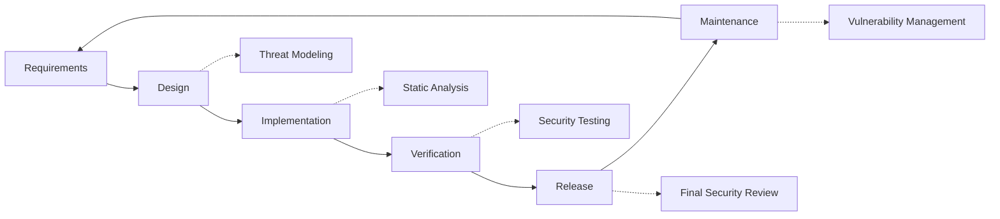

# Güvenlik Uygulamaları {#security-practices}

## İçindekiler {#table-of-contents}

* [Önsöz](#foreword)
* [Altyapı Güvenliği](#infrastructure-security)
  * [Güvenli Veri Merkezleri](#secure-data-centers)
  * [Ağ Güvenliği](#network-security)
* [E-posta Güvenliği](#email-security)
  * [Şifreleme](#encryption)
  * [Kimlik Doğrulama ve Yetkilendirme](#authentication-and-authorization)
  * [İstismara Karşı Önlemler](#anti-abuse-measures)
* [Veri Koruma](#data-protection)
  * [Veri Minimizasyonu](#data-minimization)
  * [Yedekleme ve Kurtarma](#backup-and-recovery)
* [Hizmet Sağlayıcılar](#service-providers)
* [Uyumluluk ve Denetim](#compliance-and-auditing)
  * [Düzenli Güvenlik Değerlendirmeleri](#regular-security-assessments)
  * [Uyumluluk](#compliance)
* [Olay Müdahalesi](#incident-response)
* [Güvenlik Geliştirme Yaşam Döngüsü](#security-development-lifecycle)
* [Sunucu Güçlendirme](#server-hardening)
* [Hizmet Seviyesi Anlaşması](#service-level-agreement)
* [Açık Kaynak Güvenliği](#open-source-security)
* [Çalışan Güvenliği](#employee-security)
* [Sürekli İyileştirme](#continuous-improvement)
* [Ek Kaynaklar](#additional-resources)

## Önsöz {#foreword}

Forward Email'de güvenlik en büyük önceliğimizdir. E-posta iletişimlerinizi ve kişisel verilerinizi korumak için kapsamlı güvenlik önlemleri uyguladık. Bu belge, güvenlik uygulamalarımızı ve e-postanızın gizliliğini, bütünlüğünü ve kullanılabilirliğini sağlamak için attığımız adımları ana hatlarıyla açıklamaktadır.

## Altyapı Güvenliği {#infrastructure-security}

### Güvenli Veri Merkezleri {#secure-data-centers}

Altyapımız SOC 2 uyumlu veri merkezlerinde barındırılmaktadır:

* 7/24 fiziksel güvenlik ve gözetim
* Biyometrik erişim kontrolleri
* Yedekli güç sistemleri
* Gelişmiş yangın algılama ve söndürme
* Çevresel izleme

### Ağ Güvenliği {#network-security}

Ağ güvenliğinin birden fazla katmanını uyguluyoruz:

* Sıkı erişim kontrol listelerine sahip kurumsal düzeyde güvenlik duvarları
* DDoS koruması ve azaltma
* Düzenli ağ güvenlik açığı taraması
* Saldırı algılama ve önleme sistemleri
* Tüm hizmet uç noktaları arasında trafik şifrelemesi
* Şüpheli etkinliğin otomatik olarak engellenmesiyle port tarama koruması

> \[!IMPORTANT]
> All data in transit is encrypted using TLS 1.2+ with modern cipher suites.

## E-posta Güvenliği {#email-security}

### Şifreleme {#encryption}

* **Taşıma Katmanı Güvenliği (TLS)**: Tüm e-posta trafiği TLS 1.2 veya üzeri kullanılarak aktarım sırasında şifrelenir
* **Uçtan Uca Şifreleme**: OpenPGP/MIME ve S/MIME standartları desteği
* **Depolama Şifreleme**: Tüm depolanan e-postalar SQLite dosyalarında ChaCha20-Poly1305 şifrelemesi kullanılarak hareketsizken şifrelenir
* **Tam Disk Şifreleme**: Tüm disk için LUKS v2 şifrelemesi
* **Kapsamlı Koruma**: Hareketsizken şifreleme, bellekte şifreleme ve aktarım sırasında şifreleme uygularız

> \[!NOTE]
> We're the world's first and only email service to use **[quantum-resistant and individually encrypted SQLite mailboxes](https://forwardemail.net/en/blog/docs/best-quantum-safe-encrypted-email-service)**.

### Kimlik Doğrulama ve Yetkilendirme {#authentication-and-authorization}

* **DKIM İmzalama**: Tüm giden e-postalar DKIM ile imzalanır
* **SPF ve DMARC**: E-posta sahteciliğini önlemek için SPF ve DMARC için tam destek
* **MTA-STS**: TLS şifrelemesini zorunlu kılmak için MTA-STS desteği
* **Çok Faktörlü Kimlik Doğrulama**: Tüm hesap erişimleri için kullanılabilir

### Kötüye Kullanım Önlemleri {#anti-abuse-measures}

* **Spam Filtreleme**: Makine öğrenimiyle çok katmanlı spam tespiti
* **Virüs Tarama**: Tüm eklerin gerçek zamanlı taranması
* **Oran Sınırlama**: Kaba kuvvet ve numaralandırma saldırılarına karşı koruma
* **IP İtibarı**: Gönderen IP itibarının izlenmesi
* **İçerik Filtreleme**: Kötü amaçlı URL'lerin ve kimlik avı girişimlerinin tespiti

## Veri Koruması {#data-protection}

### Veri Küçültme {#data-minimization}

Veri minimizasyonu ilkesini benimsiyoruz:

* Yalnızca hizmetimizi sağlamak için gerekli verileri topluyoruz
* E-posta içeriği bellekte işlenir ve IMAP/POP3 teslimatı için gerekli olmadıkça kalıcı olarak saklanmaz
* Günlükler anonimleştirilir ve yalnızca gerektiği kadar uzun süre saklanır

### Yedekleme ve Kurtarma {#backup-and-recovery}

* Şifreleme ile otomatik günlük yedeklemeler
* Coğrafi olarak dağıtılmış yedekleme depolama
* Düzenli yedekleme restorasyon testi
* Tanımlı RPO ve RTO ile felaket kurtarma prosedürleri

## Servis Sağlayıcıları {#service-providers}

Yüksek güvenlik standartlarımızı karşıladıklarından emin olmak için hizmet sağlayıcılarımızı dikkatlice seçiyoruz. Aşağıda uluslararası veri transferi için kullandığımız sağlayıcılar ve GDPR uyumluluk durumları yer almaktadır:

| Sağlayıcı | Amaç | DPF Sertifikalı | GDPR Uyumluluk Sayfası |
| --------------------------------------------- | ------------------------- | ------------- | ----------------------------------------------------------------- |
| [Cloudflare](https://www.cloudflare.com) | CDN, DDoS koruması, DNS | ✅ Evet | [Cloudflare GDPR](https://www.cloudflare.com/trust-hub/gdpr/) |
| [DataPacket](https://www.datapacket.com) | Sunucu altyapısı | ❌ Hayır | [DataPacket Privacy](https://www.datapacket.com/privacy-policy) |
| [Digital Ocean](https://www.digitalocean.com) | Bulut altyapısı | ❌ Hayır | [DigitalOcean GDPR](https://www.digitalocean.com/legal/gdpr) |
| [Vultr](https://www.vultr.com) | Bulut altyapısı | ❌ Hayır | [Vultr GDPR](https://www.vultr.com/legal/eea-gdpr-privacy/) |
| [Stripe](https://stripe.com) | Ödeme işleme | ✅ Evet | [Stripe Privacy Center](https://stripe.com/legal/privacy-center) |
| [PayPal](https://www.paypal.com) | Ödeme işleme | ❌ Hayır | [PayPal Privacy](https://www.paypal.com/uk/legalhub/privacy-full) |

Uluslararası veri koruma düzenlemelerine uyumu korurken güvenilir, güvenli hizmet sunumunu sağlamak için bu sağlayıcıları kullanırız. Tüm veri transferleri, kişisel bilgilerinizi korumak için uygun güvenlik önlemleri alınarak gerçekleştirilir.

## Uyumluluk ve Denetim {#compliance-and-auditing}

### Düzenli Güvenlik Değerlendirmeleri {#regular-security-assessments}

Ekibimiz kod tabanını, sunucuları, altyapıyı ve uygulamaları düzenli olarak izler, inceler ve değerlendirir. Şunları içeren kapsamlı bir güvenlik programı uygularız:

* SSH anahtarlarının düzenli rotasyonu
* Erişim günlüklerinin sürekli izlenmesi
* Otomatik güvenlik taraması
* Proaktif güvenlik açığı yönetimi
* Tüm ekip üyeleri için düzenli güvenlik eğitimi

### Uyumluluk {#compliance}

* [GDPR](https://forwardemail.net/gdpr) uyumlu veri işleme uygulamaları
* [Veri İşleme Sözleşmesi (DPA)](https://forwardemail.net/dpa) kurumsal müşteriler için mevcuttur
* CCPA uyumlu gizlilik kontrolleri
* SOC 2 Tip II denetlenmiş süreçler

## Olay Yanıtı {#incident-response}

Güvenlik olayına müdahale planımız şunları içerir:

1. **Tespit**: Otomatik izleme ve uyarı sistemleri
2. **Kısıtlama**: Etkilenen sistemlerin anında izole edilmesi
3. **Eradikasyon**: Tehdidin ortadan kaldırılması ve temel neden analizi
4. **Kurtarma**: Hizmetlerin güvenli bir şekilde geri yüklenmesi
5. **Bildirim**: Etkilenen kullanıcılarla zamanında iletişim
6. **Olay Sonrası Analiz**: Kapsamlı inceleme ve iyileştirme

> \[!WARNING]
> If you discover a security vulnerability, please report it immediately to <security@forwardemail.net>.

## Güvenlik Geliştirme Yaşam Döngüsü {#security-development-lifecycle}

Tüm kodlar şunlardan geçer:

* Güvenlik gereksinimlerinin toplanması
* Tasarım sırasında tehdit modellemesi
* Güvenli kodlama uygulamaları
* Statik ve dinamik uygulama güvenlik testi
* Güvenlik odaklı kod incelemesi
* Bağımlılık güvenlik açığı taraması

## Sunucu Güçlendirmesi {#server-hardening}

[Ansible yapılandırması](https://github.com/forwardemail/forwardemail.net/tree/master/ansible) çok sayıda sunucu güçlendirme önlemi uygular:

* **USB Erişimi Devre Dışı**: Fiziksel bağlantı noktaları, usb-storage çekirdek modülünü kara listeye alarak devre dışı bırakılır
* **Güvenlik Duvarı Kuralları**: Yalnızca gerekli bağlantılara izin veren sıkı iptables kuralları
* **SSH Güçlendirmesi**: Yalnızca anahtar tabanlı kimlik doğrulama, parola girişi yok, kök girişi devre dışı
* **Hizmet Yalıtımı**: Her hizmet, gereken en az ayrıcalıkla çalışır
* **Otomatik Güncellemeler**: Güvenlik yamaları otomatik olarak uygulanır
* **Güvenli Önyükleme**: Kurcalamayı önlemek için doğrulanmış önyükleme işlemi
* **Çekirdek Güçlendirmesi**: Güvenli çekirdek parametreleri ve sysctl yapılandırmaları
* **Dosya Sistemi Kısıtlamaları**: Uygun olan yerlerde noexec, nosuid ve nodev bağlama seçenekleri
* **Çekirdek Dökümleri Devre Dışı**: Sistem, güvenlik için çekirdek dökümlerini önleyecek şekilde yapılandırıldı
* **Değişim Devre Dışı**: Veri sızıntısını önlemek için değişim belleği devre dışı bırakıldı
* **Bağlantı Noktası Tarama Koruması**: Bağlantı noktası tarama girişimlerinin otomatik olarak algılanması ve engellenmesi
* **Şeffaf Büyük Sayfalar Devre Dışı Bırakıldı**: Geliştirilmiş performans ve güvenlik için THP devre dışı bırakıldı
* **Sistem Hizmeti Güçlendirmesi**: Apport gibi temel olmayan hizmetler devre dışı bırakıldı
* **Kullanıcı Yönetimi**: Ayrı dağıtım ve devops kullanıcıları ile en az ayrıcalık ilkesi
* **Dosya Tanımlayıcı Sınırları**: Daha iyi performans ve güvenlik için artırılmış sınırlar

## Hizmet Düzeyi Sözleşmesi {#service-level-agreement}

Yüksek düzeyde hizmet kullanılabilirliği ve güvenilirliğini sürdürüyoruz. Altyapımız, e-posta hizmetinizin çalışır durumda kalmasını sağlamak için yedeklilik ve hata toleransı için tasarlanmıştır. Resmi bir SLA belgesi yayınlamasak da, şunları taahhüt ediyoruz:

* Tüm hizmetler için %99,9+ çalışma süresi
* Hizmet kesintilerine hızlı yanıt
* Olaylar sırasında şeffaf iletişim
* Düşük trafik dönemlerinde düzenli bakım

## Açık Kaynak Güvenliği {#open-source-security}

[açık kaynaklı hizmet](https://github.com/forwardemail/forwardemail.net) olarak güvenliğimiz şunlardan yararlanır:

* Herkes tarafından denetlenebilen şeffaf kod
* Topluluk odaklı güvenlik iyileştirmeleri
* Güvenlik açıklarının hızlı bir şekilde belirlenmesi ve yamalanması
* Belirsizlik nedeniyle güvenlik yok

## Çalışan Güvenliği {#employee-security}

* Tüm çalışanlar için geçmiş kontrolleri
* Güvenlik farkındalığı eğitimi
* En az ayrıcalıklı erişim ilkesi
* Düzenli güvenlik eğitimi

## Sürekli İyileştirme {#continuous-improvement}

Güvenlik duruşumuzu şu şekilde sürekli olarak iyileştiriyoruz:

* Güvenlik eğilimlerinin ve ortaya çıkan tehditlerin izlenmesi
* Güvenlik politikalarının düzenli olarak gözden geçirilmesi ve güncellenmesi
* Güvenlik araştırmacıları ve kullanıcılarından geri bildirim
* Güvenlik topluluğuna katılım

Güvenlik uygulamalarımız hakkında daha fazla bilgi edinmek veya güvenlik endişelerinizi bildirmek için lütfen <security@forwardemail.net> adresine başvurun.

## Ek Kaynaklar {#additional-resources}

* [Gizlilik Politikası](https://forwardemail.net/en/privacy)
* [Hizmet Şartları](https://forwardemail.net/en/terms)
* [GDPR Uyumluluğu](https://forwardemail.net/gdpr)
* [Veri İşleme Sözleşmesi (DPA)](https://forwardemail.net/dpa)
* [Kötüye Kullanımı Bildir](https://forwardemail.net/en/report-abuse)
* [Güvenlik Politikası](https://github.com/forwardemail/.github/blob/main/SECURITY.md)
* [Security.txt](https://forwardemail.net/security.txt)
* [GitHub Deposu](https://github.com/forwardemail/forwardemail.net)
* [FAQ](https://forwardemail.net/en/faq)