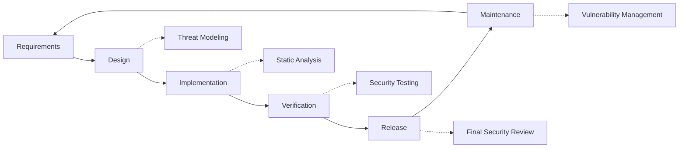

# Güvenlik Uygulamaları {#security-practices}

## İçindekiler {#table-of-contents}

* [Önsöz](#foreword)
* [Altyapı Güvenliği](#infrastructure-security)
  * [Güvenli Veri Merkezleri](#secure-data-centers)
  * [Ağ Güvenliği](#network-security)
* [E-posta Güvenliği](#email-security)
  * [Şifreleme](#encryption)
  * [Kimlik Doğrulama ve Yetkilendirme](#authentication-and-authorization)
  * [Kötüye Kullanım Önlemleri](#anti-abuse-measures)
* [Veri Koruma](#data-protection)
  * [Veri Azaltma](#data-minimization)
  * [Yedekleme ve Kurtarma](#backup-and-recovery)
* [Hizmet Sağlayıcılar](#service-providers)
* [Uyumluluk ve Denetim](#compliance-and-auditing)
  * [Düzenli Güvenlik Değerlendirmeleri](#regular-security-assessments)
  * [Uyumluluk](#compliance)
* [Olay Müdahalesi](#incident-response)
* [Güvenlik Geliştirme Yaşam Döngüsü](#security-development-lifecycle)
* [Sunucu Sertleştirme](#server-hardening)
* [Hizmet Seviyesi Anlaşması](#service-level-agreement)
* [Açık Kaynak Güvenliği](#open-source-security)
* [Çalışan Güvenliği](#employee-security)
* [Sürekli İyileştirme](#continuous-improvement)
* [Ek Kaynaklar](#additional-resources)

## Önsöz {#foreword}

Forward Email'de güvenlik en öncelikli konumuzdur. E-posta iletişimlerinizi ve kişisel verilerinizi korumak için kapsamlı güvenlik önlemleri uyguladık. Bu belge, güvenlik uygulamalarımızı ve e-postalarınızın gizliliği, bütünlüğü ve erişilebilirliğini sağlamak için attığımız adımları özetlemektedir.

## Altyapı Güvenliği {#infrastructure-security}

### Güvenli Veri Merkezleri {#secure-data-centers}

Altyapımız SOC 2 uyumlu veri merkezlerinde barındırılmaktadır ve şunları içerir:

* 7/24 fiziksel güvenlik ve gözetim
* Biyometrik erişim kontrolleri
* Yedekli güç sistemleri
* Gelişmiş yangın algılama ve söndürme
* Çevresel izleme

### Ağ Güvenliği {#network-security}

Birden fazla katmanda ağ güvenliği uygularız:

* Katı erişim kontrol listelerine sahip kurumsal düzeyde güvenlik duvarları
* DDoS koruması ve azaltma
* Düzenli ağ zafiyet taramaları
* Saldırı tespit ve önleme sistemleri
* Tüm hizmet uç noktaları arasında trafik şifrelemesi
* Şüpheli etkinliklerin otomatik engellenmesi ile port tarama koruması

> \[!IMPORTANT]
> Tüm iletim halindeki veriler TLS 1.2+ ve modern şifreleme paketleri kullanılarak şifrelenir.

## E-posta Güvenliği {#email-security}

### Şifreleme {#encryption}

* **Taşıma Katmanı Güvenliği (TLS)**: Tüm e-posta trafiği TLS 1.2 veya üzeri ile iletim sırasında şifrelenir
* **Uçtan Uca Şifreleme**: OpenPGP/MIME ve S/MIME standartları desteği
* **Depolama Şifrelemesi**: Tüm saklanan e-postalar SQLite dosyalarında ChaCha20-Poly1305 şifrelemesi ile şifrelenir
* **Tam Disk Şifrelemesi**: Tüm disk için LUKS v2 şifrelemesi
* **Kapsamlı Koruma**: Bellekte, iletimde ve depolamada şifreleme uygularız

> \[!NOTE]
> Dünyanın ilk ve tek **[kuantum dirençli ve bireysel olarak şifrelenmiş SQLite posta kutuları](https://forwardemail.net/en/blog/docs/best-quantum-safe-encrypted-email-service)** kullanan e-posta servisiyiz.

### Kimlik Doğrulama ve Yetkilendirme {#authentication-and-authorization}

* **DKIM İmzalama**: Tüm giden e-postalar DKIM ile imzalanır
* **SPF ve DMARC**: E-posta sahtekarlığını önlemek için tam SPF ve DMARC desteği
* **MTA-STS**: TLS şifrelemesini zorunlu kılmak için MTA-STS desteği
* **Çok Faktörlü Kimlik Doğrulama**: Tüm hesap erişimleri için mevcuttur

### Kötüye Kullanım Önlemleri {#anti-abuse-measures}

* **Spam Filtreleme**: Makine öğrenimi ile çok katmanlı spam tespiti
* **Virüs Taraması**: Tüm eklerin gerçek zamanlı taranması
* **Oran Sınırlaması**: Kaba kuvvet ve sayım saldırılarına karşı koruma
* **IP İtibarı**: Gönderen IP itibarının izlenmesi
* **İçerik Filtreleme**: Zararlı URL'ler ve oltalama girişimlerinin tespiti

## Veri Koruma {#data-protection}

### Veri Azaltma {#data-minimization}

Veri azaltma ilkesini takip ediyoruz:

* Hizmetimizi sağlamak için gerekli olan verileri toplarız
* E-posta içeriği bellekte işlenir ve IMAP/POP3 teslimatı için gerekmedikçe kalıcı olarak saklanmaz
* Kayıtlar anonimleştirilir ve yalnızca gerekli olduğu sürece saklanır
### Yedekleme ve Kurtarma {#backup-and-recovery}

* Şifrelemeli otomatik günlük yedeklemeler  
* Coğrafi olarak dağıtılmış yedekleme depolama  
* Düzenli yedekleme geri yükleme testleri  
* Tanımlı RPO ve RTO ile felaket kurtarma prosedürleri  

## Hizmet Sağlayıcılar {#service-providers}

Yüksek güvenlik standartlarımızı karşılamalarını sağlamak için hizmet sağlayıcılarımızı dikkatle seçiyoruz. Aşağıda uluslararası veri transferi için kullandığımız sağlayıcılar ve GDPR uyumluluk durumları yer almaktadır:

| Sağlayıcı                                     | Amaç                       | DPF Sertifikalı | GDPR Uyumluluk Sayfası                                                                                 |
| --------------------------------------------- | -------------------------- | --------------- | ------------------------------------------------------------------------------------------------------- |
| [Cloudflare](https://www.cloudflare.com)      | CDN, DDoS koruması, DNS    | ✅ Evet          | [Cloudflare GDPR](https://www.cloudflare.com/trust-hub/gdpr/)                                           |
| [DataPacket](https://www.datapacket.com)      | Sunucu altyapısı           | ❌ Hayır        | [DataPacket Gizlilik](https://www.datapacket.com/privacy-policy)                                         |
| [Digital Ocean](https://www.digitalocean.com) | Bulut altyapısı            | ❌ Hayır        | [DigitalOcean GDPR](https://www.digitalocean.com/legal/gdpr)                                            |
| [GitHub](https://github.com)                  | Kaynak kod barındırma, CI/CD | ✅ Evet          | [GitHub GDPR](https://docs.github.com/en/site-policy/privacy-policies/github-data-protection-agreement) |
| [Vultr](https://www.vultr.com)                | Bulut altyapısı            | ❌ Hayır        | [Vultr GDPR](https://www.vultr.com/legal/eea-gdpr-privacy/)                                             |
| [Stripe](https://stripe.com)                  | Ödeme işleme               | ✅ Evet          | [Stripe Gizlilik Merkezi](https://stripe.com/legal/privacy-center)                                        |
| [PayPal](https://www.paypal.com)              | Ödeme işleme               | ❌ Hayır        | [PayPal Gizlilik](https://www.paypal.com/uk/legalhub/privacy-full)                                       |

Bu sağlayıcıları, uluslararası veri koruma düzenlemelerine uyum sağlarken güvenilir ve güvenli hizmet sunumu için kullanıyoruz. Tüm veri transferleri, kişisel bilgilerinizi korumak için uygun güvenlik önlemleri ile gerçekleştirilir.  

## Uyumluluk ve Denetim {#compliance-and-auditing}

### Düzenli Güvenlik Değerlendirmeleri {#regular-security-assessments}

Ekibimiz kod tabanını, sunucuları, altyapıyı ve uygulamaları düzenli olarak izler, gözden geçirir ve değerlendirir. Kapsamlı bir güvenlik programı uygularız:

* SSH anahtarlarının düzenli rotasyonu  
* Erişim kayıtlarının sürekli izlenmesi  
* Otomatik güvenlik taramaları  
* Proaktif zafiyet yönetimi  
* Tüm ekip üyeleri için düzenli güvenlik eğitimi  

### Uyumluluk {#compliance}

* [GDPR](https://forwardemail.net/gdpr) uyumlu veri işleme uygulamaları  
* İş müşterileri için mevcut [Veri İşleme Sözleşmesi (DPA)](https://forwardemail.net/dpa)  
* CCPA uyumlu gizlilik kontrolleri  
* SOC 2 Tip II denetimli süreçler  

## Olay Müdahalesi {#incident-response}

Güvenlik olay müdahale planımız şunları içerir:

1. **Tespit**: Otomatik izleme ve uyarı sistemleri  
2. **İzole Etme**: Etkilenen sistemlerin derhal izole edilmesi  
3. **Yok Etme**: Tehdidin kaldırılması ve kök neden analizi  
4. **Kurtarma**: Hizmetlerin güvenli şekilde geri yüklenmesi  
5. **Bildirim**: Etkilenen kullanıcılarla zamanında iletişim  
6. **Olay Sonrası Analiz**: Kapsamlı inceleme ve iyileştirme  

> \[!WARNING]  
> Bir güvenlik açığı keşfederseniz, lütfen derhal <security@forwardemail.net> adresine bildirin.  

## Güvenlik Geliştirme Yaşam Döngüsü {#security-development-lifecycle}

```mermaid
flowchart LR
    A[Requirements] --> B[Design]
    B --> C[Implementation]
    C --> D[Verification]
    D --> E[Release]
    E --> F[Maintenance]
    F --> A
    B -.-> G[Threat Modeling]
    C -.-> H[Static Analysis]
    D -.-> I[Security Testing]
    E -.-> J[Final Security Review]
    F -.-> K[Vulnerability Management]
```
Tüm kodlar şunlardan geçer:

* Güvenlik gereksinimlerinin toplanması
* Tasarım sırasında tehdit modellemesi
* Güvenli kodlama uygulamaları
* Statik ve dinamik uygulama güvenliği testleri
* Güvenlik odaklı kod incelemesi
* Bağımlılık zafiyet taraması

## Sunucu Sertleştirme {#server-hardening}

[Ansible konfigürasyonumuz](https://github.com/forwardemail/forwardemail.net/tree/master/ansible) birçok sunucu sertleştirme önlemi uygular:

* **USB Erişimi Devre Dışı**: Fiziksel portlar usb-storage kernel modülünün kara listeye alınmasıyla devre dışı bırakılmıştır
* **Güvenlik Duvarı Kuralları**: Yalnızca gerekli bağlantılara izin veren sıkı iptables kuralları
* **SSH Sertleştirme**: Yalnızca anahtara dayalı kimlik doğrulama, parola ile giriş yok, root girişi devre dışı
* **Servis İzolasyonu**: Her servis minimum gerekli ayrıcalıklarla çalışır
* **Otomatik Güncellemeler**: Güvenlik yamaları otomatik olarak uygulanır
* **Güvenli Önyükleme**: Müdahaleyi önlemek için doğrulanmış önyükleme süreci
* **Kernel Sertleştirme**: Güvenli kernel parametreleri ve sysctl yapılandırmaları
* **Dosya Sistemi Kısıtlamaları**: Uygun yerlerde noexec, nosuid ve nodev bağlama seçenekleri
* **Core Dump Devre Dışı**: Güvenlik için sistem core dump’ları engelleyecek şekilde yapılandırılmıştır
* **Swap Devre Dışı**: Veri sızıntısını önlemek için swap belleği devre dışı bırakılmıştır
* **Port Taraması Koruması**: Port tarama girişimlerinin otomatik tespiti ve engellenmesi
* **Şeffaf Büyük Sayfalar Devre Dışı**: Performans ve güvenlik için THP devre dışı bırakılmıştır
* **Sistem Servisi Sertleştirme**: Apport gibi gereksiz servisler devre dışı bırakılmıştır
* **Kullanıcı Yönetimi**: Ayrı deploy ve devops kullanıcıları ile en az ayrıcalık ilkesi
* **Dosya Tanımlayıcı Limitleri**: Daha iyi performans ve güvenlik için artırılmış limitler

## Hizmet Seviyesi Anlaşması {#service-level-agreement}

Yüksek hizmet kullanılabilirliği ve güvenilirliği sağlıyoruz. Altyapımız, e-posta hizmetinizin kesintisiz çalışmasını sağlamak için yedeklilik ve hata toleransı için tasarlanmıştır. Resmi bir SLA belgesi yayınlamasak da, taahhütlerimiz şunlardır:

* Tüm hizmetlerde %99,9+ çalışma süresi
* Hizmet kesintilerine hızlı müdahale
* Olaylar sırasında şeffaf iletişim
* Düşük trafik dönemlerinde düzenli bakım

## Açık Kaynak Güvenliği {#open-source-security}

Bir [açık kaynak hizmeti](https://github.com/forwardemail/forwardemail.net) olarak güvenliğimiz şunlardan faydalanır:

* Herkes tarafından denetlenebilen şeffaf kod
* Topluluk odaklı güvenlik iyileştirmeleri
* Zafiyetlerin hızlı tespiti ve yamalanması
* Gizlilikle sağlanan güvenlik yok

## Çalışan Güvenliği {#employee-security}

* Tüm çalışanlar için geçmiş kontrolleri
* Güvenlik farkındalık eğitimi
* En az ayrıcalık erişim ilkesi
* Düzenli güvenlik eğitimi

## Sürekli İyileştirme {#continuous-improvement}

Güvenlik duruşumuzu sürekli iyileştiriyoruz:

* Güvenlik trendleri ve ortaya çıkan tehditlerin izlenmesi
* Güvenlik politikalarının düzenli gözden geçirilmesi ve güncellenmesi
* Güvenlik araştırmacıları ve kullanıcılarından geri bildirim
* Güvenlik topluluğuna katılım

Güvenlik uygulamalarımız hakkında daha fazla bilgi almak veya güvenlik endişelerini bildirmek için lütfen <security@forwardemail.net> ile iletişime geçin.

## Ek Kaynaklar {#additional-resources}

* [Gizlilik Politikası](https://forwardemail.net/en/privacy)
* [Hizmet Şartları](https://forwardemail.net/en/terms)
* [GDPR Uyumluluğu](https://forwardemail.net/gdpr)
* [Veri İşleme Sözleşmesi (DPA)](https://forwardemail.net/dpa)
* [Kötüye Kullanımı Bildir](https://forwardemail.net/en/report-abuse)
* [Güvenlik Politikası](https://github.com/forwardemail/.github/blob/main/SECURITY.md)
* [Security.txt](https://forwardemail.net/security.txt)
* [GitHub Deposu](https://github.com/forwardemail/forwardemail.net)
* [SSS](https://forwardemail.net/en/faq)
