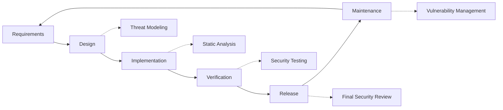

# Заходи безпеки {#security-practices}

## Зміст {#table-of-contents}

* [Передмова](#foreword)
* [Безпека інфраструктури](#infrastructure-security)
  * [Безпечні центри обробки даних](#secure-data-centers)
  * [Безпека мережі](#network-security)
* [Безпека електронної пошти](#email-security)
  * [Шифрування](#encryption)
  * [Автентифікація та авторизація](#authentication-and-authorization)
  * [Заходи проти зловживань](#anti-abuse-measures)
* [Захист даних](#data-protection)
  * [Мінімізація даних](#data-minimization)
  * [Резервне копіювання та відновлення](#backup-and-recovery)
* [Постачальники послуг](#service-providers)
* [Комплаєнс і аудит](#compliance-and-auditing)
  * [Регулярні оцінки безпеки](#regular-security-assessments)
  * [Відповідність](#compliance)
* [Реагування на інцидент](#incident-response)
* [Життєвий цикл розробки безпеки](#security-development-lifecycle)
* [Зміцнення сервера](#server-hardening)
* [Угода про рівень обслуговування](#service-level-agreement)
* [Безпека відкритого коду](#open-source-security)
* [Безпека співробітників](#employee-security)
* [Постійне вдосконалення](#continuous-improvement)
* [Додаткові ресурси](#additional-resources)

## Передмова {#foreword}

У Forward Email безпека є нашим головним пріоритетом. Ми запровадили комплексні заходи безпеки, щоб захистити вашу електронну пошту та особисті дані. У цьому документі описано наші методи безпеки та кроки, які ми вживаємо для забезпечення конфіденційності, цілісності та доступності вашої електронної пошти.

## Безпека інфраструктури {#infrastructure-security}

### Безпечні центри обробки даних {#secure-data-centers}

Наша інфраструктура розміщена в центрах обробки даних, сумісних із SOC 2, з:

* Цілодобова фізична охорона та відеоспостереження
* Біометричний контроль доступу
* Резервні системи живлення
* Удосконалені системи виявлення та гасіння пожежі
* Моніторинг навколишнього середовища

### Безпека мережі {#network-security}

Ми впроваджуємо кілька рівнів мережевої безпеки:

* Брандмауери корпоративного рівня зі списками суворого контролю доступу
* Захист та пом'якшення DDoS-атак
* Регулярне сканування мережі на вразливості
* Системи виявлення та запобігання вторгненням
* Шифрування трафіку між усіма кінцевими точками сервісу
* Захист скануванням портів з автоматичним блокуванням підозрілої активності

> \[!IMPORTANT]
> All data in transit is encrypted using TLS 1.2+ with modern cipher suites.

## Безпека електронної пошти {#email-security}

### Шифрування {#encryption}

* **Безпека транспортного рівня (TLS)**: Весь електронний трафік шифрується під час передачі за допомогою TLS 1.2 або вище
* **Наскрізне шифрування**: Підтримка стандартів OpenPGP/MIME та S/MIME
* **Шифрування сховища**: Усі збережені електронні листи шифруються під час зберігання за допомогою шифрування ChaCha20-Poly1305 у файлах SQLite
* **Шифрування всього диска**: Шифрування LUKS v2 для всього диска
* **Комплексний захист**: Ми реалізуємо шифрування під час зберігання, шифрування в пам'яті та шифрування під час передачі

> \[!NOTE]
> We're the world's first and only email service to use **[quantum-resistant and individually encrypted SQLite mailboxes](https://forwardemail.net/en/blog/docs/best-quantum-safe-encrypted-email-service)**.

### Автентифікація та авторизація {#authentication-and-authorization}

* **Підпис DKIM**: Усі вихідні електронні листи підписуються за допомогою DKIM
* **SPF та DMARC**: Повна підтримка SPF та DMARC для запобігання підміні електронної пошти
* **MTA-STS**: Підтримка MTA-STS для забезпечення шифрування TLS
* **Багатофакторна автентифікація**: Доступна для всіх облікових записів

### Заходи проти зловживань {#anti-abuse-measures}

* **Фільтрація спаму**: Багаторівневе виявлення спаму за допомогою машинного навчання
* **Сканування на віруси**: Сканування всіх вкладень у режимі реального часу
* **Обмеження швидкості**: Захист від атак методом перебору та переліку
* **Репутація IP-адрес**: Моніторинг репутації IP-адрес відправника
* **Фільтрація контенту**: Виявлення шкідливих URL-адрес та спроб фішингу

## Захист даних {#data-protection}

### Мінімізація даних {#data-minimization}

Ми дотримуємося принципу мінімізації даних:

* Ми збираємо лише ті дані, які необхідні для надання наших послуг.
* Вміст електронної пошти обробляється в пам'яті та не зберігається постійно, окрім випадків, коли це потрібно для доставки IMAP/POP3.
* Журнали анонімізуються та зберігаються лише стільки, скільки необхідно.

### Резервне копіювання та відновлення {#backup-and-recovery}

* Автоматизоване щоденне резервне копіювання з шифруванням
* Географічно розподілене сховище резервних копій
* Регулярне тестування відновлення резервних копій
* Процедури аварійного відновлення з визначеними RPO та RTO

## Постачальники послуг {#service-providers}

Ми ретельно відбираємо наших постачальників послуг, щоб гарантувати, що вони відповідають нашим високим стандартам безпеки. Нижче наведено постачальників, яких ми використовуємо для міжнародної передачі даних, і їхній статус відповідності GDPR:

| Постачальник | Мета | Сертифікований DPF | Сторінка відповідності GDPR |
| --------------------------------------------- | ------------------------- | ------------- | ----------------------------------------------------------------- |
| [Cloudflare](https://www.cloudflare.com) | CDN, захист від DDoS, DNS | ✅ Так | [Cloudflare GDPR](https://www.cloudflare.com/trust-hub/gdpr/) |
| [DataPacket](https://www.datapacket.com) | Серверна інфраструктура | ❌ Ні | [DataPacket Privacy](https://www.datapacket.com/privacy-policy) |
| [Digital Ocean](https://www.digitalocean.com) | Хмарна інфраструктура | ❌ Ні | [DigitalOcean GDPR](https://www.digitalocean.com/legal/gdpr) |
| [Vultr](https://www.vultr.com) | Хмарна інфраструктура | ❌ Ні | [Vultr GDPR](https://www.vultr.com/legal/eea-gdpr-privacy/) |
| [Stripe](https://stripe.com) | Обробка платежів | ✅ Так | [Stripe Privacy Center](https://stripe.com/legal/privacy-center) |
| [PayPal](https://www.paypal.com) | Обробка платежів | ❌ Ні | [PayPal Privacy](https://www.paypal.com/uk/legalhub/privacy-full) |

Ми використовуємо цих постачальників, щоб забезпечити надійне та безпечне надання послуг, дотримуючись при цьому відповідності до міжнародних норм захисту даних. Усі передачі даних здійснюються з відповідними заходами захисту вашої особистої інформації.

## Відповідність та аудит {#compliance-and-auditing}

### Регулярні оцінки безпеки {#regular-security-assessments}

Наша команда регулярно відстежує, перевіряє та оцінює кодову базу, сервери, інфраструктуру та практики. Ми реалізуємо комплексну програму безпеки, яка включає:

* Регулярна ротація SSH-ключів
* Безперервний моніторинг журналів доступу
* Автоматизоване сканування безпеки
* Проактивне управління вразливостями
* Регулярне навчання з безпеки для всіх членів команди

### Відповідність {#compliance}

* [GDPR](https://forwardemail.net/gdpr) методи обробки даних, що відповідають вимогам
* [Угода про обробку даних (DPA)](https://forwardemail.net/dpa) доступні для бізнес-клієнтів
* Засоби контролю конфіденційності, що відповідають вимогам CCPA
* Процеси, що пройшли аудит SOC 2 типу II

## Відповідь на інцидент {#incident-response}

Наш план реагування на інциденти безпеки включає:

1. **Виявлення**: Автоматизовані системи моніторингу та оповіщення
2. **Стримування**: Негайна ізоляція уражених систем
3. **Ліквідація**: Видалення загрози та аналіз першопричини
4. **Відновлення**: Безпечне відновлення послуг
5. **Повідомлення**: Своєчасне спілкування з ураженими користувачами
6. **Аналіз після інциденту**: Комплексний огляд та вдосконалення

> \[!WARNING]
> If you discover a security vulnerability, please report it immediately to <security@forwardemail.net>.

## Життєвий цикл розробки безпеки {#security-development-lifecycle}

Весь код проходить:

* Збір вимог безпеки
* Моделювання загроз під час проектування
* Практики безпечного кодування
* Статичне та динамічне тестування безпеки додатків
* Перевірка коду з акцентом на безпеку
* Сканування вразливостей залежностей

## Посилення захисту сервера {#server-hardening}

Наш [Конфігурація Ansible](https://github.com/forwardemail/forwardemail.net/tree/master/ansible) реалізує численні заходи захисту сервера:

* **Доступ до USB вимкнено**: Фізичні порти вимкнено шляхом додавання модуля ядра usb-storage до чорного списку
* **Правила брандмауера**: Суворі правила iptables, що дозволяють лише необхідні підключення
* **Посилення захисту SSH**: Тільки автентифікація на основі ключів, вхід без пароля, вхід root вимкнено
* **Ізоляція служб**: Кожна служба працює з мінімальними необхідними правами
* **Автоматичні оновлення**: Патчі безпеки застосовуються автоматично
* **Безпечне завантаження**: Перевірений процес завантаження для запобігання несанкціонованому доступу
* **Посилення захисту ядра**: Захищені параметри ядра та конфігурації sysctl
* **Обмеження файлової системи**: параметри монтування noexec, nosuid та nodev, де це доречно
* **Дампи основного ядра вимкнено**: Система налаштована на запобігання дампам основного ядра з міркувань безпеки
* **Підміна вимкнена**: Пам'ять підміни вимкнена для запобігання витоку даних
* **Захист сканування портів**: Автоматичне виявлення та блокування спроб сканування портів
* **Прозорі величезні сторінки вимкнено**: THP вимкнено для покращення продуктивності та безпеки
* **Посилення захисту системних служб**: Несуттєві служби, такі як Apport, вимкнено
* **Керування користувачами**: Принцип найменших привілеїв з окремими користувачами розгортання та розробки
* **Обмеження файлових дескрипторів**: Збільшені обмеження для кращої продуктивності та безпеки

## Угода про рівень обслуговування {#service-level-agreement}

Ми підтримуємо високий рівень доступності та надійності послуг. Наша інфраструктура створена для резервування та відмовостійкості, щоб забезпечити безперервну роботу служби електронної пошти. Хоча ми не публікуємо офіційний документ SLA, ми зобов’язуємося:

* 99,9%+ часу безвідмовної роботи для всіх послуг
* Швидке реагування на перебої в обслуговуванні
* Прозора комунікація під час інцидентів
* Регулярне технічне обслуговування в періоди низького трафіку

## Безпека з відкритим кодом {#open-source-security}

Як [служба з відкритим кодом](https://github.com/forwardemail/forwardemail.net), наша безпека має такі переваги:

* Прозорий код, який може бути перевірений будь-ким
* Покращення безпеки, ініційовані спільнотою
* Швидке виявлення та виправлення вразливостей
* Відсутність безпеки через невідомість

## Безпека співробітників {#employee-security}

* Перевірка біографічних даних усіх співробітників
* Навчання з питань безпеки
* Принцип мінімального доступу
* Регулярне навчання з питань безпеки

## Постійне вдосконалення {#continuous-improvement}

Ми постійно вдосконалюємо нашу безпеку за допомогою:

* Моніторинг тенденцій безпеки та нових загроз
* Регулярний перегляд та оновлення політик безпеки
* Зворотній зв'язок від дослідників безпеки та користувачів
* Участь у спільноті безпеки

Щоб отримати додаткову інформацію про наші методи безпеки або повідомити про проблеми з безпекою, зверніться за адресою <security@forwardemail.net>.

## Додаткові ресурси {#additional-resources}

* [Політика конфіденційності](https://forwardemail.net/en/privacy)
* [Умови надання послуг](https://forwardemail.net/en/terms)
* [Відповідність GDPR](https://forwardemail.net/gdpr)
* [Угода про обробку даних (DPA)](https://forwardemail.net/dpa)
* [Повідомити про зловживання](https://forwardemail.net/en/report-abuse)
* [Політика безпеки](https://github.com/forwardemail/.github/blob/main/SECURITY.md)
* [Security.txt](https://forwardemail.net/security.txt)
* [Репозиторій GitHub](https://github.com/forwardemail/forwardemail.net)
* [FAQ](https://forwardemail.net/en/faq)