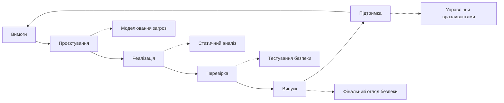

# Практики безпеки {#security-practices}

## Зміст {#table-of-contents}

* [Передмова](#foreword)
* [Безпека інфраструктури](#infrastructure-security)
  * [Безпечні дата-центри](#secure-data-centers)
  * [Безпека мережі](#network-security)
* [Безпека електронної пошти](#email-security)
  * [Шифрування](#encryption)
  * [Аутентифікація та авторизація](#authentication-and-authorization)
  * [Заходи проти зловживань](#anti-abuse-measures)
* [Захист даних](#data-protection)
  * [Мінімізація даних](#data-minimization)
  * [Резервне копіювання та відновлення](#backup-and-recovery)
* [Постачальники послуг](#service-providers)
* [Відповідність та аудит](#compliance-and-auditing)
  * [Регулярні оцінки безпеки](#regular-security-assessments)
  * [Відповідність](#compliance)
* [Реагування на інциденти](#incident-response)
* [Життєвий цикл розробки безпеки](#security-development-lifecycle)
* [Зміцнення серверів](#server-hardening)
* [Угода про рівень обслуговування](#service-level-agreement)
* [Безпека відкритого коду](#open-source-security)
* [Безпека працівників](#employee-security)
* [Безперервне вдосконалення](#continuous-improvement)
* [Додаткові ресурси](#additional-resources)

## Передмова {#foreword}

У Forward Email безпека є нашим головним пріоритетом. Ми впровадили комплексні заходи безпеки для захисту ваших електронних комунікацій та персональних даних. Цей документ описує наші практики безпеки та кроки, які ми робимо для забезпечення конфіденційності, цілісності та доступності вашої електронної пошти.

## Безпека інфраструктури {#infrastructure-security}

### Безпечні дата-центри {#secure-data-centers}

Наша інфраструктура розміщена у дата-центрах, що відповідають стандарту SOC 2, з:

* цілодобовою фізичною охороною та відеоспостереженням
* біометричним контролем доступу
* резервними системами живлення
* передовими системами виявлення та гасіння пожеж
* моніторингом навколишнього середовища

### Безпека мережі {#network-security}

Ми впроваджуємо кілька рівнів мережевої безпеки:

* корпоративні міжмережеві екрани з суворими списками контролю доступу
* захист і пом'якшення DDoS-атак
* регулярне сканування мережі на вразливості
* системи виявлення та запобігання вторгненням
* шифрування трафіку між усіма кінцевими точками сервісу
* захист від сканування портів з автоматичним блокуванням підозрілої активності

> \[!IMPORTANT]
> Всі дані під час передачі шифруються за допомогою TLS 1.2+ з сучасними наборами шифрів.

## Безпека електронної пошти {#email-security}

### Шифрування {#encryption}

* **Transport Layer Security (TLS)**: Весь поштовий трафік шифрується під час передачі за допомогою TLS 1.2 або вище
* **Шифрування від кінця до кінця**: Підтримка стандартів OpenPGP/MIME та S/MIME
* **Шифрування зберігання**: Всі збережені листи шифруються у стані спокою за допомогою ChaCha20-Poly1305 у файлах SQLite
* **Повне шифрування диска**: Шифрування LUKS v2 для всього диска
* **Комплексний захист**: Ми впроваджуємо шифрування в стані спокою, у пам’яті та під час передачі

> \[!NOTE]
> Ми — перший і єдиний у світі поштовий сервіс, що використовує **[квантово-стійкі та індивідуально зашифровані поштові скриньки SQLite](https://forwardemail.net/en/blog/docs/best-quantum-safe-encrypted-email-service)**.

### Аутентифікація та авторизація {#authentication-and-authorization}

* **Підписування DKIM**: Всі вихідні листи підписуються DKIM
* **SPF та DMARC**: Повна підтримка SPF та DMARC для запобігання підробці листів
* **MTA-STS**: Підтримка MTA-STS для примусового шифрування TLS
* **Багатофакторна аутентифікація**: Доступна для всіх облікових записів

### Заходи проти зловживань {#anti-abuse-measures}

* **Фільтрація спаму**: Багаторівневе виявлення спаму з використанням машинного навчання
* **Сканування на віруси**: Сканування всіх вкладень у режимі реального часу
* **Обмеження швидкості**: Захист від атак грубої сили та переліку
* **Репутація IP**: Моніторинг репутації IP-адрес відправників
* **Фільтрація контенту**: Виявлення шкідливих URL та фішингових спроб

## Захист даних {#data-protection}

### Мінімізація даних {#data-minimization}

Ми дотримуємося принципу мінімізації даних:

* Ми збираємо лише ті дані, які необхідні для надання нашої послуги
* Вміст електронної пошти обробляється в пам’яті і не зберігається постійно, якщо це не потрібно для доставки IMAP/POP3
* Логи анонімізуються і зберігаються лише стільки, скільки необхідно
### Резервне копіювання та відновлення {#backup-and-recovery}

* Автоматизовані щоденні резервні копії з шифруванням
* Географічно розподілене сховище резервних копій
* Регулярне тестування відновлення резервних копій
* Процедури відновлення після аварій з визначеними RPO та RTO

## Постачальники послуг {#service-providers}

Ми ретельно обираємо наших постачальників послуг, щоб забезпечити відповідність їх високим стандартам безпеки. Нижче наведені постачальники, яких ми використовуємо для міжнародної передачі даних, та їх статус відповідності GDPR:

| Постачальник                                  | Призначення               | Сертифікат DPF | Сторінка відповідності GDPR                                                                              |
| --------------------------------------------- | -------------------------- | ------------- | ------------------------------------------------------------------------------------------------------- |
| [Cloudflare](https://www.cloudflare.com)      | CDN, захист від DDoS, DNS  | ✅ Так         | [Cloudflare GDPR](https://www.cloudflare.com/trust-hub/gdpr/)                                           |
| [DataPacket](https://www.datapacket.com)      | Серверна інфраструктура    | ❌ Ні          | [DataPacket Privacy](https://www.datapacket.com/privacy-policy)                                         |
| [Digital Ocean](https://www.digitalocean.com) | Хмарна інфраструктура      | ❌ Ні          | [DigitalOcean GDPR](https://www.digitalocean.com/legal/gdpr)                                            |
| [GitHub](https://github.com)                  | Хостинг коду, CI/CD        | ✅ Так         | [GitHub GDPR](https://docs.github.com/en/site-policy/privacy-policies/github-data-protection-agreement) |
| [Vultr](https://www.vultr.com)                | Хмарна інфраструктура      | ❌ Ні          | [Vultr GDPR](https://www.vultr.com/legal/eea-gdpr-privacy/)                                             |
| [Stripe](https://stripe.com)                  | Обробка платежів           | ✅ Так         | [Stripe Privacy Center](https://stripe.com/legal/privacy-center)                                        |
| [PayPal](https://www.paypal.com)              | Обробка платежів           | ❌ Ні          | [PayPal Privacy](https://www.paypal.com/uk/legalhub/privacy-full)                                       |

Ми використовуємо цих постачальників, щоб забезпечити надійне, безпечне надання послуг, одночасно дотримуючись міжнародних правил захисту даних. Всі передачі даних здійснюються з відповідними заходами безпеки для захисту вашої особистої інформації.

## Відповідність та аудит {#compliance-and-auditing}

### Регулярні оцінки безпеки {#regular-security-assessments}

Наша команда регулярно моніторить, переглядає та оцінює кодову базу, сервери, інфраструктуру та практики. Ми впроваджуємо комплексну програму безпеки, яка включає:

* Регулярну ротацію SSH-ключів
* Безперервний моніторинг журналів доступу
* Автоматизоване сканування безпеки
* Проактивне управління вразливостями
* Регулярне навчання з безпеки для всіх членів команди

### Відповідність {#compliance}

* Практики обробки даних, що відповідають [GDPR](https://forwardemail.net/gdpr)
* Доступна [Угода про обробку даних (DPA)](https://forwardemail.net/dpa) для бізнес-клієнтів
* Контролі конфіденційності, що відповідають CCPA
* Процеси, перевірені аудитом SOC 2 Type II

## Реагування на інциденти {#incident-response}

Наш план реагування на інциденти безпеки включає:

1. **Виявлення**: Автоматизовані системи моніторингу та оповіщення
2. **Ізоляція**: Негайне відокремлення уражених систем
3. **Усунення**: Видалення загрози та аналіз кореневої причини
4. **Відновлення**: Безпечне відновлення сервісів
5. **Повідомлення**: Своєчасне інформування постраждалих користувачів
6. **Аналіз після інциденту**: Комплексний огляд та вдосконалення

> \[!WARNING]
> Якщо ви виявили вразливість безпеки, будь ласка, негайно повідомте про це на <security@forwardemail.net>.

## Життєвий цикл розробки безпеки {#security-development-lifecycle}

```mermaid
flowchart LR
    A[Вимоги] --> B[Проєктування]
    B --> C[Реалізація]
    C --> D[Перевірка]
    D --> E[Випуск]
    E --> F[Підтримка]
    F --> A
    B -.-> G[Моделювання загроз]
    C -.-> H[Статичний аналіз]
    D -.-> I[Тестування безпеки]
    E -.-> J[Фінальний огляд безпеки]
    F -.-> K[Управління вразливостями]
```
Весь код проходить:

* Збір вимог безпеки
* Моделювання загроз під час проєктування
* Практики безпечного кодування
* Статичне та динамічне тестування безпеки застосунків
* Перегляд коду з акцентом на безпеку
* Сканування вразливостей залежностей

## Загартування сервера {#server-hardening}

Наш [Ansible конфігурація](https://github.com/forwardemail/forwardemail.net/tree/master/ansible) реалізує численні заходи загартування сервера:

* **Доступ до USB вимкнено**: Фізичні порти вимкнені шляхом внесення модуля ядра usb-storage до чорного списку
* **Правила брандмауера**: Строгі правила iptables, що дозволяють лише необхідні з’єднання
* **Загартування SSH**: Тільки автентифікація на основі ключів, без входу за паролем, вхід root заборонено
* **Ізоляція сервісів**: Кожен сервіс працює з мінімальними необхідними привілеями
* **Автоматичні оновлення**: Патчі безпеки застосовуються автоматично
* **Безпечне завантаження**: Перевірений процес завантаження для запобігання підробці
* **Загартування ядра**: Безпечні параметри ядра та конфігурації sysctl
* **Обмеження файлової системи**: опції монтування noexec, nosuid та nodev там, де це доречно
* **Відключені core dumps**: Система налаштована для запобігання core dumps з міркувань безпеки
* **Відключений swap**: Swap пам’ять вимкнена для запобігання витоку даних
* **Захист від сканування портів**: Автоматичне виявлення та блокування спроб сканування портів
* **Відключені Transparent Huge Pages**: THP вимкнено для покращення продуктивності та безпеки
* **Загартування системних сервісів**: Відключені неважливі сервіси, такі як Apport
* **Управління користувачами**: Принцип найменших привілеїв з окремими користувачами deploy та devops
* **Обмеження дескрипторів файлів**: Підвищені ліміти для кращої продуктивності та безпеки

## Угода про рівень обслуговування {#service-level-agreement}

Ми підтримуємо високий рівень доступності та надійності сервісу. Наша інфраструктура спроєктована з урахуванням надлишковості та відмовостійкості, щоб забезпечити безперервну роботу вашої поштової служби. Хоча ми не публікуємо офіційний документ SLA, ми зобов’язуємося:

* 99.9%+ часу безвідмовної роботи для всіх сервісів
* Швидке реагування на збої в роботі сервісів
* Прозору комунікацію під час інцидентів
* Регулярне обслуговування у періоди низького навантаження

## Безпека відкритого коду {#open-source-security}

Як [сервіс з відкритим кодом](https://github.com/forwardemail/forwardemail.net), наша безпека базується на:

* Прозорому коді, який може перевірити будь-хто
* Покращеннях безпеки, керованих спільнотою
* Швидкому виявленні та усуненні вразливостей
* Відсутності безпеки через приховування

## Безпека працівників {#employee-security}

* Перевірка біографії всіх працівників
* Навчання з підвищення обізнаності про безпеку
* Принцип найменших привілеїв доступу
* Регулярна освіта з безпеки

## Постійне вдосконалення {#continuous-improvement}

Ми постійно покращуємо нашу безпеку через:

* Моніторинг тенденцій безпеки та нових загроз
* Регулярний перегляд та оновлення політик безпеки
* Зворотний зв’язок від дослідників безпеки та користувачів
* Участь у спільноті безпеки

Для отримання додаткової інформації про наші практики безпеки або для повідомлення про проблеми безпеки, будь ласка, зв’яжіться з <security@forwardemail.net>.

## Додаткові ресурси {#additional-resources}

* [Політика конфіденційності](https://forwardemail.net/en/privacy)
* [Умови обслуговування](https://forwardemail.net/en/terms)
* [Відповідність GDPR](https://forwardemail.net/gdpr)
* [Угода про обробку даних (DPA)](https://forwardemail.net/dpa)
* [Повідомити про зловживання](https://forwardemail.net/en/report-abuse)
* [Політика безпеки](https://github.com/forwardemail/.github/blob/main/SECURITY.md)
* [Security.txt](https://forwardemail.net/security.txt)
* [Репозиторій GitHub](https://github.com/forwardemail/forwardemail.net)
* [Часті питання](https://forwardemail.net/en/faq)
