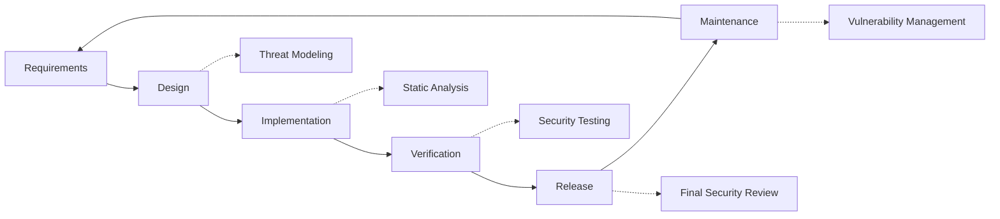

# Thực hành bảo mật {#security-practices}

## Mục lục {#table-of-contents}

* [Lời nói đầu](#foreword)
* [An ninh cơ sở hạ tầng](#infrastructure-security)
  * [Trung tâm dữ liệu an toàn](#secure-data-centers)
  * [Bảo mật mạng](#network-security)
* [Bảo mật Email](#email-security)
  * [Mã hóa](#encryption)
  * [Xác thực và ủy quyền](#authentication-and-authorization)
  * [Biện pháp chống lạm dụng](#anti-abuse-measures)
* [Bảo vệ dữ liệu](#data-protection)
  * [Giảm thiểu dữ liệu](#data-minimization)
  * [Sao lưu và Phục hồi](#backup-and-recovery)
* [Nhà cung cấp dịch vụ](#service-providers)
* [Tuân thủ và Kiểm toán](#compliance-and-auditing)
  * [Đánh giá an ninh thường xuyên](#regular-security-assessments)
  * [Sự tuân thủ](#compliance)
* [Phản ứng sự cố](#incident-response)
* [Vòng đời phát triển bảo mật](#security-development-lifecycle)
* [Làm cứng máy chủ](#server-hardening)
* [Thỏa thuận mức dịch vụ](#service-level-agreement)
* [Bảo mật nguồn mở](#open-source-security)
* [An ninh nhân viên](#employee-security)
* [Cải tiến liên tục](#continuous-improvement)
* [Tài nguyên bổ sung](#additional-resources)

## Lời nói đầu {#foreword}

Tại Forward Email, bảo mật là ưu tiên hàng đầu của chúng tôi. Chúng tôi đã triển khai các biện pháp bảo mật toàn diện để bảo vệ thông tin liên lạc qua email và dữ liệu cá nhân của bạn. Tài liệu này nêu rõ các biện pháp bảo mật của chúng tôi và các bước chúng tôi thực hiện để đảm bảo tính bảo mật, toàn vẹn và khả dụng của email của bạn.

## Bảo mật cơ sở hạ tầng {#infrastructure-security}

### Trung tâm dữ liệu an toàn {#secure-data-centers}

Cơ sở hạ tầng của chúng tôi được lưu trữ tại các trung tâm dữ liệu tuân thủ SOC 2 với:

* An ninh vật lý và giám sát 24/7
* Kiểm soát truy cập sinh trắc học
* Hệ thống điện dự phòng
* Phát hiện và dập lửa tiên tiến
* Giám sát môi trường

### Bảo mật mạng {#network-security}

Chúng tôi triển khai nhiều lớp bảo mật mạng:

* Tường lửa cấp doanh nghiệp với danh sách kiểm soát truy cập nghiêm ngặt
* Bảo vệ và giảm thiểu DDoS
* Quét lỗ hổng mạng thường xuyên
* Hệ thống phát hiện và ngăn chặn xâm nhập
* Mã hóa lưu lượng giữa tất cả các điểm cuối dịch vụ
* Bảo vệ quét cổng với chức năng tự động chặn hoạt động đáng ngờ

> \[!IMPORTANT]
> All data in transit is encrypted using TLS 1.2+ with modern cipher suites.

## Bảo mật Email {#email-security}

### Mã hóa {#encryption}

* **Bảo mật lớp truyền tải (TLS)**: Tất cả lưu lượng email được mã hóa khi truyền tải bằng TLS 1.2 trở lên
* **Mã hóa đầu cuối**: Hỗ trợ các tiêu chuẩn OpenPGP/MIME và S/MIME
* **Mã hóa lưu trữ**: Tất cả email được lưu trữ đều được mã hóa khi lưu trữ bằng mã hóa ChaCha20-Poly1305 trong các tệp SQLite
* **Mã hóa toàn bộ đĩa**: Mã hóa LUKS v2 cho toàn bộ đĩa
* **Bảo vệ toàn diện**: Chúng tôi triển khai mã hóa khi lưu trữ, mã hóa trong bộ nhớ và mã hóa khi truyền tải

> \[!NOTE]
> We're the world's first and only email service to use **[quantum-resistant and individually encrypted SQLite mailboxes](https://forwardemail.net/en/blog/docs/best-quantum-safe-encrypted-email-service)**.

### Xác thực và Ủy quyền {#authentication-and-authorization}

* **Ký DKIM**: Tất cả email gửi đi đều được ký bằng DKIM
* **SPF và DMARC**: Hỗ trợ đầy đủ SPF và DMARC để ngăn chặn email giả mạo
* **MTA-STS**: Hỗ trợ MTA-STS để thực thi mã hóa TLS
* **Xác thực đa yếu tố**: Có sẵn cho tất cả quyền truy cập tài khoản

### Các biện pháp chống lạm dụng {#anti-abuse-measures}

* **Lọc thư rác**: Phát hiện thư rác nhiều lớp với máy học
* **Quét vi-rút**: Quét tất cả các tệp đính kèm theo thời gian thực
* **Giới hạn tốc độ**: Bảo vệ chống lại các cuộc tấn công bằng cách dùng vũ lực và liệt kê
* **Danh tiếng IP**: Theo dõi danh tiếng IP khi gửi
* **Lọc nội dung**: Phát hiện các URL độc hại và các nỗ lực lừa đảo

## Bảo vệ dữ liệu {#data-protection}

### Giảm thiểu dữ liệu {#data-minimization}

Chúng tôi tuân theo nguyên tắc giảm thiểu dữ liệu:

* Chúng tôi chỉ thu thập dữ liệu cần thiết để cung cấp dịch vụ của mình
* Nội dung email được xử lý trong bộ nhớ và không được lưu trữ liên tục trừ khi cần thiết để phân phối IMAP/POP3
* Nhật ký được ẩn danh và chỉ được lưu giữ trong thời gian cần thiết

### Sao lưu và Phục hồi {#backup-and-recovery}

* Sao lưu tự động hàng ngày với mã hóa
* Lưu trữ sao lưu phân tán theo địa lý
* Kiểm tra khôi phục sao lưu thường xuyên
* Quy trình khôi phục sau thảm họa với RPO và RTO được xác định

## Nhà cung cấp dịch vụ {#service-providers}

Chúng tôi lựa chọn cẩn thận các nhà cung cấp dịch vụ của mình để đảm bảo họ đáp ứng các tiêu chuẩn bảo mật cao của chúng tôi. Dưới đây là các nhà cung cấp chúng tôi sử dụng để truyền dữ liệu quốc tế và trạng thái tuân thủ GDPR của họ:

| Nhà cung cấp | Mục đích | Chứng nhận DPF | Trang tuân thủ GDPR |
| --------------------------------------------- | ------------------------- | ------------- | ----------------------------------------------------------------- |
| [Cloudflare](https://www.cloudflare.com) | CDN, bảo vệ DDoS, DNS | ✅ Có | [Cloudflare GDPR](https://www.cloudflare.com/trust-hub/gdpr/) |
| [DataPacket](https://www.datapacket.com) | Cơ sở hạ tầng máy chủ | ❌ Không | [DataPacket Privacy](https://www.datapacket.com/privacy-policy) |
| [Digital Ocean](https://www.digitalocean.com) | Cơ sở hạ tầng đám mây | ❌ Không | [DigitalOcean GDPR](https://www.digitalocean.com/legal/gdpr) |
| [Vultr](https://www.vultr.com) | Cơ sở hạ tầng đám mây | ❌ Không | [Vultr GDPR](https://www.vultr.com/legal/eea-gdpr-privacy/) |
| [Stripe](https://stripe.com) | Xử lý thanh toán | ✅ Có | [Stripe Privacy Center](https://stripe.com/legal/privacy-center) |
| [PayPal](https://www.paypal.com) | Xử lý thanh toán | ❌ Không | [PayPal Privacy](https://www.paypal.com/uk/legalhub/privacy-full) |

Chúng tôi sử dụng các nhà cung cấp này để đảm bảo cung cấp dịch vụ đáng tin cậy, an toàn trong khi vẫn tuân thủ các quy định bảo vệ dữ liệu quốc tế. Tất cả các hoạt động chuyển dữ liệu đều được thực hiện với các biện pháp bảo vệ phù hợp để bảo vệ thông tin cá nhân của bạn.

## Tuân thủ và Kiểm toán {#compliance-and-auditing}

### Đánh giá bảo mật thường xuyên {#regular-security-assessments}

Nhóm của chúng tôi thường xuyên theo dõi, xem xét và đánh giá cơ sở mã, máy chủ, cơ sở hạ tầng và các hoạt động. Chúng tôi triển khai một chương trình bảo mật toàn diện bao gồm:

* Thay đổi khóa SSH thường xuyên
* Liên tục theo dõi nhật ký truy cập
* Quét bảo mật tự động
* Quản lý lỗ hổng chủ động
* Đào tạo bảo mật thường xuyên cho tất cả các thành viên trong nhóm

### Tuân thủ {#compliance}

* [GDPR](https://forwardemail.net/gdpr) thực hành xử lý dữ liệu tuân thủ
* [Thỏa thuận xử lý dữ liệu (DPA)](https://forwardemail.net/dpa) dành cho khách hàng doanh nghiệp
* Các biện pháp kiểm soát quyền riêng tư tuân thủ CCPA
* Quy trình được kiểm toán SOC 2 Loại II

## Phản hồi sự cố {#incident-response}

Kế hoạch ứng phó sự cố an ninh của chúng tôi bao gồm:

1. **Phát hiện**: Hệ thống giám sát và cảnh báo tự động
2. **Kiềm chế**: Cô lập ngay lập tức các hệ thống bị ảnh hưởng
3. **Xóa bỏ**: Loại bỏ mối đe dọa và phân tích nguyên nhân gốc rễ
4. **Phục hồi**: Khôi phục dịch vụ an toàn
5. **Thông báo**: Giao tiếp kịp thời với người dùng bị ảnh hưởng
6. **Phân tích sau sự cố**: Đánh giá và cải thiện toàn diện

> \[!WARNING]
> If you discover a security vulnerability, please report it immediately to <security@forwardemail.net>.

## Vòng đời phát triển bảo mật {#security-development-lifecycle}

Tất cả mã đều trải qua:

* Thu thập yêu cầu bảo mật
* Mô hình hóa mối đe dọa trong quá trình thiết kế
* Thực hành mã hóa an toàn
* Kiểm tra bảo mật ứng dụng tĩnh và động
* Đánh giá mã với trọng tâm bảo mật
* Quét lỗ hổng phụ thuộc

## Bảo mật máy chủ {#server-hardening}

[Cấu hình Ansible](https://github.com/forwardemail/forwardemail.net/tree/master/ansible) của chúng tôi triển khai nhiều biện pháp tăng cường bảo mật máy chủ:

* **Tắt quyền truy cập USB**: Các cổng vật lý bị tắt bằng cách đưa mô-đun hạt nhân lưu trữ usb vào danh sách đen
* **Quy tắc tường lửa**: Các quy tắc iptables nghiêm ngặt chỉ cho phép các kết nối cần thiết
* **Bảo mật SSH**: Chỉ xác thực dựa trên khóa, không đăng nhập bằng mật khẩu, vô hiệu hóa đăng nhập root
* **Cô lập dịch vụ**: Mỗi dịch vụ chạy với các đặc quyền tối thiểu bắt buộc
* **Cập nhật tự động**: Các bản vá bảo mật được áp dụng tự động
* **Khởi động an toàn**: Quy trình khởi động được xác minh để ngăn chặn sự can thiệp
* **Bảo mật hạt nhân**: Các tham số hạt nhân an toàn và cấu hình sysctl
* **Hạn chế hệ thống tệp**: Các tùy chọn gắn noexec, nosuid và nodev khi thích hợp
* **Tắt Core Dumps**: Hệ thống được định cấu hình để ngăn chặn core dumps vì lý do bảo mật
* **Tắt Swap**: Tắt bộ nhớ Swap để ngăn chặn rò rỉ dữ liệu
* **Bảo vệ quét cổng**: Tự động phát hiện và chặn các nỗ lực quét cổng
* **Tắt Transparent Huge Pages**: Tắt THP để cải thiện hiệu suất và bảo mật
* **Bảo mật dịch vụ hệ thống**: Các dịch vụ không cần thiết như Apport đã bị vô hiệu hóa
* **Quản lý người dùng**: Nguyên tắc đặc quyền tối thiểu với người dùng triển khai và devops riêng biệt
* **Giới hạn mô tả tệp**: Tăng giới hạn để có hiệu suất và bảo mật tốt hơn

## Thỏa thuận mức dịch vụ {#service-level-agreement}

Chúng tôi duy trì mức độ sẵn sàng và độ tin cậy của dịch vụ cao. Cơ sở hạ tầng của chúng tôi được thiết kế để dự phòng và chịu lỗi để đảm bảo dịch vụ email của bạn vẫn hoạt động. Mặc dù chúng tôi không công bố tài liệu SLA chính thức, nhưng chúng tôi cam kết:

* Thời gian hoạt động 99,9%+ cho tất cả các dịch vụ
* Phản hồi nhanh chóng khi có sự cố dịch vụ
* Giao tiếp minh bạch trong quá trình xảy ra sự cố
* Bảo trì thường xuyên trong thời gian lưu lượng truy cập thấp

## Bảo mật nguồn mở {#open-source-security}

Với tư cách là [dịch vụ mã nguồn mở](https://github.com/forwardemail/forwardemail.net), bảo mật của chúng tôi được hưởng lợi từ:

* Mã minh bạch có thể được kiểm tra bởi bất kỳ ai
* Cải thiện bảo mật do cộng đồng thúc đẩy
* Xác định và vá lỗ hổng nhanh chóng
* Không có bảo mật thông qua sự mơ hồ

## Bảo mật nhân viên {#employee-security}

* Kiểm tra lý lịch của tất cả nhân viên
* Đào tạo nhận thức về an ninh
* Nguyên tắc tiếp cận đặc quyền tối thiểu
* Giáo dục an ninh thường xuyên

## Cải tiến liên tục {#continuous-improvement}

Chúng tôi liên tục cải thiện khả năng bảo mật của mình thông qua:

* Theo dõi xu hướng bảo mật và các mối đe dọa mới nổi
* Thường xuyên xem xét và cập nhật các chính sách bảo mật
* Phản hồi từ các nhà nghiên cứu bảo mật và người dùng
* Tham gia vào cộng đồng bảo mật

Để biết thêm thông tin về các hoạt động bảo mật của chúng tôi hoặc để báo cáo các vấn đề bảo mật, vui lòng liên hệ <security@forwardemail.net>.

## Tài nguyên bổ sung {#additional-resources}

* [Chính sách bảo mật](https://forwardemail.net/en/privacy)
* [Điều khoản dịch vụ](https://forwardemail.net/en/terms)
* [Tuân thủ GDPR](https://forwardemail.net/gdpr)
* [Thỏa thuận xử lý dữ liệu (DPA)](https://forwardemail.net/dpa)
* [Báo cáo lạm dụng](https://forwardemail.net/en/report-abuse)
* [Chính sách bảo mật](https://github.com/forwardemail/.github/blob/main/SECURITY.md)
* [Security.txt](https://forwardemail.net/security.txt)
* [Kho lưu trữ GitHub](https://github.com/forwardemail/forwardemail.net)
* [FAQ](https://forwardemail.net/en/faq)