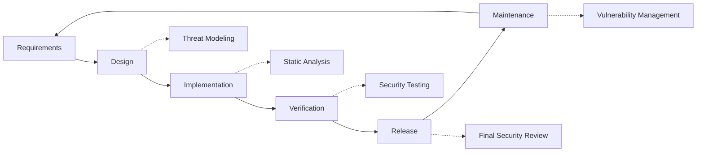

# Thực hành Bảo mật {#security-practices}

## Mục lục {#table-of-contents}

* [Lời nói đầu](#foreword)
* [Bảo mật Hạ tầng](#infrastructure-security)
  * [Trung tâm Dữ liệu An toàn](#secure-data-centers)
  * [Bảo mật Mạng](#network-security)
* [Bảo mật Email](#email-security)
  * [Mã hóa](#encryption)
  * [Xác thực và Ủy quyền](#authentication-and-authorization)
  * [Biện pháp Chống Lạm dụng](#anti-abuse-measures)
* [Bảo vệ Dữ liệu](#data-protection)
  * [Giảm thiểu Dữ liệu](#data-minimization)
  * [Sao lưu và Phục hồi](#backup-and-recovery)
* [Nhà cung cấp Dịch vụ](#service-providers)
* [Tuân thủ và Kiểm toán](#compliance-and-auditing)
  * [Đánh giá Bảo mật Định kỳ](#regular-security-assessments)
  * [Tuân thủ](#compliance)
* [Phản ứng Sự cố](#incident-response)
* [Vòng đời Phát triển Bảo mật](#security-development-lifecycle)
* [Tăng cường Máy chủ](#server-hardening)
* [Thỏa thuận Mức dịch vụ](#service-level-agreement)
* [Bảo mật Mã nguồn Mở](#open-source-security)
* [Bảo mật Nhân viên](#employee-security)
* [Cải tiến Liên tục](#continuous-improvement)
* [Tài nguyên Bổ sung](#additional-resources)

## Lời nói đầu {#foreword}

Tại Forward Email, bảo mật là ưu tiên hàng đầu của chúng tôi. Chúng tôi đã triển khai các biện pháp bảo mật toàn diện để bảo vệ giao tiếp email và dữ liệu cá nhân của bạn. Tài liệu này trình bày các thực hành bảo mật của chúng tôi và các bước chúng tôi thực hiện để đảm bảo tính bảo mật, toàn vẹn và khả dụng của email của bạn.

## Bảo mật Hạ tầng {#infrastructure-security}

### Trung tâm Dữ liệu An toàn {#secure-data-centers}

Hạ tầng của chúng tôi được lưu trữ tại các trung tâm dữ liệu tuân thủ SOC 2 với:

* An ninh vật lý và giám sát 24/7
* Kiểm soát truy cập bằng sinh trắc học
* Hệ thống điện dự phòng
* Phát hiện và dập cháy tiên tiến
* Giám sát môi trường

### Bảo mật Mạng {#network-security}

Chúng tôi triển khai nhiều lớp bảo mật mạng:

* Tường lửa cấp doanh nghiệp với danh sách kiểm soát truy cập nghiêm ngặt
* Bảo vệ và giảm thiểu DDoS
* Quét lỗ hổng mạng định kỳ
* Hệ thống phát hiện và ngăn chặn xâm nhập
* Mã hóa lưu lượng giữa tất cả các điểm dịch vụ
* Bảo vệ quét cổng với chặn tự động các hoạt động đáng ngờ

> \[!IMPORTANT]
> Tất cả dữ liệu truyền tải đều được mã hóa sử dụng TLS 1.2+ với bộ mã hóa hiện đại.

## Bảo mật Email {#email-security}

### Mã hóa {#encryption}

* **Transport Layer Security (TLS)**: Tất cả lưu lượng email được mã hóa khi truyền tải sử dụng TLS 1.2 trở lên
* **Mã hóa Đầu-cuối**: Hỗ trợ các chuẩn OpenPGP/MIME và S/MIME
* **Mã hóa Lưu trữ**: Tất cả email lưu trữ được mã hóa khi nghỉ sử dụng mã hóa ChaCha20-Poly1305 trong các file SQLite
* **Mã hóa Toàn bộ Ổ đĩa**: Mã hóa LUKS v2 cho toàn bộ ổ đĩa
* **Bảo vệ Toàn diện**: Chúng tôi triển khai mã hóa khi lưu trữ, mã hóa trong bộ nhớ và mã hóa khi truyền tải

> \[!NOTE]
> Chúng tôi là dịch vụ email đầu tiên và duy nhất trên thế giới sử dụng **[hộp thư SQLite được mã hóa cá nhân và chống lượng tử](https://forwardemail.net/en/blog/docs/best-quantum-safe-encrypted-email-service)**.

### Xác thực và Ủy quyền {#authentication-and-authorization}

* **Ký DKIM**: Tất cả email gửi đi đều được ký bằng DKIM
* **SPF và DMARC**: Hỗ trợ đầy đủ SPF và DMARC để ngăn chặn giả mạo email
* **MTA-STS**: Hỗ trợ MTA-STS để bắt buộc mã hóa TLS
* **Xác thực Đa yếu tố**: Có sẵn cho tất cả truy cập tài khoản

### Biện pháp Chống Lạm dụng {#anti-abuse-measures}

* **Lọc Spam**: Phát hiện spam đa lớp với học máy
* **Quét Virus**: Quét thời gian thực tất cả tệp đính kèm
* **Giới hạn Tốc độ**: Bảo vệ chống tấn công brute force và dò tìm
* **Đánh giá Uy tín IP**: Giám sát uy tín IP gửi đi
* **Lọc Nội dung**: Phát hiện URL độc hại và các cố gắng lừa đảo

## Bảo vệ Dữ liệu {#data-protection}

### Giảm thiểu Dữ liệu {#data-minimization}

Chúng tôi tuân theo nguyên tắc giảm thiểu dữ liệu:

* Chúng tôi chỉ thu thập dữ liệu cần thiết để cung cấp dịch vụ
* Nội dung email được xử lý trong bộ nhớ và không lưu trữ lâu dài trừ khi cần thiết cho việc giao nhận IMAP/POP3
* Nhật ký được ẩn danh và chỉ lưu giữ trong thời gian cần thiết
### Sao lưu và Phục hồi {#backup-and-recovery}

* Sao lưu tự động hàng ngày với mã hóa
* Lưu trữ sao lưu phân tán theo địa lý
* Kiểm tra phục hồi sao lưu định kỳ
* Quy trình phục hồi thảm họa với RPO và RTO được xác định

## Nhà cung cấp dịch vụ {#service-providers}

Chúng tôi lựa chọn kỹ lưỡng các nhà cung cấp dịch vụ để đảm bảo họ đáp ứng các tiêu chuẩn bảo mật cao của chúng tôi. Dưới đây là các nhà cung cấp mà chúng tôi sử dụng cho việc chuyển dữ liệu quốc tế và trạng thái tuân thủ GDPR của họ:

| Nhà cung cấp                                  | Mục đích                   | Được chứng nhận DPF | Trang tuân thủ GDPR                                                                                     |
| --------------------------------------------- | -------------------------- | ------------------ | ------------------------------------------------------------------------------------------------------- |
| [Cloudflare](https://www.cloudflare.com)      | CDN, bảo vệ DDoS, DNS      | ✅ Có              | [Cloudflare GDPR](https://www.cloudflare.com/trust-hub/gdpr/)                                           |
| [DataPacket](https://www.datapacket.com)      | Hạ tầng máy chủ            | ❌ Không           | [DataPacket Privacy](https://www.datapacket.com/privacy-policy)                                         |
| [Digital Ocean](https://www.digitalocean.com) | Hạ tầng đám mây            | ❌ Không           | [DigitalOcean GDPR](https://www.digitalocean.com/legal/gdpr)                                            |
| [GitHub](https://github.com)                  | Lưu trữ mã nguồn, CI/CD    | ✅ Có              | [GitHub GDPR](https://docs.github.com/en/site-policy/privacy-policies/github-data-protection-agreement) |
| [Vultr](https://www.vultr.com)                | Hạ tầng đám mây            | ❌ Không           | [Vultr GDPR](https://www.vultr.com/legal/eea-gdpr-privacy/)                                             |
| [Stripe](https://stripe.com)                  | Xử lý thanh toán           | ✅ Có              | [Stripe Privacy Center](https://stripe.com/legal/privacy-center)                                        |
| [PayPal](https://www.paypal.com)              | Xử lý thanh toán           | ❌ Không           | [PayPal Privacy](https://www.paypal.com/uk/legalhub/privacy-full)                                       |

Chúng tôi sử dụng các nhà cung cấp này để đảm bảo cung cấp dịch vụ đáng tin cậy, an toàn đồng thời duy trì tuân thủ các quy định bảo vệ dữ liệu quốc tế. Tất cả các chuyển dữ liệu đều được thực hiện với các biện pháp bảo vệ thích hợp nhằm bảo vệ thông tin cá nhân của bạn.

## Tuân thủ và Kiểm toán {#compliance-and-auditing}

### Đánh giá An ninh Định kỳ {#regular-security-assessments}

Đội ngũ của chúng tôi thường xuyên giám sát, xem xét và đánh giá mã nguồn, máy chủ, hạ tầng và các thực hành. Chúng tôi triển khai một chương trình bảo mật toàn diện bao gồm:

* Thay đổi định kỳ khóa SSH
* Giám sát liên tục các nhật ký truy cập
* Quét bảo mật tự động
* Quản lý lỗ hổng chủ động
* Đào tạo bảo mật định kỳ cho tất cả thành viên trong nhóm

### Tuân thủ {#compliance}

* Thực hành xử lý dữ liệu tuân thủ [GDPR](https://forwardemail.net/gdpr)
* Có sẵn [Thỏa thuận Xử lý Dữ liệu (DPA)](https://forwardemail.net/dpa) cho khách hàng doanh nghiệp
* Kiểm soát quyền riêng tư tuân thủ CCPA
* Quy trình được kiểm toán SOC 2 Loại II

## Phản ứng Sự cố {#incident-response}

Kế hoạch phản ứng sự cố bảo mật của chúng tôi bao gồm:

1. **Phát hiện**: Hệ thống giám sát và cảnh báo tự động
2. **Kiểm soát**: Cách ly ngay lập tức các hệ thống bị ảnh hưởng
3. **Loại bỏ**: Loại bỏ mối đe dọa và phân tích nguyên nhân gốc rễ
4. **Phục hồi**: Khôi phục dịch vụ an toàn
5. **Thông báo**: Thông tin kịp thời đến người dùng bị ảnh hưởng
6. **Phân tích sau sự cố**: Đánh giá toàn diện và cải tiến

> \[!WARNING]
> Nếu bạn phát hiện lỗ hổng bảo mật, vui lòng báo cáo ngay lập tức tới <security@forwardemail.net>.

## Vòng đời Phát triển Bảo mật {#security-development-lifecycle}

```mermaid
flowchart LR
    A[Requirements] --> B[Design]
    B --> C[Implementation]
    C --> D[Verification]
    D --> E[Release]
    E --> F[Maintenance]
    F --> A
    B -.-> G[Threat Modeling]
    C -.-> H[Static Analysis]
    D -.-> I[Security Testing]
    E -.-> J[Final Security Review]
    F -.-> K[Vulnerability Management]
```
Tất cả mã nguồn trải qua:

* Thu thập yêu cầu bảo mật
* Mô hình hóa mối đe dọa trong quá trình thiết kế
* Thực hành mã hóa an toàn
* Kiểm tra bảo mật ứng dụng tĩnh và động
* Đánh giá mã với trọng tâm bảo mật
* Quét lỗ hổng phụ thuộc

## Tăng cường bảo mật máy chủ {#server-hardening}

[Cấu hình Ansible](https://github.com/forwardemail/forwardemail.net/tree/master/ansible) của chúng tôi thực hiện nhiều biện pháp tăng cường bảo mật máy chủ:

* **Tắt truy cập USB**: Các cổng vật lý bị vô hiệu hóa bằng cách đưa module kernel usb-storage vào danh sách đen
* **Quy tắc tường lửa**: Quy tắc iptables nghiêm ngặt chỉ cho phép các kết nối cần thiết
* **Tăng cường SSH**: Chỉ xác thực bằng khóa, không đăng nhập bằng mật khẩu, vô hiệu hóa đăng nhập root
* **Cách ly dịch vụ**: Mỗi dịch vụ chạy với quyền tối thiểu cần thiết
* **Cập nhật tự động**: Các bản vá bảo mật được áp dụng tự động
* **Khởi động an toàn**: Quá trình khởi động được xác minh để ngăn chặn can thiệp
* **Tăng cường kernel**: Tham số kernel và cấu hình sysctl an toàn
* **Hạn chế hệ thống tập tin**: các tùy chọn mount noexec, nosuid, và nodev khi thích hợp
* **Tắt core dumps**: Hệ thống được cấu hình để ngăn chặn core dumps vì lý do bảo mật
* **Tắt swap**: Bộ nhớ swap bị vô hiệu hóa để ngăn rò rỉ dữ liệu
* **Bảo vệ quét cổng**: Phát hiện và chặn tự động các cố gắng quét cổng
* **Tắt Transparent Huge Pages**: THP bị vô hiệu hóa để cải thiện hiệu suất và bảo mật
* **Tăng cường dịch vụ hệ thống**: Vô hiệu hóa các dịch vụ không cần thiết như Apport
* **Quản lý người dùng**: Nguyên tắc quyền tối thiểu với người dùng deploy và devops riêng biệt
* **Giới hạn mô tả tập tin**: Tăng giới hạn để cải thiện hiệu suất và bảo mật

## Thỏa thuận cấp độ dịch vụ {#service-level-agreement}

Chúng tôi duy trì mức độ sẵn sàng và độ tin cậy dịch vụ cao. Hạ tầng của chúng tôi được thiết kế để có tính dự phòng và chịu lỗi nhằm đảm bảo dịch vụ email của bạn luôn hoạt động. Mặc dù chúng tôi không công bố tài liệu SLA chính thức, chúng tôi cam kết:

* Thời gian hoạt động 99,9%+ cho tất cả dịch vụ
* Phản hồi nhanh chóng khi có gián đoạn dịch vụ
* Giao tiếp minh bạch trong các sự cố
* Bảo trì định kỳ vào các thời điểm ít lưu lượng

## Bảo mật mã nguồn mở {#open-source-security}

Là một [dịch vụ mã nguồn mở](https://github.com/forwardemail/forwardemail.net), bảo mật của chúng tôi được hưởng lợi từ:

* Mã nguồn minh bạch có thể được bất kỳ ai kiểm tra
* Cải tiến bảo mật do cộng đồng thúc đẩy
* Phát hiện và vá lỗi nhanh chóng
* Không bảo mật dựa trên sự mờ mịt

## Bảo mật nhân viên {#employee-security}

* Kiểm tra lý lịch cho tất cả nhân viên
* Đào tạo nhận thức về bảo mật
* Nguyên tắc truy cập quyền tối thiểu
* Giáo dục bảo mật định kỳ

## Cải tiến liên tục {#continuous-improvement}

Chúng tôi liên tục cải thiện vị thế bảo mật thông qua:

* Giám sát xu hướng bảo mật và các mối đe dọa mới nổi
* Đánh giá và cập nhật chính sách bảo mật định kỳ
* Phản hồi từ các nhà nghiên cứu bảo mật và người dùng
* Tham gia cộng đồng bảo mật

Để biết thêm thông tin về các thực hành bảo mật của chúng tôi hoặc để báo cáo các mối quan ngại về bảo mật, vui lòng liên hệ <security@forwardemail.net>.

## Tài nguyên bổ sung {#additional-resources}

* [Chính sách bảo mật](https://forwardemail.net/en/privacy)
* [Điều khoản dịch vụ](https://forwardemail.net/en/terms)
* [Tuân thủ GDPR](https://forwardemail.net/gdpr)
* [Thỏa thuận xử lý dữ liệu (DPA)](https://forwardemail.net/dpa)
* [Báo cáo lạm dụng](https://forwardemail.net/en/report-abuse)
* [Chính sách bảo mật](https://github.com/forwardemail/.github/blob/main/SECURITY.md)
* [Security.txt](https://forwardemail.net/security.txt)
* [Kho lưu trữ GitHub](https://github.com/forwardemail/forwardemail.net)
* [Câu hỏi thường gặp](https://forwardemail.net/en/faq)
