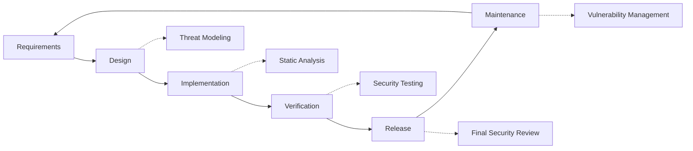

# 安全实践 {#security-practices}

## 目录 {#table-of-contents}

* [前言](#foreword)
* [基础设施安全](#infrastructure-security)
  * [安全数据中心](#secure-data-centers)
  * [网络安全](#network-security)
* [电子邮件安全](#email-security)
  * [加密](#encryption)
  * [身份验证和授权](#authentication-and-authorization)
  * [反滥用措施](#anti-abuse-measures)
* [数据保护](#data-protection)
  * [数据最小化](#data-minimization)
  * [备份和恢复](#backup-and-recovery)
* [服务提供商](#service-providers)
* [合规与审计](#compliance-and-auditing)
  * [定期安全评估](#regular-security-assessments)
  * [遵守](#compliance)
* [事件响应](#incident-response)
* [安全开发生命周期](#security-development-lifecycle)
* [服务器强化](#server-hardening)
* [服务水平协议](#service-level-agreement)
* [开源安全](#open-source-security)
* [员工安全](#employee-security)
* [持续改进](#continuous-improvement)
* [其他资源](#additional-resources)

## 前言 {#foreword}

在 Forward Email，安全是我们的首要任务。我们已实施全面的安全措施，以保护您的电子邮件通信和个人数据。本文档概述了我们的安全实践以及我们为确保您电子邮件的机密性、完整性和可用性而采取的措施。

## 基础设施安全 {#infrastructure-security}

### 安全数据中心 {#secure-data-centers}

我们的基础架构托管在符合 SOC 2 标准的数据中心，具有：

* 全天候物理安保和监控
* 生物识别门禁系统
* 冗余电源系统
* 先进的火灾探测和灭火系统
* 环境监测

### 网络安全 {#network-security}

我们实施多层网络安全：

* 具有严格访问控制列表的企业级防火墙
* DDoS 防护和缓解
* 定期网络漏洞扫描
* 入侵检测和防御系统
* 所有服务端点之间的流量加密
* 端口扫描防护，自动阻止可疑活动

> \[!IMPORTANT]
> 所有传输中的数据均使用 TLS 1.2+ 和现代密码套件进行加密。

## 电子邮件安全 {#email-security}

### 加密 {#encryption}

* **传输层安全性 (TLS)**：所有电子邮件流量在传输过程中均使用 TLS 1.2 或更高版本进行加密
* **端到端加密**：支持 OpenPGP/MIME 和 S/MIME 标准
* **存储加密**：所有存储的电子邮件均使用 SQLite 文件中的 ChaCha20-Poly1305 加密进行静态加密
* **全盘加密**：对整个磁盘进行 LUKS v2 加密
* **全面保护**：我们实施静态加密、内存加密和传输加密

> \[!NOTE]
> 我们是全球首个也是唯一一个使用 **[抗量子且单独加密的 SQLite 邮箱](https://forwardemail.net/en/blog/docs/best-quantum-safe-encrypted-email-service)** 的电子邮件服务。

### 身份验证和授权 {#authentication-and-authorization}

* DKIM 签名：所有外发邮件均使用 DKIM 签名
* SPF 和 DMARC：全面支持 SPF 和 DMARC，有效防止邮件欺诈
* MTA-STS：支持 MTA-STS 强制执行 TLS 加密
* 多重身份验证：适用于所有账户访问

### 反滥用措施 {#anti-abuse-measures}

* **垃圾邮件过滤**：基于机器学习的多层垃圾邮件检测
* **病毒扫描**：实时扫描所有附件
* **速率限制**：防御暴力破解和枚举攻击
* **IP 信誉**：监控发送 IP 信誉
* **内容过滤**：检测恶意 URL 和网络钓鱼攻击

## 数据保护 {#data-protection}

### 数据最小化 {#data-minimization}

我们遵循数据最小化原则：

* 我们仅收集提供服务所需的数据
* 电子邮件内容在内存中处理，除非 IMAP/POP3 传送需要，否则不会持久存储
* 日志将进行匿名处理，并仅在必要时保留

### 备份和恢复 {#backup-and-recovery}

* 自动每日加密备份
* 地理分布的备份存储
* 定期备份恢复测试
* 具有明确 RPO 和 RTO 的灾难恢复流程

## 服务提供商 {#service-providers}

我们精心挑选服务提供商，以确保他们符合我们严格的安全标准。以下是我们用于国际数据传输的服务提供商及其 GDPR 合规情况：

| 提供者 | 目的 | DPF认证 | GDPR 合规页面 |
| --------------------------------------------- | ------------------------- | ------------- | ----------------------------------------------------------------- |
| [Cloudflare](https://www.cloudflare.com) | CDN、DDoS 保护、DNS | ✅ 是的 | [Cloudflare GDPR](https://www.cloudflare.com/trust-hub/gdpr/) |
| [DataPacket](https://www.datapacket.com) | 服务器基础设施 | ❌ 没有 | [DataPacket Privacy](https://www.datapacket.com/privacy-policy) |
| [Digital Ocean](https://www.digitalocean.com) | 云基础设施 | ❌ 没有 | [DigitalOcean GDPR](https://www.digitalocean.com/legal/gdpr) |
| [Vultr](https://www.vultr.com) | 云基础设施 | ❌ 没有 | [Vultr GDPR](https://www.vultr.com/legal/eea-gdpr-privacy/) |
| [Stripe](https://stripe.com) | 付款处理 | ✅ 是的 | [Stripe Privacy Center](https://stripe.com/legal/privacy-center) |
| [PayPal](https://www.paypal.com) | 付款处理 | ❌ 没有 | [PayPal Privacy](https://www.paypal.com/uk/legalhub/privacy-full) |

我们使用这些提供商来确保可靠、安全的服务交付，同时遵守国际数据保护法规。所有数据传输均在适当的安全措施下进行，以保护您的个人信息。

## 合规性和审计 {#compliance-and-auditing}

### 定期安全评估 {#regular-security-assessments}

我们的团队会定期监控、审查和评估代码库、服务器、基础架构和实践。我们实施了全面的安全计划，其中包括：

* 定期轮换 SSH 密钥
* 持续监控访问日志
* 自动安全扫描
* 主动漏洞管理
* 定期为所有团队成员提供安全培训

### 合规性 {#compliance}

* [GDPR](https://forwardemail.net/gdpr) 符合数据处理规范
* [数据处理协议（DPA）](https://forwardemail.net/dpa) 可供企业客户使用
* 符合 CCPA 的隐私控制措施
* SOC 2 Type II 审核流程

## 事件响应 {#incident-response}

我们的安全事件响应计划包括：

1. **检测**：自动监控和警报系统
2. **遏制**：立即隔离受影响的系统
3. **根除**：消除威胁并进行根本原因分析
4. **恢复**：安全恢复服务
5. **通知**：及时与受影响用户沟通
6. **事件后分析**：全面审查和改进

> \[!WARNING]
> 如果您发现安全漏洞，请立即报告至 <security@forwardemail.net>。

## 安全开发生命周期 {#security-development-lifecycle}

所有代码都经过：

* 安全需求收集
* 设计过程中的威胁建模
* 安全编码实践
* 静态和动态应用程序安全测试
* 以安全为重点的代码审查
* 依赖项漏洞扫描

## 服务器强化 {#server-hardening}

我们的 [Ansible 配置](https://github.com/forwardemail/forwardemail.net/tree/master/ansible) 实施了许多服务器强化措施：

* **USB 访问已禁用**：通过将 usb-storage 内核模块列入黑名单来禁用物理端口
* **防火墙规则**：严格的 iptables 规则，仅允许必要的连接
* **SSH 加固**：仅基于密钥的身份验证，无需密码登录，禁用 root 登录
* **服务隔离**：每个服务都以最低所需权限运行
* **自动更新**：自动应用安全补丁
* **安全启动**：验证启动过程以防止篡改
* **内核加固**：安全的内核参数和 sysctl 配置
* **文件系统限制**：在适当的情况下使用 noexec、nosuid 和 nodev 挂载选项
* **核心转储已禁用**：系统已配置为防止核心转储以确保安全
* **交换已禁用**：禁用交换内存以防止数据泄露
* **端口扫描保护**：自动检测并阻止端口扫描尝试
* **透明大页面已禁用**：THP已禁用以提高性能和安全性
* **系统服务强化**：已禁用 Apport 等非必要服务
* **用户管理**：遵循最小权限原则，将部署用户和 DevOps 用户分开
* **文件描述符限制**：已提高限制以提高性能和安全性

## 服务水平协议 {#service-level-agreement}

我们保持高水平的服务可用性和可靠性。我们的基础设施设计具有冗余和容错功能，确保您的电子邮件服务持续运行。虽然我们没有发布正式的 SLA 文档，但我们承诺：

* 所有服务正常运行时间均超过 99.9%
* 快速响应服务中断
* 事件期间透明沟通
* 低流量时段定期维护

## 开源安全 {#open-source-security}

作为 [开源服务](https://github.com/forwardemail/forwardemail.net)，我们的安全优势在于：

* 代码透明，任何人都可以审计
* 社区驱动的安全改进
* 快速识别和修补漏洞
* 安全并非源于隐蔽

## 员工安全 {#employee-security}

* 对所有员工进行背景调查
* 安全意识培训
* 最小特权访问原则
* 定期安全教育

## 持续改进 {#continuous-improvement}

我们通过以下方式不断改善我们的安全态势：

* 监控安全趋势和新兴威胁
* 定期审查和更新安全策略
* 安全研究人员和用户的反馈
* 参与安全社区

如需了解有关我们的安全措施的更多信息或报告安全问题，请联系<security@forwardemail.net>。

## 额外资源 {#additional-resources}

* [隐私政策](https://forwardemail.net/en/privacy)
* [服务条款](https://forwardemail.net/en/terms)
* [GDPR 合规性](https://forwardemail.net/gdpr)
* [数据处理协议（DPA）](https://forwardemail.net/dpa)
* [举报滥用行为](https://forwardemail.net/en/report-abuse)
* [安全策略](https://github.com/forwardemail/.github/blob/main/SECURITY.md)
* [Security.txt](https://forwardemail.net/security.txt)
* [GitHub 存储库](https://github.com/forwardemail/forwardemail.net)
* [FAQ](https://forwardemail.net/en/faq)