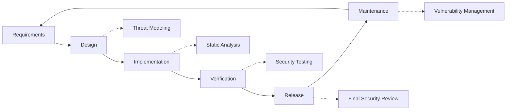

# 安全实践 {#security-practices}

## 目录 {#table-of-contents}

* [前言](#foreword)
* [基础设施安全](#infrastructure-security)
  * [安全数据中心](#secure-data-centers)
  * [网络安全](#network-security)
* [电子邮件安全](#email-security)
  * [加密](#encryption)
  * [认证与授权](#authentication-and-authorization)
  * [反滥用措施](#anti-abuse-measures)
* [数据保护](#data-protection)
  * [数据最小化](#data-minimization)
  * [备份与恢复](#backup-and-recovery)
* [服务提供商](#service-providers)
* [合规与审计](#compliance-and-auditing)
  * [定期安全评估](#regular-security-assessments)
  * [合规](#compliance)
* [事件响应](#incident-response)
* [安全开发生命周期](#security-development-lifecycle)
* [服务器加固](#server-hardening)
* [服务级别协议](#service-level-agreement)
* [开源安全](#open-source-security)
* [员工安全](#employee-security)
* [持续改进](#continuous-improvement)
* [附加资源](#additional-resources)

## 前言 {#foreword}

在 Forward Email，安全是我们的首要任务。我们已实施全面的安全措施来保护您的电子邮件通信和个人数据。本文档概述了我们的安全实践以及我们为确保您的电子邮件的机密性、完整性和可用性所采取的步骤。

## 基础设施安全 {#infrastructure-security}

### 安全数据中心 {#secure-data-centers}

我们的基础设施托管于符合 SOC 2 标准的数据中心，具备：

* 全天候物理安全和监控
* 生物识别访问控制
* 冗余电力系统
* 先进的火灾探测与抑制
* 环境监测

### 网络安全 {#network-security}

我们实施多层网络安全：

* 企业级防火墙，配备严格的访问控制列表
* DDoS 保护与缓解
* 定期网络漏洞扫描
* 入侵检测与防御系统
* 所有服务端点间的流量加密
* 端口扫描防护，自动阻断可疑活动

> \[!IMPORTANT]
> 所有传输中的数据均使用 TLS 1.2+ 及现代密码套件加密。

## 电子邮件安全 {#email-security}

### 加密 {#encryption}

* **传输层安全 (TLS)**：所有电子邮件流量在传输过程中均使用 TLS 1.2 或更高版本加密
* **端到端加密**：支持 OpenPGP/MIME 和 S/MIME 标准
* **存储加密**：所有存储的邮件均使用 ChaCha20-Poly1305 加密，存储于 SQLite 文件中
* **全盘加密**：使用 LUKS v2 对整个磁盘进行加密
* **全面保护**：我们实施静态加密、内存加密和传输加密

> \[!NOTE]
> 我们是全球首个且唯一使用 **[量子抗性且单独加密的 SQLite 邮箱](https://forwardemail.net/en/blog/docs/best-quantum-safe-encrypted-email-service)** 的电子邮件服务。

### 认证与授权 {#authentication-and-authorization}

* **DKIM 签名**：所有发出的邮件均使用 DKIM 签名
* **SPF 和 DMARC**：全面支持 SPF 和 DMARC 以防止邮件伪造
* **MTA-STS**：支持 MTA-STS 以强制 TLS 加密
* **多因素认证**：所有账户访问均可启用多因素认证

### 反滥用措施 {#anti-abuse-measures}

* **垃圾邮件过滤**：多层垃圾邮件检测，结合机器学习
* **病毒扫描**：实时扫描所有附件
* **速率限制**：防止暴力破解和枚举攻击
* **IP 信誉监控**：监控发送 IP 的信誉
* **内容过滤**：检测恶意 URL 和钓鱼尝试

## 数据保护 {#data-protection}

### 数据最小化 {#data-minimization}

我们遵循数据最小化原则：

* 仅收集提供服务所必需的数据
* 邮件内容在内存中处理，除非为 IMAP/POP3 交付需要，否则不持久存储
* 日志匿名化，仅保留必要时间
### 备份与恢复 {#backup-and-recovery}

* 自动化每日备份并加密
* 地理分布式备份存储
* 定期备份恢复测试
* 具有定义的RPO和RTO的灾难恢复程序

## 服务提供商 {#service-providers}

我们严格挑选服务提供商，以确保他们符合我们的高安全标准。以下是我们用于国际数据传输的提供商及其GDPR合规状态：

| 提供商                                        | 目的                       | DPF 认证      | GDPR 合规页面                                                                                         |
| --------------------------------------------- | -------------------------- | ------------- | ------------------------------------------------------------------------------------------------------- |
| [Cloudflare](https://www.cloudflare.com)      | CDN，DDoS防护，DNS         | ✅ 是          | [Cloudflare GDPR](https://www.cloudflare.com/trust-hub/gdpr/)                                           |
| [DataPacket](https://www.datapacket.com)      | 服务器基础设施             | ❌ 否          | [DataPacket Privacy](https://www.datapacket.com/privacy-policy)                                         |
| [Digital Ocean](https://www.digitalocean.com) | 云基础设施                 | ❌ 否          | [DigitalOcean GDPR](https://www.digitalocean.com/legal/gdpr)                                            |
| [GitHub](https://github.com)                  | 源代码托管，CI/CD          | ✅ 是          | [GitHub GDPR](https://docs.github.com/en/site-policy/privacy-policies/github-data-protection-agreement) |
| [Vultr](https://www.vultr.com)                | 云基础设施                 | ❌ 否          | [Vultr GDPR](https://www.vultr.com/legal/eea-gdpr-privacy/)                                             |
| [Stripe](https://stripe.com)                  | 支付处理                   | ✅ 是          | [Stripe Privacy Center](https://stripe.com/legal/privacy-center)                                        |
| [PayPal](https://www.paypal.com)              | 支付处理                   | ❌ 否          | [PayPal Privacy](https://www.paypal.com/uk/legalhub/privacy-full)                                       |

我们使用这些提供商以确保可靠、安全的服务交付，同时保持符合国际数据保护法规。所有数据传输均采取适当的保障措施以保护您的个人信息。

## 合规与审计 {#compliance-and-auditing}

### 定期安全评估 {#regular-security-assessments}

我们的团队定期监控、审查和评估代码库、服务器、基础设施和实践。我们实施了全面的安全计划，包括：

* 定期更换SSH密钥
* 持续监控访问日志
* 自动化安全扫描
* 主动漏洞管理
* 全体团队成员定期安全培训

### 合规 {#compliance}

* 遵守[GDPR](https://forwardemail.net/gdpr)的数据处理规范
* 为企业客户提供[数据处理协议 (DPA)](https://forwardemail.net/dpa)
* 符合CCPA的隐私控制
* 通过SOC 2 Type II审计的流程

## 事件响应 {#incident-response}

我们的安全事件响应计划包括：

1. **检测**：自动监控和警报系统
2. **遏制**：立即隔离受影响系统
3. **根除**：消除威胁并进行根本原因分析
4. **恢复**：安全恢复服务
5. **通知**：及时与受影响用户沟通
6. **事后分析**：全面审查与改进

> \[!WARNING]
> 如果您发现安全漏洞，请立即报告至 <security@forwardemail.net>。

## 安全开发生命周期 {#security-development-lifecycle}

```mermaid
flowchart LR
    A[Requirements] --> B[Design]
    B --> C[Implementation]
    C --> D[Verification]
    D --> E[Release]
    E --> F[Maintenance]
    F --> A
    B -.-> G[Threat Modeling]
    C -.-> H[Static Analysis]
    D -.-> I[Security Testing]
    E -.-> J[Final Security Review]
    F -.-> K[Vulnerability Management]
```
所有代码均经过：

* 安全需求收集
* 设计阶段的威胁建模
* 安全编码实践
* 静态和动态应用安全测试
* 以安全为重点的代码审查
* 依赖项漏洞扫描

## 服务器加固 {#server-hardening}

我们的[Ansible 配置](https://github.com/forwardemail/forwardemail.net/tree/master/ansible) 实施了多项服务器加固措施：

* **禁用 USB 访问**：通过将 usb-storage 内核模块列入黑名单来禁用物理端口
* **防火墙规则**：严格的 iptables 规则，仅允许必要的连接
* **SSH 加固**：仅基于密钥认证，禁止密码登录，禁用 root 登录
* **服务隔离**：每个服务以最小所需权限运行
* **自动更新**：自动应用安全补丁
* **安全启动**：验证启动过程以防篡改
* **内核加固**：安全的内核参数和 sysctl 配置
* **文件系统限制**：在适当情况下使用 noexec、nosuid 和 nodev 挂载选项
* **禁用核心转储**：系统配置为防止生成核心转储以增强安全
* **禁用交换分区**：禁用交换内存以防止数据泄露
* **端口扫描防护**：自动检测并阻止端口扫描尝试
* **禁用透明大页**：禁用 THP 以提升性能和安全
* **系统服务加固**：禁用非必要服务如 Apport
* **用户管理**：遵循最小权限原则，分开部署和运维用户
* **文件描述符限制**：提高限制以提升性能和安全

## 服务级别协议 {#service-level-agreement}

我们保持高水平的服务可用性和可靠性。我们的基础设施设计具备冗余和容错能力，以确保您的邮件服务持续运行。虽然我们不发布正式的 SLA 文档，但我们承诺：

* 所有服务 99.9%+ 的正常运行时间
* 快速响应服务中断
* 事件期间透明沟通
* 在低流量时段进行定期维护

## 开源安全 {#open-source-security}

作为一个[开源服务](https://github.com/forwardemail/forwardemail.net)，我们的安全性受益于：

* 任何人都可以审计的透明代码
* 社区驱动的安全改进
* 快速识别和修补漏洞
* 无安全依赖于隐秘性

## 员工安全 {#employee-security}

* 所有员工均进行背景调查
* 安全意识培训
* 最小权限访问原则
* 定期安全教育

## 持续改进 {#continuous-improvement}

我们通过以下方式持续提升安全态势：

* 监控安全趋势和新兴威胁
* 定期审查和更新安全策略
* 来自安全研究人员和用户的反馈
* 参与安全社区

如需了解更多我们的安全实践或报告安全问题，请联系 <security@forwardemail.net>。

## 其他资源 {#additional-resources}

* [隐私政策](https://forwardemail.net/en/privacy)
* [服务条款](https://forwardemail.net/en/terms)
* [GDPR 合规](https://forwardemail.net/gdpr)
* [数据处理协议 (DPA)](https://forwardemail.net/dpa)
* [举报滥用](https://forwardemail.net/en/report-abuse)
* [安全政策](https://github.com/forwardemail/.github/blob/main/SECURITY.md)
* [Security.txt](https://forwardemail.net/security.txt)
* [GitHub 仓库](https://github.com/forwardemail/forwardemail.net)
* [常见问题](https://forwardemail.net/en/faq)
