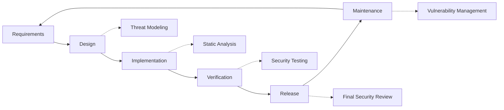

# Security Practices

## Table of Contents

* [Foreword](#foreword)
* [Infrastructure Security](#infrastructure-security)
  * [Secure Data Centers](#secure-data-centers)
  * [Network Security](#network-security)
* [Email Security](#email-security)
  * [Encryption](#encryption)
  * [Authentication and Authorization](#authentication-and-authorization)
  * [Anti-Abuse Measures](#anti-abuse-measures)
* [Data Protection](#data-protection)
  * [Data Minimization](#data-minimization)
  * [Backup and Recovery](#backup-and-recovery)
* [Service Providers](#service-providers)
* [Compliance and Auditing](#compliance-and-auditing)
  * [Regular Security Assessments](#regular-security-assessments)
  * [Compliance](#compliance)
* [Incident Response](#incident-response)
* [Security Development Lifecycle](#security-development-lifecycle)
* [Server Hardening](#server-hardening)
* [Service Level Agreement](#service-level-agreement)
* [Open Source Security](#open-source-security)
* [Employee Security](#employee-security)
* [Continuous Improvement](#continuous-improvement)
* [Additional Resources](#additional-resources)

## Foreword

At Forward Email, security is our top priority. We've implemented comprehensive security measures to protect your email communications and personal data. This document outlines our security practices and the steps we take to ensure the confidentiality, integrity, and availability of your email.

## Infrastructure Security

### Secure Data Centers

Our infrastructure is hosted in SOC 2 compliant data centers with:

* 24/7 physical security and surveillance
* Biometric access controls
* Redundant power systems
* Advanced fire detection and suppression
* Environmental monitoring

### Network Security

We implement multiple layers of network security:

* Enterprise-grade firewalls with strict access control lists
* DDoS protection and mitigation
* Regular network vulnerability scanning
* Intrusion detection and prevention systems
* Traffic encryption between all service endpoints
* Port scanning protection with automated blocking of suspicious activity

> \[!IMPORTANT]
> All data in transit is encrypted using TLS 1.2+ with modern cipher suites.

## Email Security

### Encryption

* **Transport Layer Security (TLS)**: All email traffic is encrypted in transit using TLS 1.2 or higher
* **End-to-End Encryption**: Support for OpenPGP/MIME and S/MIME standards
* **Storage Encryption**: All stored emails are encrypted at rest using ChaCha20-Poly1305 encryption in SQLite files
* **Full Disk Encryption**: LUKS v2 encryption for the entire disk
* **Comprehensive Protection**: We implement encryption-at-rest, encryption-in-memory, and encryption-in-transit

> \[!NOTE]
> We're the world's first and only email service to use **[quantum-resistant and individually encrypted SQLite mailboxes](https://forwardemail.net/en/blog/docs/best-quantum-safe-encrypted-email-service)**.

### Authentication and Authorization

* **DKIM Signing**: All outgoing emails are signed with DKIM
* **SPF and DMARC**: Full support for SPF and DMARC to prevent email spoofing
* **MTA-STS**: Support for MTA-STS to enforce TLS encryption
* **Multi-Factor Authentication**: Available for all account access

### Anti-Abuse Measures

* **Spam Filtering**: Multi-layered spam detection with machine learning
* **Virus Scanning**: Real-time scanning of all attachments
* **Rate Limiting**: Protection against brute force and enumeration attacks
* **IP Reputation**: Monitoring of sending IP reputation
* **Content Filtering**: Detection of malicious URLs and phishing attempts

## Data Protection

### Data Minimization

We follow the principle of data minimization:

* We only collect the data necessary to provide our service
* Email content is processed in memory and not persistently stored unless required for IMAP/POP3 delivery
* Logs are anonymized and retained only as long as necessary

### Backup and Recovery

* Automated daily backups with encryption
* Geographically distributed backup storage
* Regular backup restoration testing
* Disaster recovery procedures with defined RPO and RTO

## Service Providers

We carefully select our service providers to ensure they meet our high security standards. Below are the providers we use for international data transfer and their GDPR compliance status:

| Provider                                      | Purpose                   | DPF Certified | GDPR Compliance Page                                              |
| --------------------------------------------- | ------------------------- | ------------- | ----------------------------------------------------------------- |
| [Cloudflare](https://www.cloudflare.com)      | CDN, DDoS protection, DNS | ✅ Yes         | [Cloudflare GDPR](https://www.cloudflare.com/trust-hub/gdpr/)     |
| [DataPacket](https://www.datapacket.com)      | Server infrastructure     | ❌ No          | [DataPacket Privacy](https://www.datapacket.com/privacy-policy)   |
| [Digital Ocean](https://www.digitalocean.com) | Cloud infrastructure      | ❌ No          | [DigitalOcean GDPR](https://www.digitalocean.com/legal/gdpr)      |
| [Vultr](https://www.vultr.com)                | Cloud infrastructure      | ❌ No          | [Vultr GDPR](https://www.vultr.com/legal/eea-gdpr-privacy/)       |
| [Stripe](https://stripe.com)                  | Payment processing        | ✅ Yes         | [Stripe Privacy Center](https://stripe.com/legal/privacy-center)  |
| [PayPal](https://www.paypal.com)              | Payment processing        | ❌ No          | [PayPal Privacy](https://www.paypal.com/uk/legalhub/privacy-full) |

We use these providers to ensure reliable, secure service delivery while maintaining compliance with international data protection regulations. All data transfers are conducted with appropriate safeguards in place to protect your personal information.

## Compliance and Auditing

### Regular Security Assessments

Our team regularly monitors, reviews, and assesses the codebase, servers, infrastructure, and practices. We implement a comprehensive security program that includes:

* Regular rotation of SSH keys
* Continuous monitoring of access logs
* Automated security scanning
* Proactive vulnerability management
* Regular security training for all team members

### Compliance

* [GDPR](https://forwardemail.net/gdpr) compliant data handling practices
* [Data Processing Agreement (DPA)](https://forwardemail.net/dpa) available for business customers
* CCPA compliant privacy controls
* SOC 2 Type II audited processes

## Incident Response

Our security incident response plan includes:

1. **Detection**: Automated monitoring and alerting systems
2. **Containment**: Immediate isolation of affected systems
3. **Eradication**: Removal of the threat and root cause analysis
4. **Recovery**: Secure restoration of services
5. **Notification**: Timely communication with affected users
6. **Post-incident Analysis**: Comprehensive review and improvement

> \[!WARNING]
> If you discover a security vulnerability, please report it immediately to <security@forwardemail.net>.

## Security Development Lifecycle

All code undergoes:

* Security requirements gathering
* Threat modeling during design
* Secure coding practices
* Static and dynamic application security testing
* Code review with security focus
* Dependency vulnerability scanning

## Server Hardening

Our [Ansible configuration](https://github.com/forwardemail/forwardemail.net/tree/master/ansible) implements numerous server hardening measures:

* **USB Access Disabled**: Physical ports are disabled by blacklisting the usb-storage kernel module
* **Firewall Rules**: Strict iptables rules allowing only necessary connections
* **SSH Hardening**: Key-based authentication only, no password login, root login disabled
* **Service Isolation**: Each service runs with minimal required privileges
* **Automatic Updates**: Security patches are applied automatically
* **Secure Boot**: Verified boot process to prevent tampering
* **Kernel Hardening**: Secure kernel parameters and sysctl configurations
* **File System Restrictions**: noexec, nosuid, and nodev mount options where appropriate
* **Core Dumps Disabled**: System configured to prevent core dumps for security
* **Swap Disabled**: Swap memory disabled to prevent data leakage
* **Port Scanning Protection**: Automated detection and blocking of port scanning attempts
* **Transparent Huge Pages Disabled**: THP disabled for improved performance and security
* **System Service Hardening**: Non-essential services like Apport disabled
* **User Management**: Principle of least privilege with separate deploy and devops users
* **File Descriptor Limits**: Increased limits for better performance and security

## Service Level Agreement

We maintain a high level of service availability and reliability. Our infrastructure is designed for redundancy and fault tolerance to ensure your email service remains operational. While we don't publish a formal SLA document, we're committed to:

* 99.9%+ uptime for all services
* Rapid response to service disruptions
* Transparent communication during incidents
* Regular maintenance during low-traffic periods

## Open Source Security

As an [open-source service](https://github.com/forwardemail/forwardemail.net), our security benefits from:

* Transparent code that can be audited by anyone
* Community-driven security improvements
* Rapid identification and patching of vulnerabilities
* No security through obscurity

## Employee Security

* Background checks for all employees
* Security awareness training
* Principle of least privilege access
* Regular security education

## Continuous Improvement

We continuously improve our security posture through:

* Monitoring of security trends and emerging threats
* Regular review and updates to security policies
* Feedback from security researchers and users
* Participation in the security community

For more information about our security practices or to report security concerns, please contact <security@forwardemail.net>.

## Additional Resources

* [Privacy Policy](https://forwardemail.net/en/privacy)
* [Terms of Service](https://forwardemail.net/en/terms)
* [GDPR Compliance](https://forwardemail.net/gdpr)
* [Data Processing Agreement (DPA)](https://forwardemail.net/dpa)
* [Report Abuse](https://forwardemail.net/en/report-abuse)
* [Security Policy](https://github.com/forwardemail/.github/blob/main/SECURITY.md)
* [Security.txt](https://forwardemail.net/security.txt)
* [GitHub Repository](https://github.com/forwardemail/forwardemail.net)
* [FAQ](https://forwardemail.net/en/faq)
